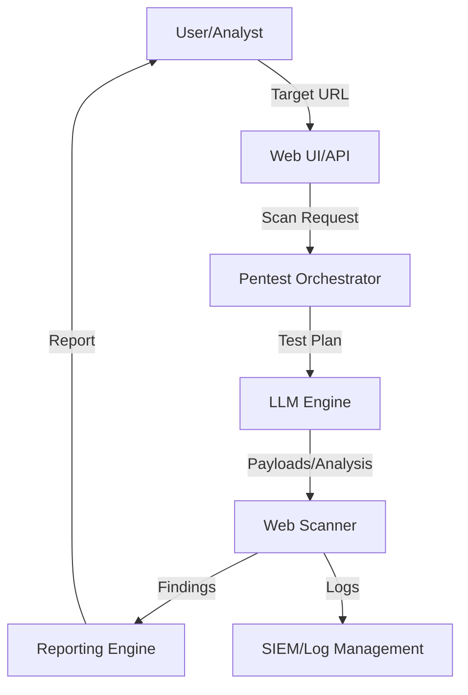
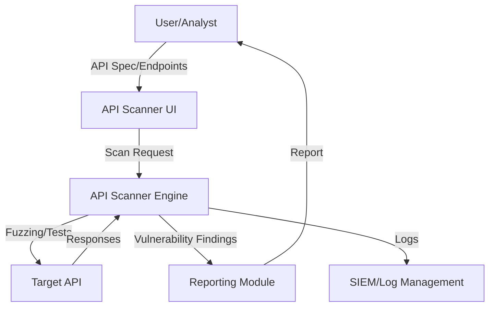

# Application Security Architectures

---

## 1. LLM-Driven Penetration Testing Agents

**Description:**
LLM-driven pentesting agents automate web application security testing, payload generation, and vulnerability reporting using large language models.

**Architecture Diagram:**

**Key Components:**
- Web UI/API: User interface for scan configuration and results.
- Pentest Orchestrator: Manages scan workflow and LLM interaction.
- LLM Engine: Generates payloads, analyzes responses, and suggests next steps.
- Web Scanner: Executes tests against the target application.
- Reporting Engine: Aggregates and formats findings.
- SIEM/Log Management: Stores scan logs and events.

---

## 2. API Security Scanner

**Description:**
An API security scanner tests RESTful or GraphQL APIs for vulnerabilities, misconfigurations, and compliance with security best practices.

**Architecture Diagram:**

**Key Components:**
- API Scanner UI: Interface for specifying API endpoints and scan options.
- API Scanner Engine: Orchestrates tests, fuzzing, and analysis.
- Target API: The API under test.
- Reporting Module: Summarizes and presents findings.
- SIEM/Log Management: Stores scan logs and events. 