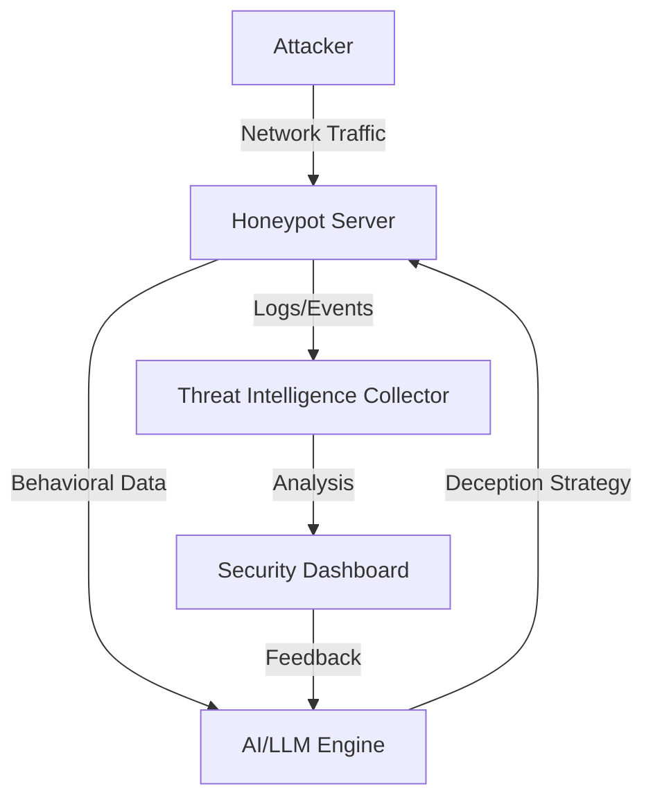

# Deception & Honeypots Architectures

---

## 1. AI-Powered Honeypots

**Description:**
Adaptive honeypots use AI/LLMs to dynamically change their behavior, services, and deception strategies to lure attackers and gather threat intelligence.

**Architecture Diagram:**


**Key Components:**
- Honeypot Server: Exposes decoy services and collects interaction data (e.g., [AI Sweden Project](https://www.ai.se/en/project/ai-powered-honeypots)).
- AI/LLM Engine: Analyzes attacker behavior and adapts honeypot responses.
- Threat Intelligence Collector: Aggregates logs and events for analysis.
- Security Dashboard: Visualizes attacks, trends, and adapts strategies.

---

## 2. Multi-Honeypot Suites

**Description:**
Deploys a range of honeypots (SSH, web, ICS, DNS, etc.) for research, monitoring, and attack surface deception.

**Architecture Diagram:**
```mermaid
flowchart TD
    A[Attacker] -->|Network Traffic| B[Honeypot Suite Host]
    B -->|Traffic| C{Honeypot Containers}
    C --> D[SSH/Telnet (Cowrie)]
    C --> E[Web (HoneyPress, Gate)]
    C --> F[ICS/SCADA (Conpot)]
    C --> G[DNS (Udpot)]
    C --> H[FTP/MySQL (Dionaea)]
    D -->|Logs| I[Central Log Collector]
    E -->|Logs| I
    F -->|Logs| I
    G -->|Logs| I
    H -->|Logs| I
    I -->|Analysis| J[Dashboard/Threat Intel]
```

**Key Components:**
- Honeypot Suite Host: Runs multiple honeypot containers (e.g., [prickly-pete](https://github.com/philcryer/prickly-pete)).
- Honeypot Containers: Emulate different protocols/services.
- Central Log Collector: Aggregates logs from all honeypots.
- Dashboard/Threat Intel: Analyzes and visualizes attack data. 