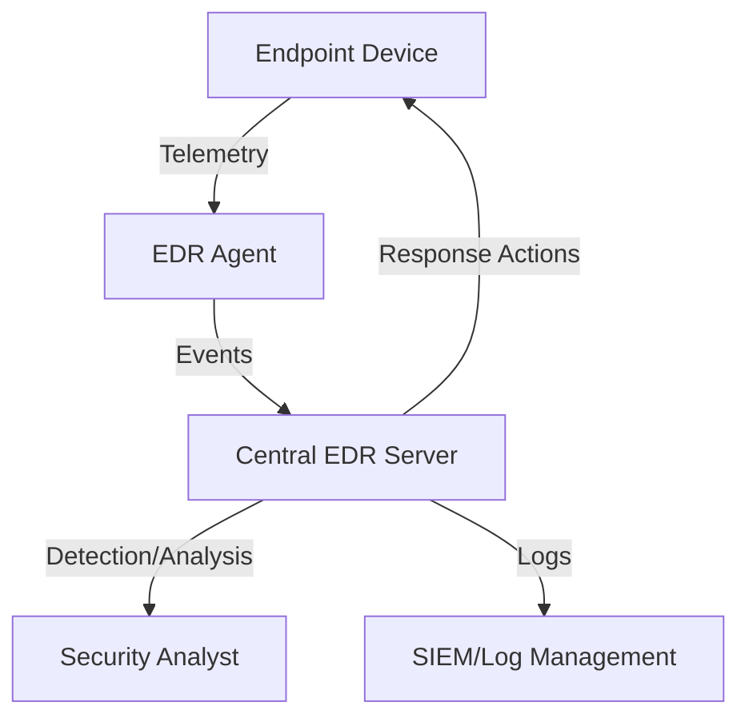
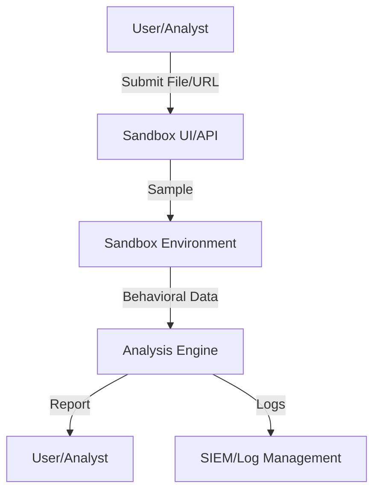

# Endpoint Security Architectures

---

## 1. Open Source EDR (Endpoint Detection & Response)

**Description:**
An open source EDR agent monitors endpoints for suspicious activity, collects telemetry, and enables detection, investigation, and response to threats.

**Architecture Diagram:**

**Key Components:**
- Endpoint Device: Workstation, server, or laptop.
- EDR Agent: Collects process, file, and network activity.
- Central EDR Server: Aggregates events, runs detection logic, and orchestrates response.
- Security Analyst: Investigates alerts and initiates response.
- SIEM/Log Management: Stores events for correlation and compliance.

---

## 2. Automated Malware Analysis Sandbox

**Description:**
A sandbox environment automatically analyzes suspicious files or URLs by executing them in isolation and observing their behavior.

**Architecture Diagram:**

**Key Components:**
- Sandbox UI/API: Interface for submitting samples and viewing results.
- Sandbox Environment: Isolated VM or container for safe execution.
- Analysis Engine: Monitors system changes, network activity, and indicators of compromise.
- User/Analyst: Reviews reports and takes action.
- SIEM/Log Management: Stores analysis logs and results. 