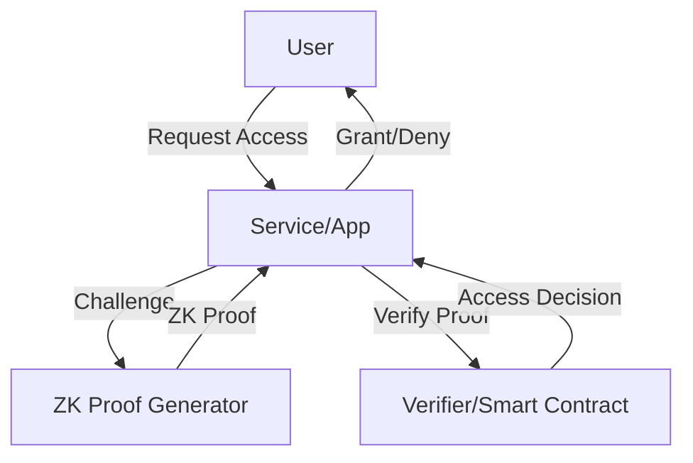

# Identity & Access Management (IAM) Architectures

---

## 1. Blockchain-Based Identity Management System

**Description:**
A decentralized identity management system leverages blockchain to provide self-sovereign, verifiable credentials and secure authentication across platforms.

**Architecture Diagram:**
```mermaid
flowchart TD
    A[User] -->|Register/Claim| B[Identity Wallet]
    B -->|Credential Request| C[Issuer (Org/Gov)]
    C -->|Signed Credential| B
    B -->|Present Credential| D[Verifier (Service/App)]
    D -->|Verify| E[Blockchain Network]
    E -->|Validation| D
```

**Key Components:**
- User: Individual controlling their digital identity.
- Identity Wallet: Stores credentials and manages keys.
- Issuer: Organization or authority that issues verifiable credentials.
- Verifier: Service or app that requests and verifies credentials.
- Blockchain Network: Stores credential proofs and supports verification.

---

## 2. Zero-Knowledge Role Assignment

**Description:**
Zero-knowledge role assignment allows users to prove their authorization or role without revealing their identity or sensitive details, using cryptographic proofs.

**Architecture Diagram:**


**Key Components:**
- User: Requests access to a resource or service.
- Service/App: The protected resource or application.
- ZK Proof Generator: Creates zero-knowledge proofs of authorization.
- Verifier/Smart Contract: Validates the proof and enforces access control. 