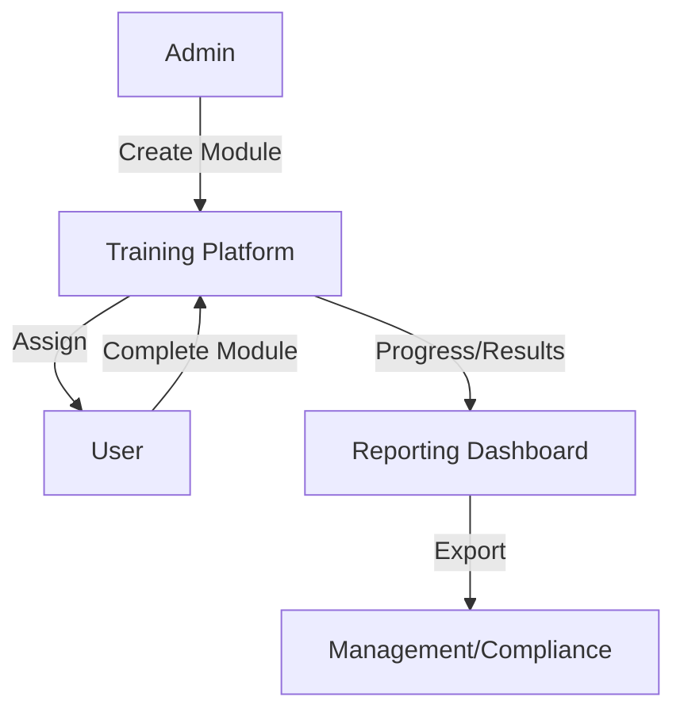
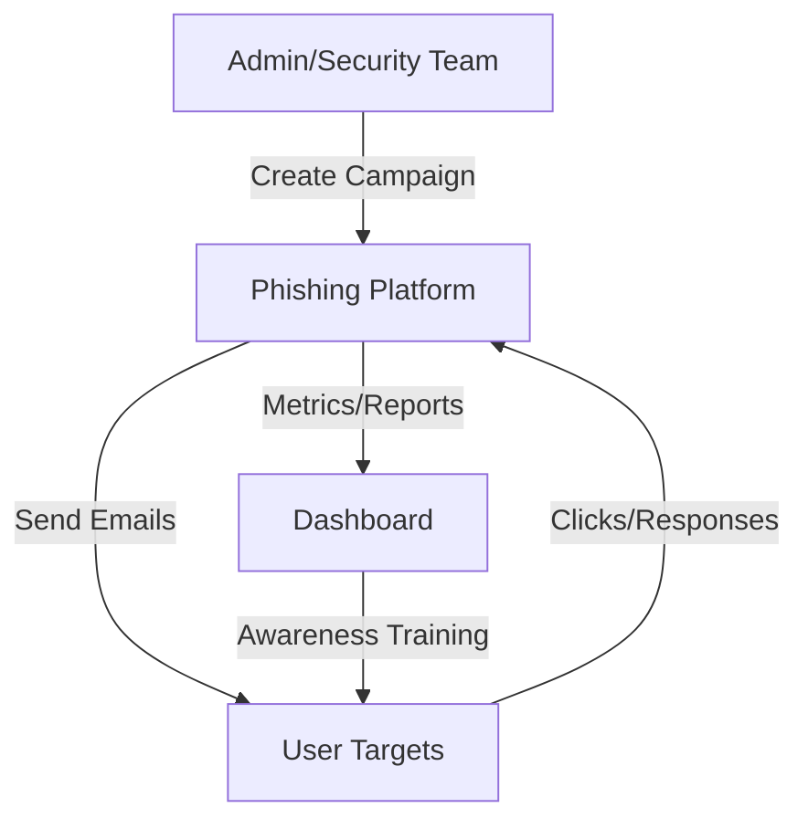

# Security Awareness & Training Architectures

---

## 1. Security Awareness Training Portal

**Description:**
Delivers security training modules, quizzes, and tracks user progress to improve organizational security culture.

**Architecture Diagram:**

**Key Components:**
- Training Platform: Delivers modules, tracks progress (e.g., [Open Source Security Awareness Platform](https://github.com/toniblyx/security-tools/blob/master/README.md#security-awareness-training)).
- Reporting Dashboard: Visualizes completion, risk, and trends.
- Management/Compliance: Consumes reports for oversight and audits.
- User: Employees or test users.

---

## 2. Phishing Simulation Platform

**Description:**
Sends simulated phishing emails to users, tracks responses, and provides metrics for awareness training and risk assessment.

**Architecture Diagram:**

**Key Components:**
- Phishing Platform: Manages campaigns, templates, and delivery (e.g., [GoPhish](https://getgophish.com/)).
- User Targets: Employees or test users.
- Dashboard: Visualizes metrics, click rates, and risk.
- Awareness Training: Delivers follow-up training to users who fall for simulations. 