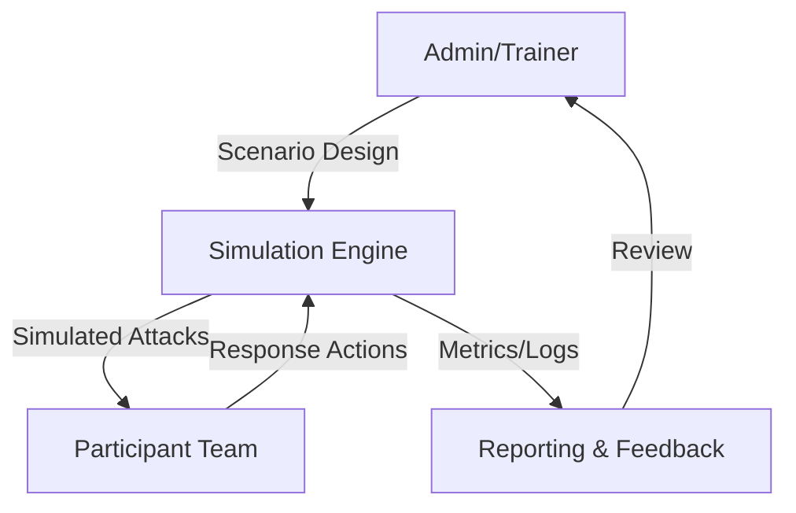
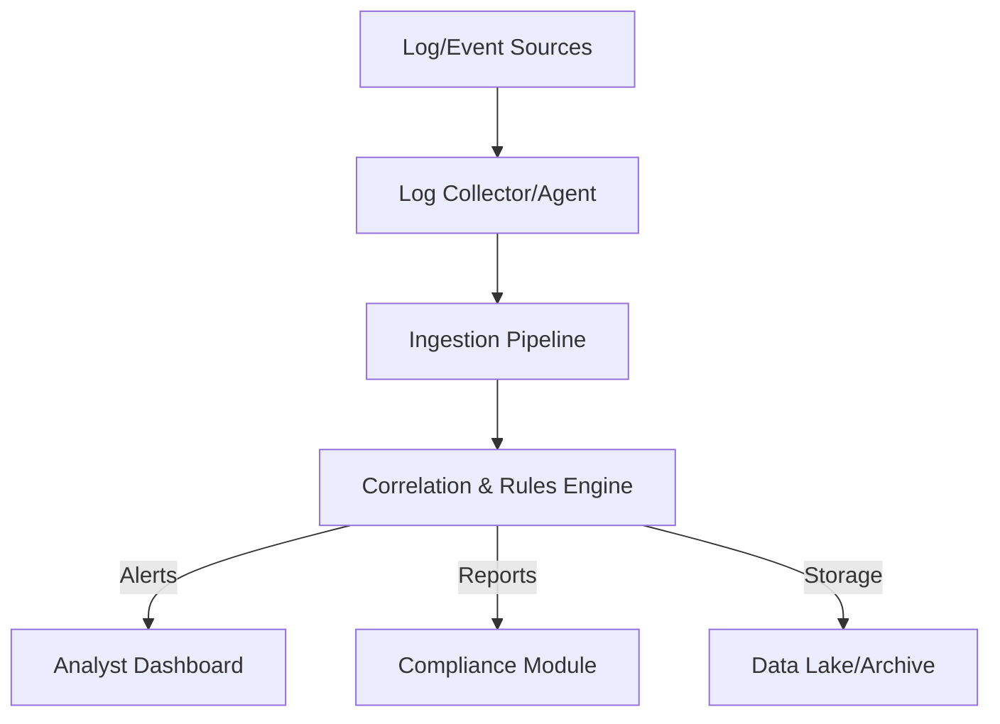

# Security Operations (SOC/SIEM/IR) Architectures

---

## 1. AI-Powered SOC Dashboard

**Description:**
A modern SOC dashboard integrates real-time threat monitoring, digital forensics, and incident response, enhanced by AI/ML for detection and automation.

**Architecture Diagram:**
```mermaid
flowchart TD
    A[Data Sources (Network, Endpoint, Cloud)] --> B[Ingestion Pipeline]
    B --> C[AI/ML Detection Engine]
    C -->|Alerts| D[Analyst Dashboard]
    C -->|Automated Response| E[Orchestration/Playbooks]
    D -->|Investigation| F[Forensics Module]
    F -->|Evidence| D
    E -->|Remediation| G[IT/Cloud Systems]
    C -->|Logs| H[SIEM/Log Management]
```

**Key Components:**
- Ingestion Pipeline: Collects and normalizes data from multiple sources.
- AI/ML Detection Engine: Identifies threats and anomalies.
- Analyst Dashboard: Central interface for monitoring and response.
- Orchestration/Playbooks: Automates response actions.
- Forensics Module: Supports investigation and evidence collection.
- SIEM/Log Management: Stores and correlates events.

---

## 2. Incident Response Simulation Tool

**Description:**
A simulation platform for practicing and testing incident response plans, including attack scenarios, decision-making, and communication.

**Architecture Diagram:**


**Key Components:**
- Simulation Engine: Orchestrates attack scenarios and tracks responses.
- Participant Team: Security team members practicing IR.
- Reporting & Feedback: Provides metrics, logs, and after-action reviews.
- Admin/Trainer: Designs scenarios and reviews performance.

---

## 3. Open Source SIEM

**Description:**
A SIEM system collects, stores, correlates, and analyzes security events from across the organization, enabling detection and compliance.

**Architecture Diagram:**


**Key Components:**
- Log Collector/Agent: Gathers events from endpoints, network, and cloud.
- Ingestion Pipeline: Normalizes and enriches data.
- Correlation & Rules Engine: Detects threats and policy violations.
- Analyst Dashboard: Investigates alerts and trends.
- Compliance Module: Generates reports for audits.
- Data Lake/Archive: Stores raw and processed logs for long-term analysis. 