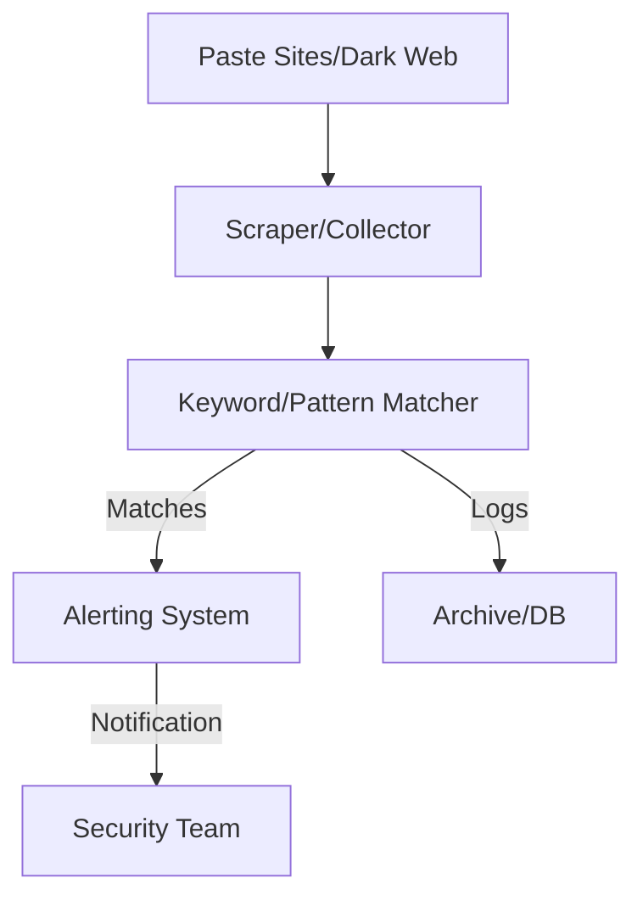
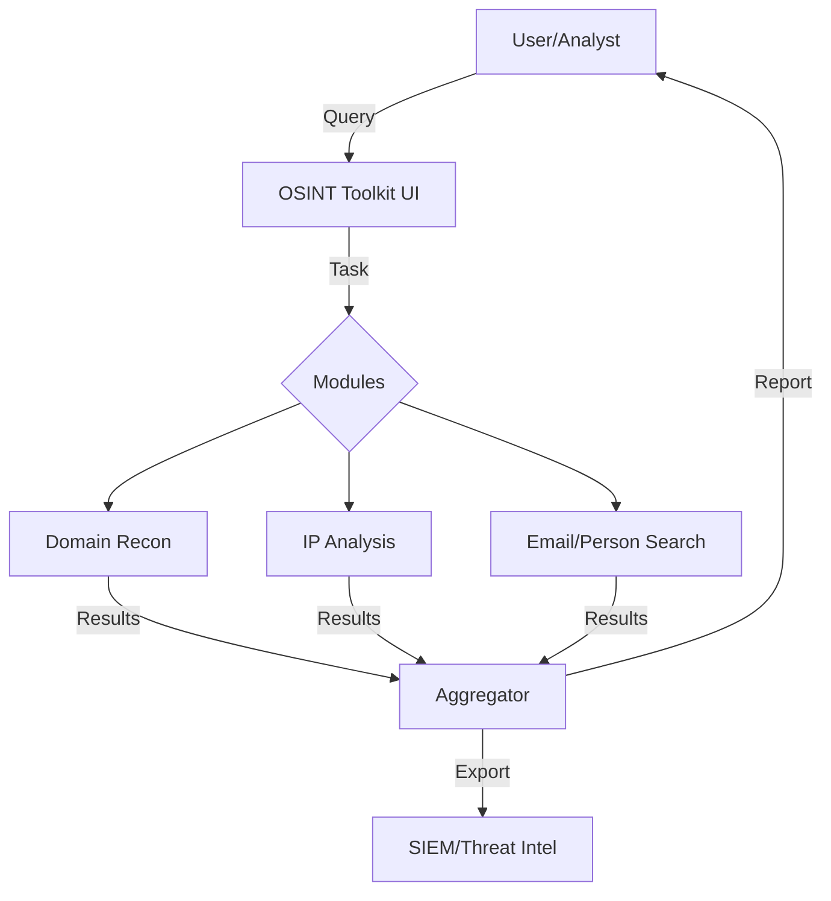

# Threat Intelligence & Hunting Architectures

---

## 1. Threat Intelligence Platform (TIP)

**Description:**
Aggregates, correlates, and analyzes threat data from multiple sources, providing actionable intelligence for defenders.

**Architecture Diagram:**
```mermaid
flowchart TD
    A[Threat Feeds (OSINT, CTI, Dark Web)] --> B[Ingestion Engine]
    B --> C[Normalization & Enrichment]
    C --> D[Correlation Engine]
    D -->|Indicators/Alerts| E[Analyst Dashboard]
    D -->|Export| F[SIEM/SOAR]
    E -->|Feedback| D
    D -->|Storage| G[Threat Intel DB]
```

**Key Components:**
- Ingestion Engine: Connects to feeds, APIs, and scrapes sources (e.g., [MISP](https://www.misp-project.org/)).
- Normalization & Enrichment: Cleans and adds context to raw data.
- Correlation Engine: Links indicators, finds patterns, and scores threats.
- Analyst Dashboard: Visualizes threats, enables search, and triage.
- SIEM/SOAR: Integrates with detection and response platforms.
- Threat Intel DB: Stores indicators, reports, and historical data.

---

## 2. Dark Web Paste Monitor

**Description:**
Monitors paste sites and dark web sources for leaked credentials, sensitive data, or targeted keywords.

**Architecture Diagram:**


**Key Components:**
- Scraper/Collector: Gathers new pastes and posts (e.g., [PasteHunter](https://github.com/kevthehermit/PasteHunter)).
- Keyword/Pattern Matcher: Searches for sensitive data or custom patterns.
- Alerting System: Notifies security team of matches.
- Archive/DB: Stores all collected data for review and compliance.

---

## 3. OSINT Toolkit

**Description:**
A modular toolkit for gathering open-source intelligence on domains, IPs, emails, and more.

**Architecture Diagram:**


**Key Components:**
- OSINT Toolkit UI: Interface for configuring and running queries (e.g., [theHarvester](https://github.com/laramies/theHarvester), [SpiderFoot](https://www.spiderfoot.net/)).
- Modules: Pluggable recon and analysis tools.
- Aggregator: Combines and formats results.
- SIEM/Threat Intel: Optional export for further analysis. 