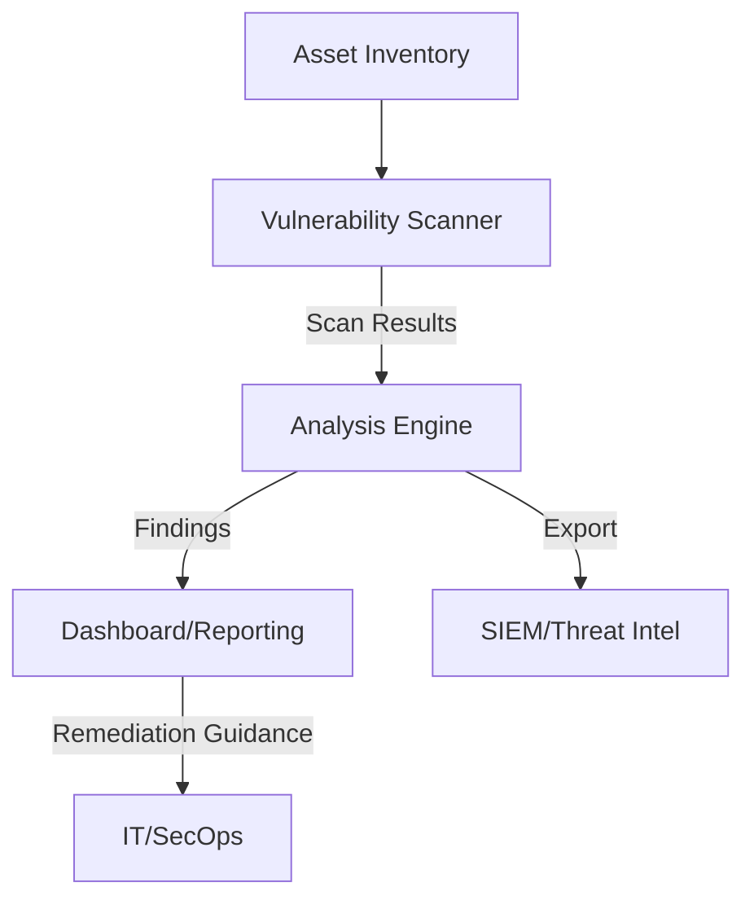
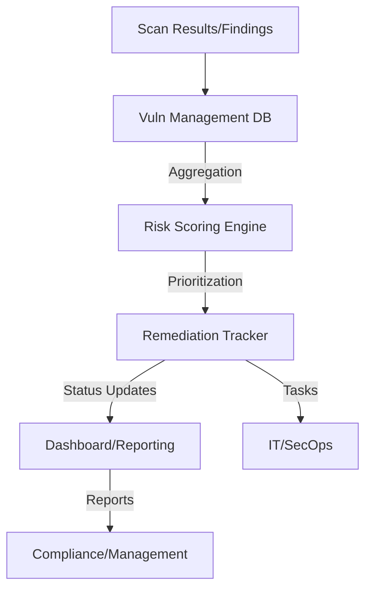

# Vulnerability Management Architectures

---

## 1. Automated Vulnerability Scanner

**Description:**
Scans networks, applications, and cloud resources for known vulnerabilities using automated tools and scheduled scans.

**Architecture Diagram:**

**Key Components:**
- Asset Inventory: List of systems, apps, and cloud resources to scan.
- Vulnerability Scanner: Automated tool (e.g., [OpenVAS](https://www.openvas.org/), [Nessus](https://www.tenable.com/products/nessus)).
- Analysis Engine: Scores, prioritizes, and deduplicates findings.
- Dashboard/Reporting: Visualizes vulnerabilities, trends, and remediation status.
- SIEM/Threat Intel: Integrates findings with detection and response platforms.
- IT/SecOps: Receives guidance and applies fixes.

---

## 2. Vulnerability Management Dashboard

**Description:**
Centralizes vulnerability data, tracks remediation, and provides analytics for risk management and compliance.

**Architecture Diagram:**

**Key Components:**
- Vuln Management DB: Stores all findings and remediation data.
- Risk Scoring Engine: Calculates risk based on asset criticality and exploitability.
- Remediation Tracker: Assigns, tracks, and verifies fixes.
- Dashboard/Reporting: Visualizes risk, trends, and compliance status.
- Compliance/Management: Consumes reports for audits and oversight.
- IT/SecOps: Executes remediation tasks. 