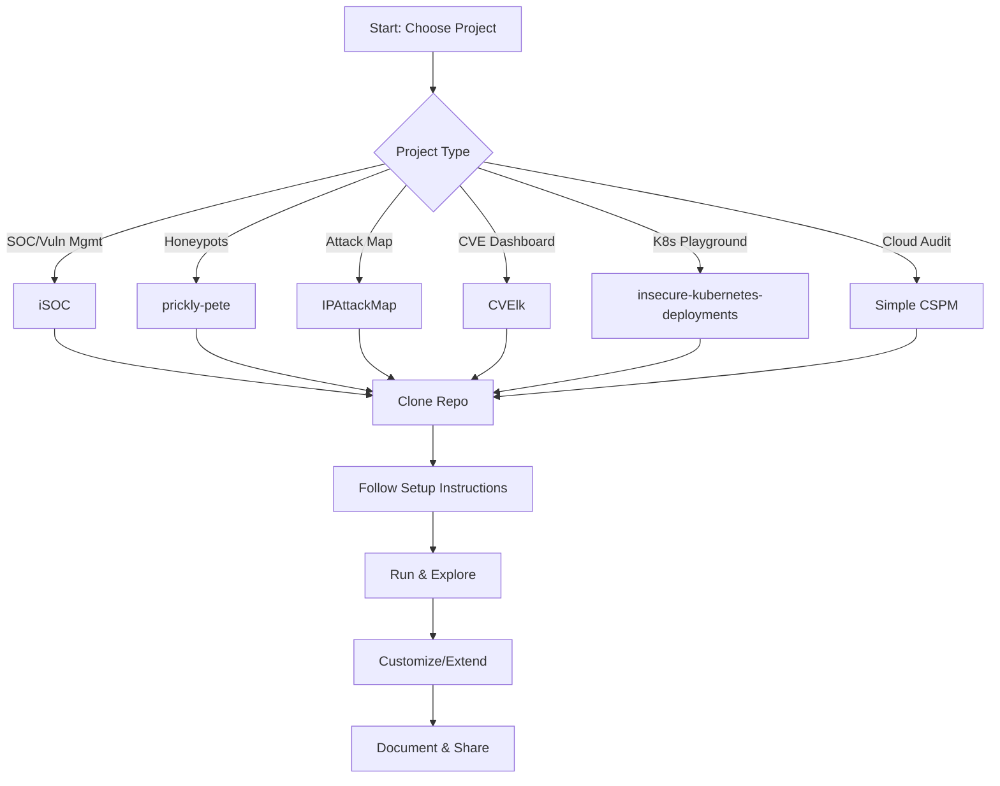

# InfoSec Project Brainstorm & Instant-Start Solutions

## About
This project is a comprehensive, open-source blueprint for modern InfoSec architectures and hands-on security projects. It provides:
- Modular architecture diagrams and explanations for every major security domain
- Instant-start setup guides for open-source tools and platforms
- Deeply researched, innovative project ideas mapped to real-world solutions
- Clear navigation, contribution guidelines, and open licensing for community collaboration

Whether you’re a security engineer, researcher, educator, or builder, this resource is designed to help you plan, deploy, and extend InfoSec solutions quickly and effectively.

## Table of Contents
- [Overview](#overview)
- [Project Summaries](#project-summaries)
- [Summary Table](#summary-table)
- [Visual Diagrams](#visual-diagrams)
- [How to Get Started](#how-to-get-started)
- [Next Steps](#next-steps)

---

## Overview
This document summarizes a range of open-source InfoSec projects you can start instantly, including both original brainstormed ideas and top solutions found via research. Use this as a reference for planning, setup, and further development.

---

## Project Summaries

### 1. Vulnerability Management & SOC
**iSOC** ([GitHub](https://github.com/alexfrancow/iSOC))
- Deploys a mini Security Operations Center (SOC) using Docker Compose.
- Components: Vulnerability scanning (OpenVAS), log management (ELK), monitoring (Zabbix), asset management (MongoDB).
- Use: Clone, install Docker & Docker Compose, run setup script, visualize vulnerabilities and logs in Kibana.

### 2. Honeypots & Attack Monitoring
**prickly-pete** ([GitHub](https://github.com/philcryer/prickly-pete))
- Instantly launches a suite of honeypots using Docker (SSH, web, ICS/SCADA, DNS, FTP, MySQL, etc.).
- Use: Clone, run script, monitor logs for real-time attacks.

### 3. Cyber Attack Visualization
**IPAttackMap (IPew)** ([GitHub](https://github.com/shildenbrand/IPAttackMap))
- D3.js-based cyber attack map for fun, demos, or education.
- Use: Clone, open `index.html` in browser, optionally feed your own attack data.

### 4. CVE Dashboard & Vulnerability Research
**CVElk** ([GitHub](https://github.com/jgamblin/CVElk))
- Autoconfigures an ELK stack and loads all NVD and EPSS CVE data.
- Use: Clone, run install script, access Kibana at `http://localhost:5601/`.

### 5. Insecure Kubernetes Playground
**insecure-kubernetes-deployments** ([GitHub](https://github.com/latiotech/insecure-kubernetes-deployments))
- Deploys a purposely insecure Kubernetes cluster for testing security tools and learning about misconfigurations.
- Use: Requires Terraform, Helm, AWS CLI (for EKS), or adapt for local clusters.

### 6. Cloud Security Posture Management (CSPM) in Google Sheets
**Simple CSPM** ([Website](https://simplecspm.com/))
- Audits your Google Cloud for exposed resources and misconfigurations using Google Sheets and Apps Script.
- Use: Copy the Google Sheet, set up permissions, run the audit.

### 7. Other Brainstormed Open Source Project Ideas
- Threat Feed Aggregator
- Lightweight SIEM
- Phishing Simulation Platform
- Automated Vulnerability Scanner
- Cloud Security Audit Tool
- Password Breach Checker
- Security Awareness Training Portal
- Incident Response Playbook
- Dark Web Paste Monitor
- OSINT Toolkit

---

## Deeply Researched & Innovative InfoSec Project Ideas (2024)

### 1. AI-Enhanced Security Operations

#### a. AI-Powered Honeypots
- **Description:** Deploy honeypots that use AI/LLMs to dynamically adapt their behavior, services, and deception techniques to lure attackers and gather threat intelligence.
- **Reference:** [AI Sweden Project](https://www.ai.se/en/project/ai-powered-honeypots)
- **Features:**
  - Shapeshifting environments (web, IoT, ICS, etc.)
  - Federated learning for distributed intelligence
  - Real-time attacker interaction analysis
  - Metrics for deception effectiveness

#### b. AI-Driven Penetration Testing Agents
- **Description:** Use LLMs to automate web app pentesting, payload generation, and vulnerability reporting.
- **Examples:**
  - [VibePenTester](https://github.com/firetix/vibe-pen-tester): LLM-powered web vulnerability scanner
  - [KaliGPT](https://infosecwriteups.com/kaligpt-the-cybersecurity-sidekick-you-wish-you-had-during-that-3am-incident-2fbb2bc43c5f?gi=845c500607c7&source=rss----7b722bfd1b8d---4): AI assistant for offensive security
- **Features:**
  - Automated exploit and payload generation
  - Context-aware vulnerability scanning
  - Real-time reporting and remediation suggestions
  - Integration with local/offline LLMs for privacy

#### c. AI-Driven Threat Intelligence Aggregator
- **Description:** Aggregate, correlate, and summarize threat feeds using NLP and LLMs for actionable intelligence.
- **Features:**
  - Automated feed ingestion (OSINT, CTI, dark web)
  - Entity extraction (IOCs, CVEs, malware names)
  - Alerting and dashboarding

### 2. Advanced Database Security

#### a. Voxkryptia: Modular AI-Driven Database Security
- **Reference:** [Voxkryptia](https://github.com/hejhdiss/Voxkryptia)
- **Features:**
  - AI-powered access anomaly detection
  - Context-aware query validation (LLM-based)
  - Zero-knowledge role assignment
  - Real-time data visibility matrix
  - Geo-fencing and blockchain-based query logs
  - Differential privacy for sensitive data

### 3. Cyber DNA & Attack Attribution

#### a. Cyber DNA Profiler (CDNAP)
- **Reference:** [CDNAP](https://github.com/Alien979/cdnap)
- **Features:**
  - Software and network “genome” mapping
  - Attack pattern sequencing and attribution
  - Predictive vulnerability analysis using ML
  - Visualization of threat evolution

### 4. Classic & Modern Security Operations

#### a. Instant SOC/ELK Stack
- **Description:** Deploy a mini-SOC with vulnerability scanning, log management, and dashboards.
- **Examples:**
  - [iSOC](https://github.com/alexfrancow/iSOC)
  - [CVElk](https://github.com/jgamblin/CVElk)
- **Features:**
  - OpenVAS, Zabbix, ELK, asset management
  - Automated reporting

#### b. Multi-Honeypot Suites
- **Description:** Deploy a range of honeypots (SSH, web, ICS, DNS, etc.) for research and monitoring.
- **Example:** [prickly-pete](https://github.com/philcryer/prickly-pete)

#### c. Cyber Attack Visualization
- **Description:** Real-time or simulated attack maps for education or demo.
- **Example:** [IPAttackMap](https://github.com/shildenbrand/IPAttackMap)

### 5. Cloud & Container Security

#### a. Insecure Kubernetes Playground
- **Description:** Deploy purposely insecure K8s clusters for tool testing and training.
- **Example:** [insecure-kubernetes-deployments](https://github.com/latiotech/insecure-kubernetes-deployments)

#### b. Cloud Security Posture Management (CSPM)
- **Description:** Audit cloud resources for misconfigurations using open-source or serverless tools.
- **Example:** [Simple CSPM](https://simplecspm.com/)

### 6. Other Innovative Ideas
- Automated Phishing Simulation Platform
- Password Breach Checker
- Security Awareness Training Portal
- Incident Response Automation
- Dark Web Paste Monitor
- OSINT Toolkit
- Blockchain-based Immutable Audit Logs
- Biometric/Voice-Verified Query Approvals
- Differential Privacy Analytics

### 7. Emerging Trends & Research Directions
- Federated Learning for Security
- LLM-powered Security Copilots
- Self-Healing Infrastructure
- AI-Driven Deception-as-a-Service

### 8. Summary Table

| Project/Concept                | Category                | Key Features/Innovations                        |
|------------------------------- |------------------------|-------------------------------------------------|
| AI-Powered Honeypots           | Deception/Threat Intel | Adaptive, federated, LLM-driven, shapeshifting  |
| VibePenTester, KaliGPT         | Pentesting/AI          | LLM-based, payload gen, context-aware, reporting|
| Voxkryptia                     | DB Security/AI         | Anomaly detection, ZK proofs, LLM query analysis|
| CDNAP                          | Attribution/ML         | Cyber DNA, attack sequencing, ML, visualization |
| iSOC, CVElk                    | SOC/ELK                | Instant deploy, vuln mgmt, dashboards           |
| prickly-pete                   | Honeypots              | Multi-protocol, Dockerized, research            |
| IPAttackMap                    | Visualization          | Real-time, D3.js, demo/education                |
| insecure-k8s-deployments       | Cloud/Container        | Insecure K8s, tool testing, training            |
| Simple CSPM                    | Cloud Audit            | GCP audit, Google Sheets, serverless            |
| Blockchain Audit Logs          | Audit/Compliance       | Tamper-proof, distributed, immutable            |
| Biometric Query Approvals      | AuthN/AuthZ            | Voice/biometric, high-assurance                 |
| Differential Privacy Analytics | Privacy/Analytics      | Secure, privacy-preserving data analysis        |

---

## Summary Table

| Project Name                    | Purpose                                  | How to Start Instantly                |
|---------------------------------|------------------------------------------|---------------------------------------|
| iSOC                           | Mini SOC, vuln mgmt, log analysis        | Docker Compose, run script            |
| prickly-pete                   | Multi-honeypot deployment                | Docker Compose, run script            |
| IPAttackMap (IPew)              | Cyber attack visualization               | Open HTML file in browser             |
| CVElk                          | CVE dashboard with ELK                   | Docker Compose, run install script    |
| insecure-kubernetes-deployments | Insecure K8s for testing                 | Terraform/Helm, deploy to EKS/local   |
| Simple CSPM                     | GCP audit in Google Sheets               | Copy Sheet, set permissions, run      |

---

## Visual Diagrams

### Project Selection & Deployment Workflow

---

## How to Get Started
1. Pick a project above.
2. Clone the repository (if using an existing open-source project).
3. Follow the setup instructions (usually Docker Compose or a shell script).
4. Start using, customizing, or extending the tool for your needs.

---

## Next Steps
- Choose a project to try.
- Request detailed setup, customization, or help building your own from scratch.
- [To be filled in:] Add visual diagrams and deeper technical guides as needed. 

## Explore by Security Domain

- [Project Ideas by Security Domain](docs/project_ideas.md)
- [AI Agentic Discussions](docs/ai_agentic_discussions.md)
- [Architecture Diagrams](docs/architecture/)
- [Setup Guides](docs/setup_guides/)

---

## 📚 Documentation Navigation

### 🏗️ Architecture Docs
- [Network Security](docs/architecture/network_security.md)
- [Application Security](docs/architecture/application_security.md)
- [Cloud Security](docs/architecture/cloud_security.md)
- [Endpoint Security](docs/architecture/endpoint_security.md)
- [Identity & Access Management (IAM)](docs/architecture/iam.md)
- [Security Operations (SOC/SIEM/IR)](docs/architecture/security_operations.md)
- [Threat Intelligence & Hunting](docs/architecture/threat_intel.md)
- [Vulnerability Management](docs/architecture/vuln_management.md)
- [Data Security & Privacy](docs/architecture/data_privacy.md)
- [Offensive Security](docs/architecture/offensive_security.md)
- [Deception & Honeypots](docs/architecture/deception_honeypots.md)
- [Security Awareness & Training](docs/architecture/security_awareness.md)
- [Governance, Risk, and Compliance (GRC)](docs/architecture/grc.md)
- [DevSecOps & Automation](docs/architecture/devsecops.md)
- [Emerging Tech](docs/architecture/emerging_tech.md)

### 🚀 Setup Guides
- [DevSecOps CI/CD Pipeline](docs/setup_guides/devsecops_ci_cd_pipeline.md)
- [Self-Healing Infrastructure](docs/setup_guides/self_healing_infrastructure.md)
- [SBOM Dashboard & Alerting](docs/setup_guides/sbom_dashboard.md)
- [Open-Source SIEM](docs/setup_guides/open_source_siem.md)
- [AI-Powered Honeypot](docs/setup_guides/ai_powered_honeypot.md)
- [Threat Intelligence Platform](docs/setup_guides/threat_intel_platform.md)
- [Phishing Simulation Platform](docs/setup_guides/phishing_simulation.md)
- [OSINT Toolkit](docs/setup_guides/osint_toolkit.md)
- [Security Awareness Portal](docs/setup_guides/security_awareness_portal.md)
- [Incident Response Playbook](docs/setup_guides/incident_response_playbook.md)
- [Password Audit Tool](docs/setup_guides/password_audit_tool.md)
- [Dark Web Monitor](docs/setup_guides/dark_web_monitor.md)
- [Compliance Automation](docs/setup_guides/compliance_automation.md)
- [Vulnerability Management Dashboard](docs/setup_guides/vuln_management_dashboard.md)

### 🏢 Industry-Specific Security Guidance

| Industry              | Compliance Frameworks         | Key Risks/Threats         | Recommended Architectures/Guides                                      |
|---------------------- |------------------------------|---------------------------|-----------------------------------------------------------------------|
| Finance               | PCI DSS, SOX, GLBA           | APTs, fraud, insider      | [Finance Security](docs/industry_guides/finance_security.md)          |
| Healthcare            | HIPAA, HITECH, GDPR          | Ransomware, PHI leaks     | [Healthcare Security](docs/industry_guides/healthcare_security.md)    |
| Critical Infrastructure| NERC CIP, NIST, ISA/IEC 62443| OT/ICS, supply chain      | [Critical Infrastructure Security](docs/industry_guides/critical_infrastructure_security.md) |
| SaaS/Tech             | SOC 2, ISO 27001, GDPR       | Cloud, supply chain, API  | [SaaS/Tech Security](docs/industry_guides/saas_tech_security.md)      |
| Government            | FISMA, FedRAMP, CJIS, GDPR   | Espionage, exfiltration   | [Government Security](docs/industry_guides/government_security.md)    |
| Education             | FERPA, GDPR                  | Phishing, ransomware      | [Education Security](docs/industry_guides/education_security.md)      |

--- 