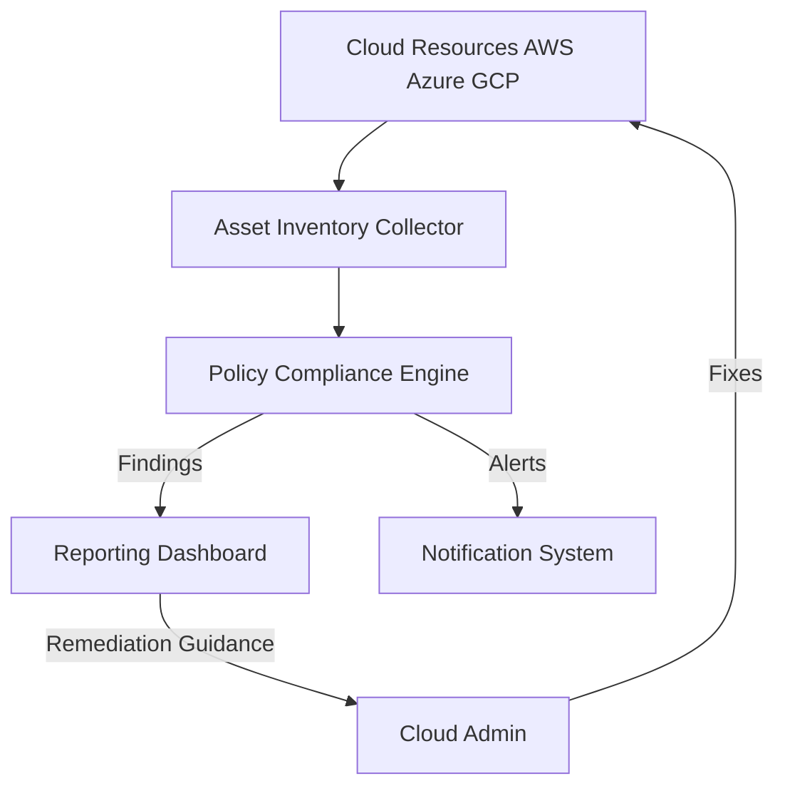
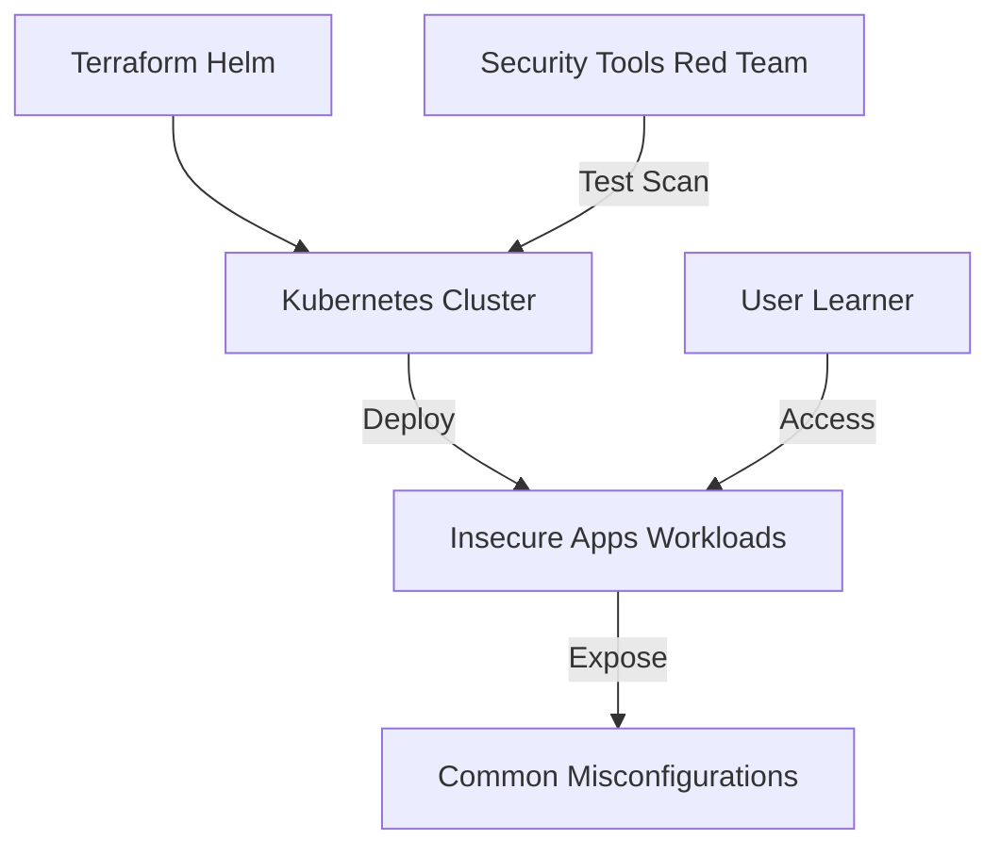

# Cloud Security Architectures

---

## 1. Cloud Security Posture Management (CSPM)

**Description:**
CSPM tools continuously audit cloud resources for misconfigurations, compliance violations, and security risks across multi-cloud environments.

**Architecture Diagram:**

**Key Components:**
- Asset Inventory Collector: Gathers resource metadata from cloud APIs.
- Policy Compliance Engine: Checks configurations against best practices and compliance standards.
- Reporting Dashboard: Visualizes findings and trends.
- Notification System: Sends alerts for critical issues.
- Cloud Admin: Receives guidance and applies remediations.

---

## 2. Insecure Kubernetes Playground

**Description:**
A purposely insecure Kubernetes environment for testing security tools, learning about misconfigurations, and practicing attack/defense scenarios.

**Architecture Diagram:**

**Key Components:**
- Terraform Helm: Automates cluster and workload deployment.
- Kubernetes Cluster: The testbed environment.
- Insecure Apps Workloads: Deliberately vulnerable containers and services.
- Common Misconfigurations: Open ports, weak RBAC, public secrets, etc.
- Security Tools Red Team: Used to scan, exploit, and test the environment.
- User Learner: Interacts with the playground for hands-on experience. 