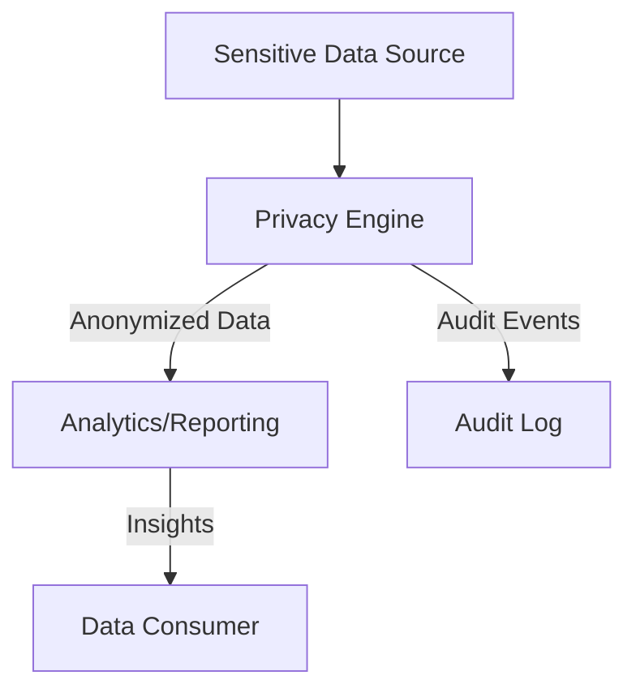
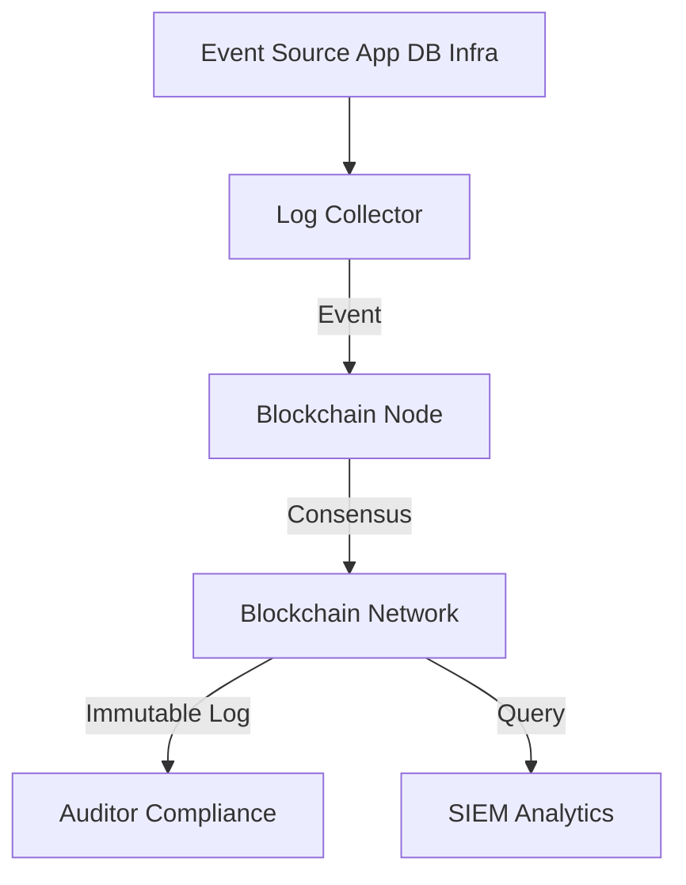

# Data Security & Privacy Architectures

---

## 1. Differential Privacy Analytics

**Description:**
Applies differential privacy techniques to sensitive datasets, enabling secure analytics and reporting without exposing individual data points.

**Architecture Diagram:**

**Key Components:**
- Privacy Engine: Applies differential privacy algorithms (e.g., [OpenDP](https://opendp.org/)).
- Analytics/Reporting: Secure data analysis and visualization.
- Audit Log: Records access and privacy events.
- Data Consumer: Receives insights, not raw data.

---

## 2. Blockchain-Based Immutable Audit Logs

**Description:**
Uses blockchain to create tamper-proof, distributed logs of security events, access, and compliance actions.

**Architecture Diagram:**

**Key Components:**
- Log Collector: Gathers events from various sources.
- Blockchain Node: Writes events to the blockchain (e.g., [Hyperledger Fabric](https://www.hyperledger.org/use/fabric), [Ethereum](https://ethereum.org/)).
- Blockchain Network: Distributed ledger for consensus and storage.
- Auditor Compliance: Reviews immutable logs for investigations and audits.
- SIEM Analytics: Queries logs for security analysis. 