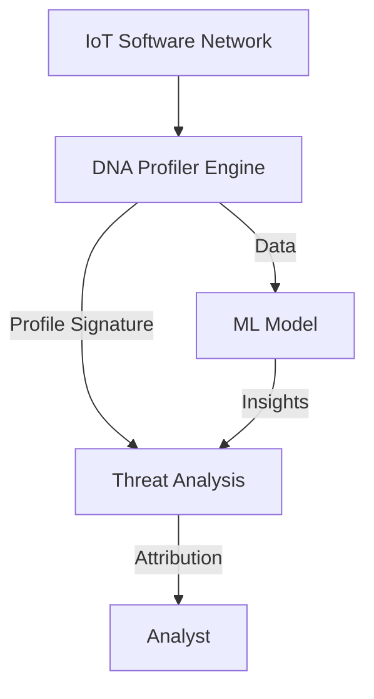
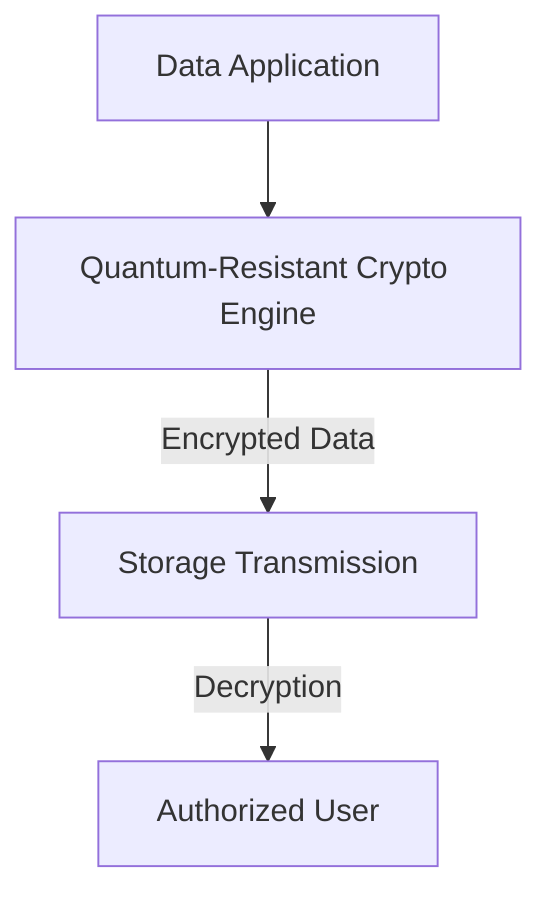
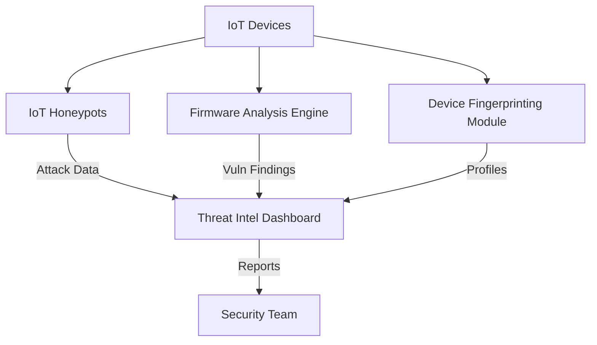

# Emerging Tech Architectures

---

## 1. Cyber DNA Profiler

**Description:**
Profiles software, networks, and attacks using ML and graph theory for attribution, prediction, and threat evolution analysis.

**Architecture Diagram:**

**Key Components:**
- DNA Profiler Engine: Extracts unique signatures (e.g., [CDNAP](https://github.com/Alien979/cdnap)).
- ML Model: Learns and predicts threats.
- Threat Analysis: Correlates and attributes attacks.
- Analyst: Consumes insights for defense.

---

## 2. Quantum-Resistant Encryption Tool

**Description:**
Implements and tests post-quantum cryptography algorithms to secure data against future quantum attacks.

**Architecture Diagram:**

**Key Components:**
- Quantum-Resistant Crypto Engine: Implements algorithms (e.g., NTRU, Kyber).
- Storage/Transmission: Where encrypted data resides or travels.
- Authorized User: Can decrypt with proper keys.

---

## 3. IoT Security Lab

**Description:**
A testbed for IoT device security, including honeypots, firmware analysis, and device fingerprinting.

**Architecture Diagram:**

**Key Components:**
- IoT Honeypots: Attract and log attacks on IoT protocols.
- Firmware Analysis Engine: Scans for vulnerabilities in device firmware.
- Device Fingerprinting Module: Identifies and profiles devices.
- Threat Intel Dashboard: Aggregates and visualizes findings.
- Security Team: Consumes reports for action. 