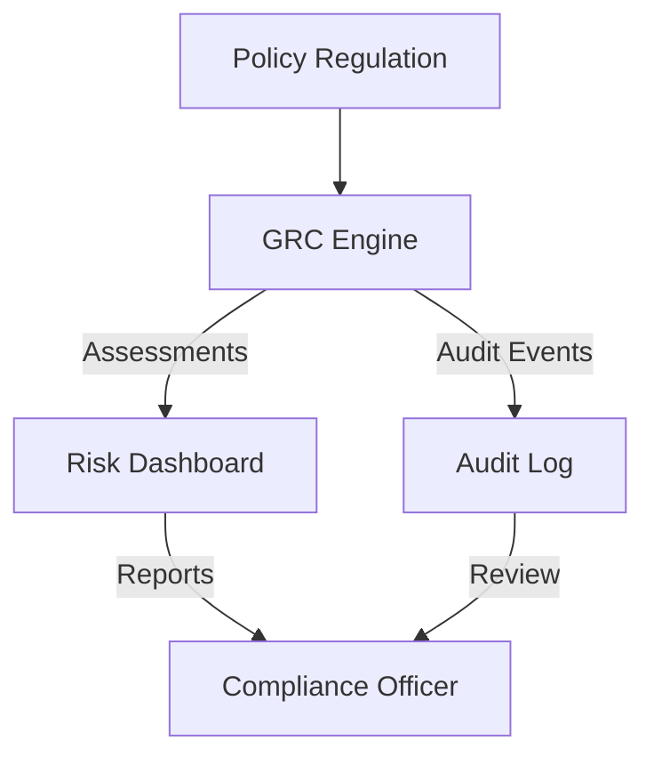
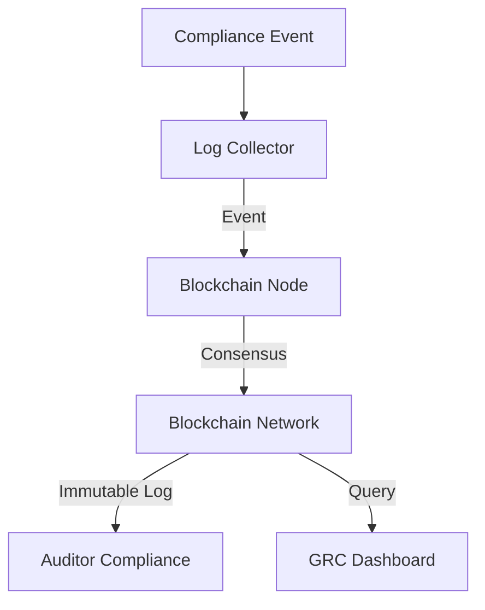

# Governance, Risk, and Compliance (GRC) Architectures

---

## 1. Compliance Automation Tool

**Description:**
Automates policy management, risk assessment, and compliance reporting for regulatory frameworks (e.g., GDPR, HIPAA, SOC2).

**Architecture Diagram:**

**Key Components:**
- GRC Engine: Maps controls, automates assessments, and tracks compliance (e.g., [OpenGRC](https://github.com/opengrc/opengrc)).
- Risk Dashboard: Visualizes risk, compliance status, and trends.
- Audit Log: Records compliance actions and events.
- Compliance Officer: Reviews reports and ensures regulatory adherence.

---

## 2. Blockchain Audit Logs

**Description:**
Uses blockchain to create tamper-proof, distributed logs of compliance actions, access, and security events.

**Architecture Diagram:**

**Key Components:**
- Log Collector: Gathers compliance and security events.
- Blockchain Node: Writes events to the blockchain (e.g., [Hyperledger Fabric](https://www.hyperledger.org/use/fabric)).
- Blockchain Network: Distributed ledger for consensus and storage.
- Auditor Compliance: Reviews immutable logs for investigations and audits.
- GRC Dashboard: Visualizes compliance status and audit trails. 