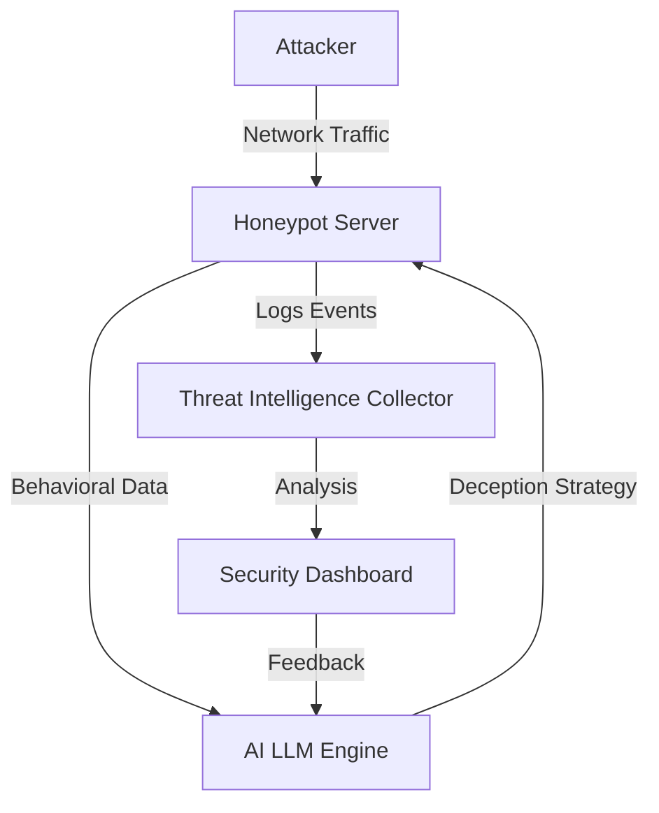
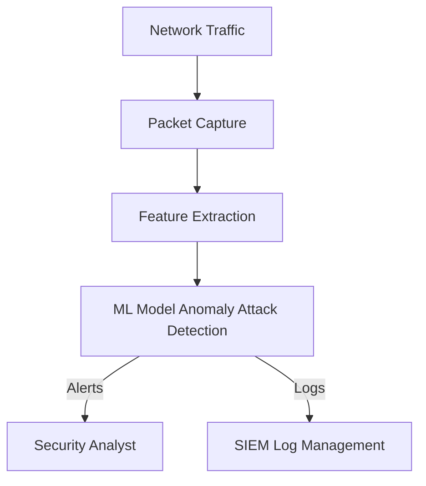

# Network Security Architectures

---

## 1. AI-Powered Honeypots

**Description:**
AI-powered honeypots use machine learning and LLMs to dynamically adapt their behavior, services, and deception techniques to lure attackers and gather threat intelligence.

**Architecture Diagram:**

**Key Components:**
- Honeypot Server: Exposes decoy services and collects interaction data.
- AI LLM Engine: Analyzes attacker behavior and adapts honeypot responses.
- Threat Intelligence Collector: Aggregates logs and events for analysis.
- Security Dashboard: Visualizes attacks, trends, and adapts strategies.

---

## 2. ML-Based Intrusion Detection System (IDS)

**Description:**
A machine learning-based IDS monitors network traffic, extracts features, and uses ML models to detect anomalies and attacks in real time.

**Architecture Diagram:**

**Key Components:**
- Packet Capture: Collects raw network data.
- Feature Extraction: Processes packets into features for ML.
- ML Model: Classifies traffic as normal or malicious.
- Security Analyst: Receives alerts for investigation.
- SIEM Log Management: Stores events for correlation and compliance. 