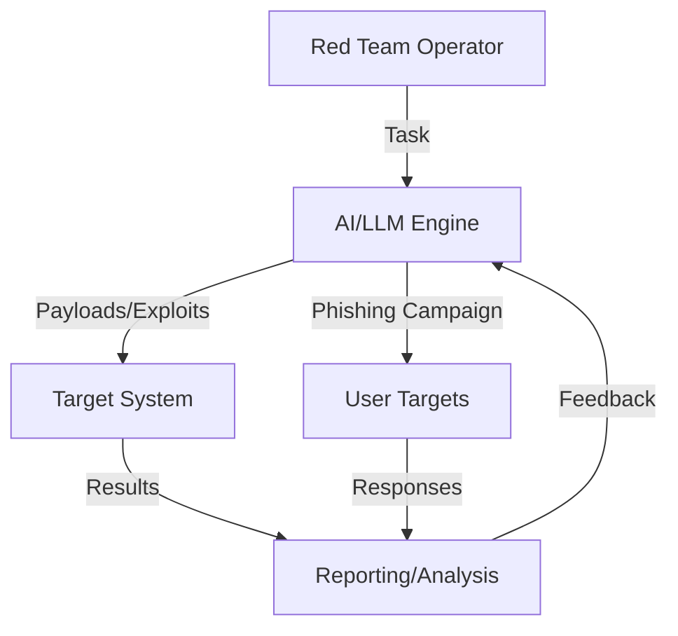
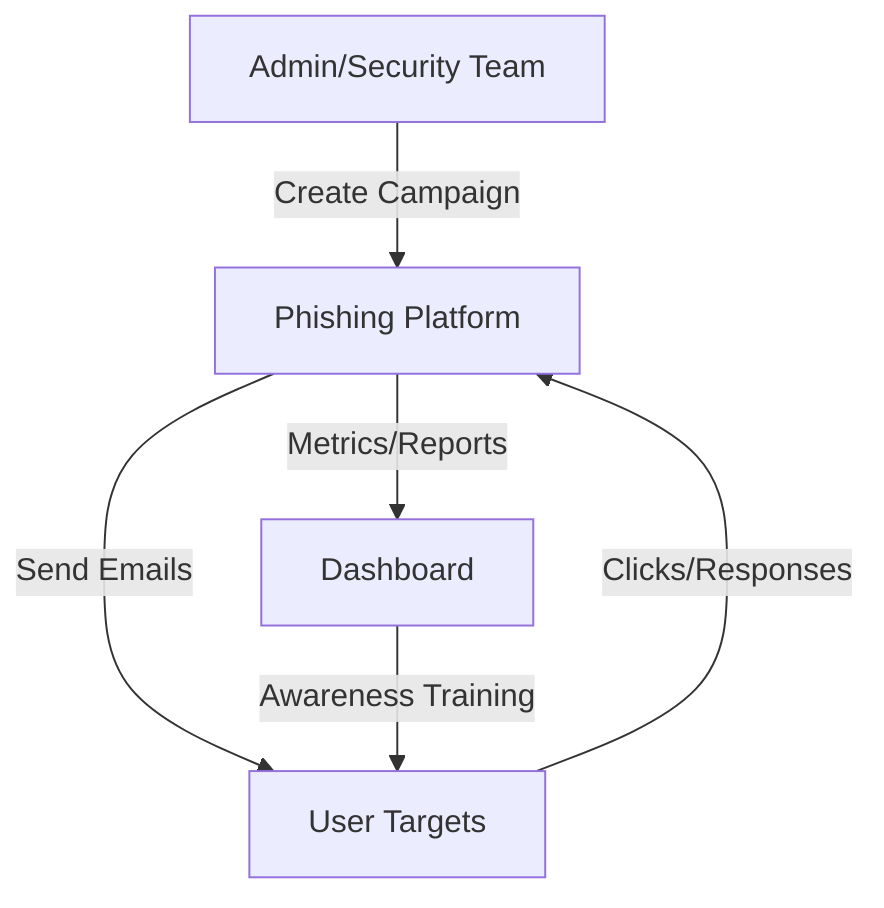

# Offensive Security Architectures

---

## 1. LLM Pentesting Agents & KaliGPT

**Description:**
AI-powered agents automate red team tasks, generate payloads, and assist with exploitation, reporting, and attack chain simulation.

**Architecture Diagram:**

**Key Components:**
- AI/LLM Engine: Generates attack payloads, phishing emails, and assists with exploitation (e.g., [KaliGPT](https://infosecwriteups.com/kaligpt-the-cybersecurity-sidekick-you-wish-you-had-during-that-3am-incident-2fbb2bc43c5f?gi=845c500607c7&source=rss----7b722bfd1b8d---4)).
- Target System: System or application under test.
- Reporting/Analysis: Tracks results, provides feedback, and generates reports.
- User Targets: Recipients of simulated phishing campaigns.

---

## 2. Phishing Simulation Platform

**Description:**
Sends simulated phishing emails to users, tracks responses, and provides metrics for awareness training and risk assessment.

**Architecture Diagram:**

**Key Components:**
- Phishing Platform: Manages campaigns, templates, and delivery (e.g., [GoPhish](https://getgophish.com/)).
- User Targets: Employees or test users.
- Dashboard: Visualizes metrics, click rates, and risk.
- Awareness Training: Delivers follow-up training to users who fall for simulations. 