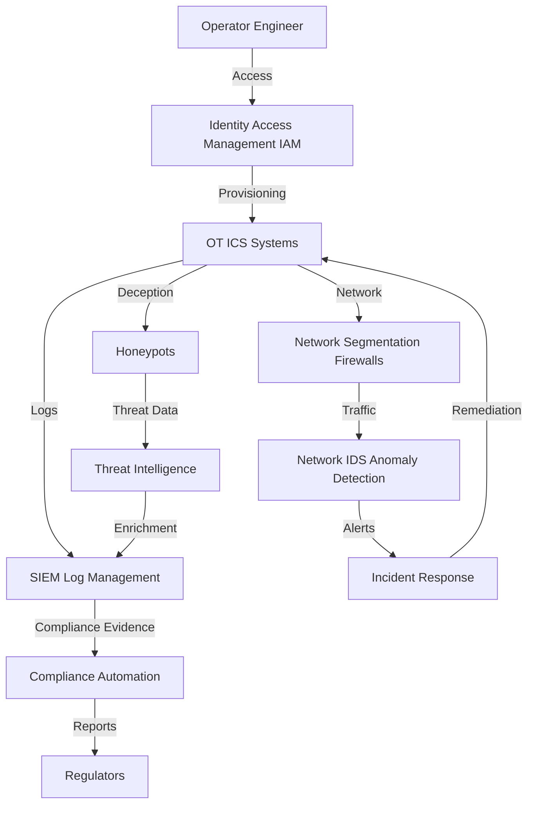

# Critical Infrastructure Security Setup Guide

---

## Overview
This guide provides actionable InfoSec recommendations for critical infrastructure sectors (energy, utilities, OT/ICS), mapping compliance requirements (NERC CIP, NIST, ISA/IEC 62443) to open-source tools and architectures. It includes example configurations, incident response workflows, and sector-specific best practices.

---

## Compliance Checklist
| Requirement/Control                | Regulation (NERC CIP/NIST/ISA-IEC 62443) | Open-Source Tool(s)         | Setup Guide/Architecture Doc                |
|------------------------------------|------------------------------------------|-----------------------------|---------------------------------------------|
| Asset Inventory & Network Segmentation | NERC CIP, ISA-IEC 62443              | NetBox, custom scripts      | (Add custom guide as needed)                |
| Network IDS & Anomaly Detection    | NERC CIP, NIST, ISA-IEC 62443            | Zeek, Suricata, Snort       | [Network Security](../architecture/network_security.md)        |
| Honeypots & Deception              | NERC CIP, ISA-IEC 62443                  | Conpot, prickly-pete        | [Deception & Honeypots](../architecture/deception_honeypots.md) |
| Self-Healing Infrastructure        | NIST, ISA-IEC 62443                      | OPA, Cloud Custodian, Ansible| [Self-Healing Infra Guide](../setup_guides/self_healing_infrastructure.md)      |
| Threat Intelligence                | NERC CIP, NIST                           | MISP, OpenCTI               | [Threat Intel Platform](../setup_guides/threat_intel_platform.md)               |
| Incident Response & Reporting      | NERC CIP, NIST, ISA-IEC 62443            | TheHive, MkDocs, SIEM       | [IR Playbook Guide](../setup_guides/incident_response_playbook.md)              |
| Log Management & Monitoring        | NERC CIP, NIST                           | Wazuh, ELK Stack, iSOC      | [SIEM Setup Guide](../setup_guides/open_source_siem.md)                         |

---

## Key Compliance Requirements
- **NERC CIP:** Cybersecurity for bulk electric systems, asset inventory, incident response, access control
- **NIST:** Risk management, continuous monitoring, incident response
- **ISA/IEC 62443:** Industrial automation and control system security, network segmentation, anomaly detection

---

## Recommended Open-Source Tools & Architectures
| Requirement                | Open-Source Tool(s)         | Setup Guide/Architecture Doc                |
|----------------------------|-----------------------------|---------------------------------------------|
| Network IDS/Anomaly Detection| Zeek, Suricata, Snort      | [Network Security](../architecture/network_security.md)        |
| Honeypots/Deception        | Conpot, prickly-pete        | [Deception & Honeypots](../architecture/deception_honeypots.md) |
| Self-Healing Infrastructure| OPA, Cloud Custodian, Ansible| [Self-Healing Infra Guide](self_healing_infrastructure.md)      |
| Threat Intelligence        | MISP, OpenCTI               | [Threat Intel Platform](threat_intel_platform.md)               |
| Incident Response          | TheHive, Markdown+MkDocs    | [IR Playbook Guide](incident_response_playbook.md)              |

---

## Example: Network IDS for OT/ICS
- Deploy [Zeek](https://zeek.org/) or [Suricata](https://suricata.io/) to monitor OT/ICS network segments
- Configure rules for detecting protocol anomalies, unauthorized access, and lateral movement
- Integrate with SIEM for alerting and correlation

---

## Example: Honeypots for Deception
- Deploy [Conpot](https://github.com/mushorg/conpot) to emulate industrial control systems
- Use [prickly-pete](https://github.com/chriskiehl/prickly-pete) for multi-protocol deception
- Monitor and analyze attacker interactions for threat intelligence

---

## Incident Response Workflow (ICS Attack)
1. **Detection:** IDS or SIEM alert for suspicious activity in OT/ICS network
2. **Triage:** Analyst reviews logs, identifies affected assets and attack vector
3. **Containment:** Isolate affected network segments, block malicious traffic
4. **Eradication:** Remove malware, restore system integrity, patch vulnerabilities
5. **Recovery:** Restore operations, monitor for recurrence
6. **Reporting:** Document incident, notify regulators as required by NERC CIP/NIST/ISA-IEC 62443

---

## Sector-Specific Tips
- Strictly segment IT and OT networks; use firewalls and unidirectional gateways
- Regularly update asset inventories and network diagrams
- Test incident response with simulated OT/ICS attack scenarios
- Monitor for supply chain risks and third-party access
- Document all compliance activities for audits

---

## References
- [NERC CIP Standards](https://www.nerc.com/pa/Stand/Pages/CIPStandards.aspx)
- [NIST Cybersecurity Framework](https://www.nist.gov/cyberframework)
- [ISA/IEC 62443 Overview](https://www.isa.org/standards-and-publications/isa-standards/isa-iec-62443) 

---

## Case Studies & Research

- [Stuxnet Worm (2010)](https://www.cisa.gov/news-events/news/stuxnet-worm): First known malware to target industrial control systems, causing physical damage to Iranian nuclear centrifuges.
- [Colonial Pipeline Ransomware Attack (2021)](https://www.cisa.gov/news-events/news/colonial-pipeline-ransomware-attack): Ransomware disrupted fuel supply across the US East Coast, highlighting OT/IT convergence risks.
- [Ukraine Power Grid Attacks (2015-2016)](https://www.sans.org/white-papers/36297/): Cyberattacks caused widespread power outages, demonstrating the vulnerability of critical infrastructure.
- [NERC CIP Compliance Lessons Learned](https://www.nerc.com/pa/CI/Comp/Pages/Lessons-Learned.aspx): Official lessons learned from NERC CIP compliance and incident response.
- [Dragos Year in Review: ICS/OT Threats](https://www.dragos.com/year-in-review/): Annual report on industrial cyber threats and trends.

---

## Reference Architecture

**Key Components:**
- IAM: Keycloak, Authelia
- OT ICS Systems: Industrial control systems
- Network Segmentation: Firewalls, VLANs, unidirectional gateways
- Network IDS: Zeek, Suricata, Snort
- Honeypots: Conpot, prickly-pete
- SIEM: Wazuh, ELK Stack, iSOC
- Threat Intelligence: MISP, OpenCTI
- Compliance Automation: Chef InSpec, OpenControl

--- 