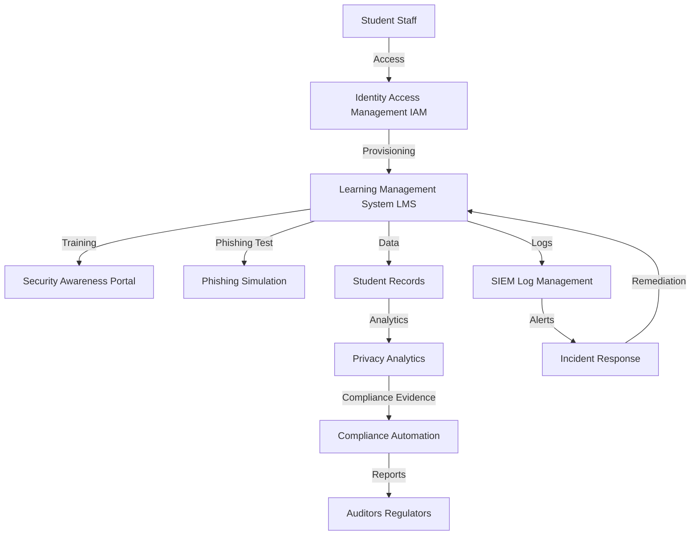

# Education Sector Security Setup Guide

---

## Overview
This guide provides actionable InfoSec recommendations for educational institutions, mapping compliance requirements (FERPA, GDPR) to open-source tools and architectures. It includes example configurations, incident response workflows, and sector-specific best practices.

---

## Compliance Checklist
| Requirement/Control                | Regulation (FERPA/GDPR) | Open-Source Tool(s)         | Setup Guide/Architecture Doc                |
|------------------------------------|-------------------------|-----------------------------|---------------------------------------------|
| Security Awareness & Training      | FERPA                   | Moodle, Quizzer             | [Awareness Portal](../setup_guides/security_awareness_portal.md)              |
| Phishing Simulation                | FERPA                   | GoPhish                     | [Phishing Simulation](../setup_guides/phishing_simulation.md)                 |
| Data Privacy Analytics             | FERPA, GDPR             | OpenDP, custom analytics    | [Data Privacy Architecture](../architecture/data_privacy.md)                  |
| Incident Response & Breach Notification | FERPA, GDPR        | TheHive, MkDocs, SIEM       | [IR Playbook Guide](../setup_guides/incident_response_playbook.md)            |
| SIEM/Log Management                | FERPA                   | Wazuh, ELK Stack, iSOC      | [SIEM Setup Guide](../setup_guides/open_source_siem.md)                       |
| Access Control & IAM               | FERPA, GDPR             | Keycloak, Authelia          | [IAM Architecture](../architecture/iam.md)                                    |
| Data Encryption                    | FERPA, GDPR             | OpenSSL, GnuPG              | (Add custom guide as needed)                                                    |

---

## Key Compliance Requirements
- **FERPA:** Student data privacy, access control, breach notification
- **GDPR:** Data privacy, consent management, breach reporting

---

## Recommended Open-Source Tools & Architectures
| Requirement                | Open-Source Tool(s)         | Setup Guide/Architecture Doc                |
|----------------------------|-----------------------------|---------------------------------------------|
| Security Awareness         | Moodle, Quizzer             | [Awareness Portal](../setup_guides/security_awareness_portal.md)              |
| Phishing Simulation        | GoPhish                     | [Phishing Simulation](../setup_guides/phishing_simulation.md)                 |
| Data Privacy Analytics     | OpenDP, custom analytics    | [Data Privacy Architecture](../architecture/data_privacy.md)                  |
| Incident Response Playbooks| TheHive, Markdown+MkDocs    | [IR Playbook Guide](../setup_guides/incident_response_playbook.md)            |
| SIEM/Log Management        | Wazuh, ELK Stack, iSOC      | [SIEM Setup Guide](../setup_guides/open_source_siem.md)                       |

---

## Example: Security Awareness & Phishing Simulation
- Deploy [Moodle](https://moodle.org/) or [Quizzer](https://github.com/quizzer/quizzer) for security training
- Use [GoPhish](https://getgophish.com/) to run simulated phishing campaigns
- Track user participation and improvement over time

---

## Example: Data Privacy Analytics for FERPA/GDPR
- Use [OpenDP](https://opendp.org/) or custom analytics to analyze student data with privacy guarantees
- Log and monitor access to sensitive student records
- Regularly review and update privacy policies

---

## Incident Response Workflow (Student Data Breach)
1. **Detection:** SIEM or alert for unauthorized access to student records
2. **Triage:** Analyst reviews logs, confirms scope of breach
3. **Containment:** Disable compromised accounts, isolate affected systems
4. **Eradication:** Remove malware, patch vulnerabilities, reset credentials
5. **Recovery:** Restore systems, monitor for recurrence
6. **Reporting:** Notify affected students, parents, and regulators as required by FERPA/GDPR

---

## Sector-Specific Tips
- Train staff and students on phishing, social engineering, and privacy best practices
- Use role-based access control (RBAC) for student information systems
- Regularly test incident response with simulated data breach scenarios
- Document all compliance activities for audits
- Monitor for ransomware and data leak threats targeting education

---

## Case Studies & Research

- [University of California Ransomware Attack (2021)](https://www.ucop.edu/information-technology-services/initiatives/uc-cyber-risk-program/uc-cyber-risk-coordination-center/uc-cyber-incident-response.html): Ransomware attack impacted multiple UC campuses, highlighting the need for IR and awareness.
- [Blackbaud Data Breach (2020)](https://www.educause.edu/educause-review/2020/10/blackbaud-breach-lessons-learned): Cloud provider breach affected hundreds of educational institutions.
- [EDUCAUSE: Cybersecurity in Higher Ed](https://www.educause.edu/focus-areas-and-initiatives/policy-and-security/cybersecurity-program): Research, best practices, and policy for education sector security.
- [FERPA Case Studies](https://studentprivacy.ed.gov/case-studies): Real-world examples of FERPA compliance and enforcement.
- [K-12 Cybersecurity Resource Center](https://www.k12six.org/): Threat intelligence and incident tracking for K-12 schools.

---

## References
- [FERPA Overview](https://studentprivacy.ed.gov/ferpa)
- [GDPR Guide](https://gdpr.eu/) 

---

## Reference Architecture

**Key Components:**
- IAM: Keycloak, Authelia
- LMS: Moodle, custom platforms
- Security Awareness Portal: Moodle, Quizzer
- Phishing Simulation: GoPhish
- SIEM: Wazuh, ELK Stack, iSOC
- Privacy Analytics: OpenDP, custom analytics
- Compliance Automation: Chef InSpec, OpenControl

--- 