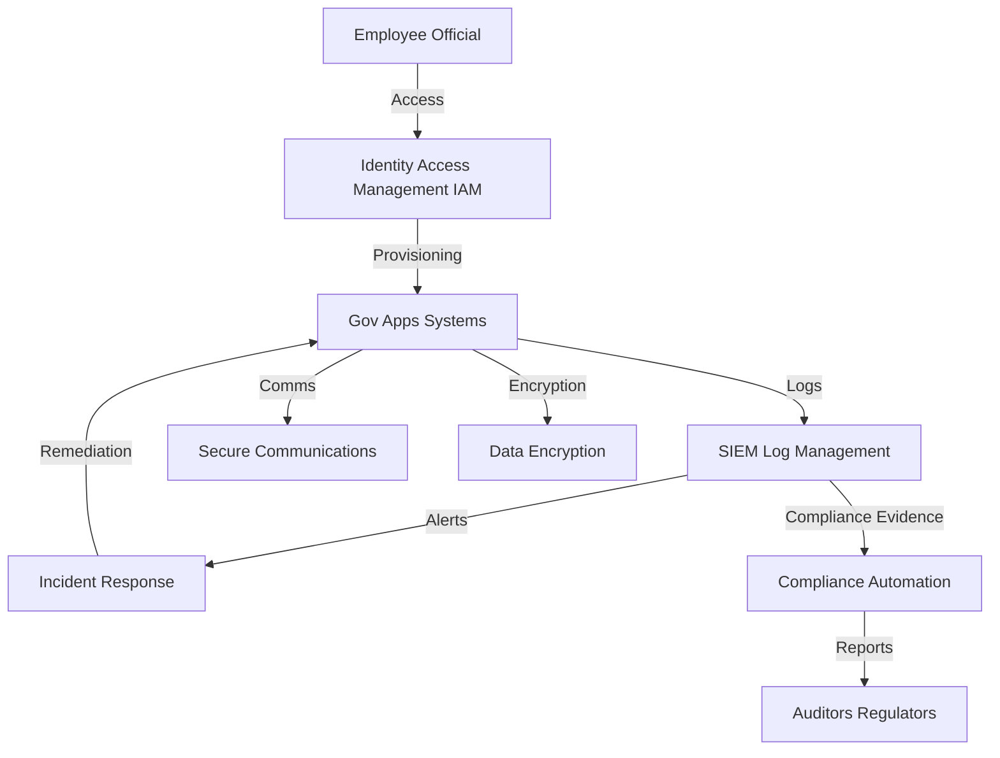

# Government Sector Security Setup Guide

---

## Overview
This guide provides actionable InfoSec recommendations for government organizations, mapping compliance requirements (FISMA, FedRAMP, CJIS, GDPR) to open-source tools and architectures. It includes example configurations, incident response workflows, and sector-specific best practices.

---

## Compliance Checklist
| Requirement/Control                | Regulation (FISMA/FedRAMP/CJIS/GDPR) | Open-Source Tool(s)         | Setup Guide/Architecture Doc                |
|------------------------------------|--------------------------------------|-----------------------------|---------------------------------------------|
| Identity & Access Management       | FISMA, FedRAMP, CJIS, GDPR           | Keycloak, Authelia          | [IAM Architecture](../architecture/iam.md)  |
| SIEM/Log Management                | FISMA, FedRAMP, CJIS                 | Wazuh, ELK Stack, iSOC      | [SIEM Setup Guide](../setup_guides/open_source_siem.md)     |
| Secure Communications              | FISMA, CJIS                          | Matrix, Signal, Wire        | (Add custom guide as needed)                |
| Compliance Automation              | FISMA, FedRAMP, CJIS                 | Chef InSpec, OpenControl    | [Compliance Automation](../setup_guides/compliance_automation.md) |
| Incident Response & Reporting      | FISMA, FedRAMP, CJIS, GDPR           | TheHive, MkDocs, SIEM       | [IR Playbook Guide](../setup_guides/incident_response_playbook.md) |
| Data Privacy & Encryption          | GDPR, FISMA, FedRAMP                 | OpenSSL, GnuPG, OpenDP      | [Data Privacy Architecture](../architecture/data_privacy.md)         |

---

## Key Compliance Requirements
- **FISMA:** Federal information security management, risk assessment, continuous monitoring
- **FedRAMP:** Cloud service provider security, authorization, continuous monitoring
- **CJIS:** Criminal justice data protection, access control, audit logging
- **GDPR:** Data privacy, consent management, breach reporting

---

## Recommended Open-Source Tools & Architectures
| Requirement                | Open-Source Tool(s)         | Setup Guide/Architecture Doc                |
|----------------------------|-----------------------------|---------------------------------------------|
| Identity & Access Mgmt     | Keycloak, Authelia          | [IAM Architecture](../architecture/iam.md)  |
| SIEM/Log Management        | Wazuh, ELK Stack, iSOC      | [SIEM Setup Guide](../setup_guides/open_source_siem.md)     |
| Secure Communications      | Matrix, Signal, Wire        | (Add custom guide as needed)                |
| Compliance Automation      | Chef InSpec, OpenControl    | [Compliance Automation](../setup_guides/compliance_automation.md) |
| Incident Response          | TheHive, Markdown+MkDocs    | [IR Playbook Guide](../setup_guides/incident_response_playbook.md) |

---

## Example: IAM for FISMA/FedRAMP
- Deploy [Keycloak](https://www.keycloak.org/) or [Authelia](https://www.authelia.com/)
- Integrate with SSO, MFA, and user provisioning
- Enforce least privilege, RBAC, and regular access reviews

---

## Example: SIEM for CJIS/FISMA
- Deploy [Wazuh](https://documentation.wazuh.com/) or [ELK Stack](https://www.elastic.co/what-is/elk-stack)
- Collect logs from endpoints, network devices, and cloud services
- Set up alerts for unauthorized access, data exfiltration, and policy violations

---

## Incident Response Workflow (Data Exfiltration)
1. **Detection:** SIEM alert for suspicious data transfer or unauthorized access
2. **Triage:** Analyst reviews logs, identifies affected systems and data
3. **Containment:** Disable compromised accounts, block malicious IPs, isolate affected systems
4. **Eradication:** Remove malware, patch vulnerabilities, reset credentials
5. **Recovery:** Restore systems, monitor for recurrence
6. **Reporting:** Document incident, notify authorities and affected individuals as required by FISMA/FedRAMP/CJIS/GDPR

---

## Sector-Specific Tips
- Classify data and apply controls based on sensitivity and regulatory requirements
- Use end-to-end encryption for sensitive communications
- Regularly test incident response with simulated data exfiltration scenarios
- Automate compliance evidence collection and reporting
- Document all compliance activities for audits

---

## Case Studies & Research

- [US OPM Data Breach (2015)](https://www.gao.gov/products/gao-16-487): Compromise of US Office of Personnel Management led to the exposure of 21.5 million records.
- [Australian Parliament Cyberattack (2019)](https://www.cyber.gov.au/news/australian-parliament-house-cyber-incident): State-sponsored attack targeted government email systems.
- [CISA: Cyber Essentials for Government](https://www.cisa.gov/cyber-essentials): Foundational guidance for government cybersecurity.
- [FedRAMP Case Studies](https://www.fedramp.gov/case-studies/): Real-world examples of cloud security and compliance in government.
- [NIST Special Publication 800-53](https://csrc.nist.gov/publications/detail/sp/800-53/rev-5/final): Comprehensive security and privacy controls for federal information systems.

---

## Reference Architecture

**Key Components:**
- IAM: Keycloak, Authelia
- Gov Apps/Systems: Government applications and databases
- SIEM: Wazuh, ELK Stack, iSOC
- Secure Communications: Matrix, Signal, Wire
- Compliance Automation: Chef InSpec, OpenControl
- Data Encryption: OpenSSL, GnuPG

---

## References
- [FISMA Implementation Project](https://csrc.nist.gov/projects/risk-management)
- [FedRAMP Documentation](https://www.fedramp.gov/documents/)
- [CJIS Security Policy](https://www.fbi.gov/services/cjis/cjis-security-policy-resource-center)
- [GDPR Guide](https://gdpr.eu/) 