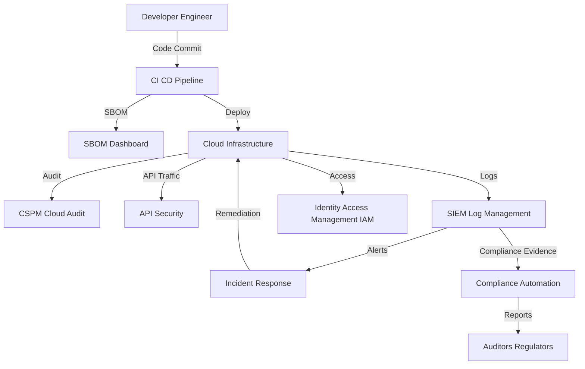

# SaaS/Tech Sector Security Setup Guide

---

## Overview
This guide provides actionable InfoSec recommendations for SaaS and technology companies, mapping compliance requirements (SOC 2, ISO 27001, GDPR) to open-source tools and architectures. It includes example configurations, incident response workflows, and sector-specific best practices.

---

## Compliance Checklist
| Requirement/Control                | Regulation (SOC 2/ISO 27001/GDPR) | Open-Source Tool(s)         | Setup Guide/Architecture Doc                |
|------------------------------------|-----------------------------------|-----------------------------|---------------------------------------------|
| CI/CD Security & Code Scanning     | SOC 2, ISO 27001                  | Semgrep, Checkov, Trivy     | [DevSecOps CI/CD Guide](../setup_guides/devsecops_ci_cd_pipeline.md) |
| SBOM & Supply Chain Management     | SOC 2, ISO 27001                  | Syft, Trivy, CycloneDX      | [SBOM Dashboard](../setup_guides/sbom_dashboard.md)                |
| Cloud Security Posture Management  | SOC 2, ISO 27001                  | Prowler, Cloud Custodian    | [Cloud Security](../architecture/cloud_security.md)                 |
| API Security                       | SOC 2, ISO 27001                  | OWASP ZAP, 42Crunch, APISec | [Application Security](../architecture/application_security.md)      |
| Access Control & IAM               | SOC 2, ISO 27001, GDPR            | Keycloak, Authelia          | [IAM Architecture](../architecture/iam.md)  |
| Data Privacy & Encryption          | GDPR, ISO 27001                   | OpenSSL, GnuPG, OpenDP      | [Data Privacy Architecture](../architecture/data_privacy.md)         |
| Incident Response & Breach Notification | SOC 2, ISO 27001, GDPR      | TheHive, MkDocs, SIEM       | [IR Playbook Guide](../setup_guides/incident_response_playbook.md)   |
| Compliance Automation              | SOC 2, ISO 27001                  | Chef InSpec, OpenControl    | [Compliance Automation](../setup_guides/compliance_automation.md)   |

---

## Key Compliance Requirements
- **SOC 2:** Security, availability, processing integrity, confidentiality, privacy
- **ISO 27001:** Information security management system (ISMS), risk assessment, controls
- **GDPR:** Data privacy, consent management, breach reporting

---

## Recommended Open-Source Tools & Architectures
| Requirement                | Open-Source Tool(s)         | Setup Guide/Architecture Doc                |
|----------------------------|-----------------------------|---------------------------------------------|
| CI/CD Security             | Semgrep, Checkov, Trivy     | [DevSecOps CI/CD Guide](../setup_guides/devsecops_ci_cd_pipeline.md) |
| SBOM & Supply Chain        | Syft, Trivy, CycloneDX      | [SBOM Dashboard](../setup_guides/sbom_dashboard.md)                |
| CSPM/Cloud Audit           | Prowler, Cloud Custodian    | [Cloud Security](../architecture/cloud_security.md)                 |
| API Security               | OWASP ZAP, 42Crunch, APISec| [Application Security](../architecture/application_security.md)      |
| Compliance Automation      | Chef InSpec, OpenControl    | [Compliance Automation](../setup_guides/compliance_automation.md)   |
| Incident Response          | TheHive, Markdown+MkDocs    | [IR Playbook Guide](../setup_guides/incident_response_playbook.md)   |

---

## Example: CI/CD Security for SOC 2/ISO 27001
- Integrate [Semgrep](https://semgrep.dev/), [Checkov](https://www.checkov.io/), and [Trivy](https://aquasecurity.github.io/trivy/) into your CI/CD pipeline
- Automate SAST, DAST, dependency, and IaC scanning
- Enforce pipeline gates for critical findings

---

## Example: SBOM & Supply Chain Security
- Use [Syft](https://github.com/anchore/syft) or [Trivy](https://aquasecurity.github.io/trivy/) to generate SBOMs
- Monitor dependencies for vulnerabilities and license compliance
- Use [CycloneDX Web](https://github.com/CycloneDX/cyclonedx-web) for dashboarding

---

## Incident Response Workflow (Cloud/API Breach)
1. **Detection:** SIEM or API security tool alert for suspicious activity or data exfiltration
2. **Triage:** Analyst reviews logs, correlates with cloud and API activity
3. **Containment:** Revoke API keys, isolate affected services, block malicious IPs
4. **Eradication:** Patch vulnerabilities, rotate credentials, update configs
5. **Recovery:** Restore services, monitor for recurrence
6. **Reporting:** Document incident, notify affected customers and regulators as required by SOC 2/ISO 27001/GDPR

---

## Sector-Specific Tips
- Enforce least privilege and strong IAM for cloud and SaaS platforms
- Regularly review and test incident response plans for cloud-native threats
- Monitor for supply chain risks in third-party dependencies and APIs
- Automate compliance evidence collection for audits
- Document all compliance activities and security controls

---

## References
- [SOC 2 Overview](https://www.aicpa.org/resources/article/soc-2-report-explained)
- [ISO 27001 Guide](https://www.iso.org/isoiec-27001-information-security.html)
- [GDPR Guide](https://gdpr.eu/) 

---

## Case Studies & Research

- [GitHub OAuth Token Breach (2022)](https://github.blog/2022-04-15-security-alert-stolen-oauth-user-tokens/): Stolen OAuth tokens led to unauthorized access to private repositories.
- [SolarWinds Supply Chain Attack (2020)](https://www.cisa.gov/news-events/news/solarwinds-supply-chain-compromise): Compromise of a software supply chain affected thousands of organizations.
- [Okta Security Incident (2022)](https://www.okta.com/blog/2022/03/okta-security-incident/): Third-party breach impacted identity provider for many SaaS platforms.
- [OWASP Top 10 for APIs](https://owasp.org/www-project-api-security/): Key risks and best practices for API security in SaaS environments.
- [Cloud Security Alliance Research](https://cloudsecurityalliance.org/research/): Whitepapers and best practices for SaaS and cloud security.

---

## Reference Architecture

**Key Components:**
- CI CD: GitHub Actions, GitLab CI, Jenkins
- SBOM: Syft, Trivy, CycloneDX
- Cloud Audit: Prowler, Cloud Custodian
- API Security: OWASP ZAP, 42Crunch, APISec
- IAM: Keycloak, Authelia
- SIEM: Wazuh, ELK Stack, iSOC
- Compliance Automation: Chef InSpec, OpenControl

--- 