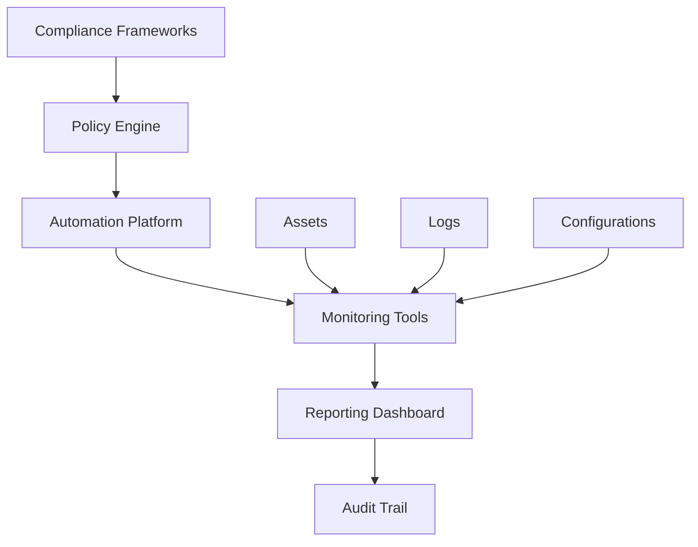

# Compliance Automation Setup Guide

## Overview
This guide provides a comprehensive approach to automating compliance monitoring, reporting, and enforcement across multiple regulatory frameworks including SOX, PCI DSS, HIPAA, GDPR, and FedRAMP.

## Architecture



## Prerequisites
- Linux/Unix environment
- Docker and Docker Compose
- Git
- Python 3.8+
- Access to target systems for scanning

## Step 1: Set Up Compliance Automation Platform

### 1.1 Install Core Components
```bash
# Clone the compliance automation repository
git clone https://github.com/your-org/compliance-automation
cd compliance-automation

# Create virtual environment
python -m venv venv
source venv/bin/activate  # On Windows: venv\Scripts\activate

# Install dependencies
pip install -r requirements.txt
```

### 1.2 Configure Docker Environment
```yaml
# docker-compose.yml
version: '3.8'
services:
  compliance-engine:
    image: compliance-automation:latest
    ports:
      - "8080:8080"
    environment:
      - COMPLIANCE_FRAMEWORK=SOX,PCI,HIPAA
      - SCAN_INTERVAL=3600
    volumes:
      - ./config:/app/config
      - ./reports:/app/reports

  monitoring:
    image: elk:latest
    ports:
      - "9200:9200"
      - "5601:5601"
    volumes:
      - elk-data:/usr/share/elasticsearch/data

  reporting:
    image: grafana:latest
    ports:
      - "3000:3000"
    volumes:
      - grafana-data:/var/lib/grafana

volumes:
  elk-data:
  grafana-data:
```

## Step 2: Configure Compliance Frameworks

### 2.1 SOX Compliance
```yaml
# config/sox.yaml
framework: SOX
controls:
  - id: SOX-001
    name: "Access Control"
    description: "Ensure proper access controls are in place"
    tools:
      - OpenSCAP
      - Wazuh
    scan_interval: 3600
    alert_threshold: 0.8

  - id: SOX-002
    name: "Change Management"
    description: "Monitor system changes and configurations"
    tools:
      - Ansible
      - Git
    scan_interval: 1800
    alert_threshold: 0.9
```

### 2.2 PCI DSS Compliance
```yaml
# config/pci.yaml
framework: PCI-DSS
controls:
  - id: PCI-001
    name: "Firewall Configuration"
    description: "Maintain firewall configuration standards"
    tools:
      - OpenSCAP
      - Nmap
    scan_interval: 7200
    alert_threshold: 0.95

  - id: PCI-002
    name: "Vendor Defaults"
    description: "Change vendor default passwords"
    tools:
      - Hydra
      - Custom scripts
    scan_interval: 3600
    alert_threshold: 1.0
```

### 2.3 HIPAA Compliance
```yaml
# config/hipaa.yaml
framework: HIPAA
controls:
  - id: HIPAA-001
    name: "PHI Protection"
    description: "Protect patient health information"
    tools:
      - OpenDLP
      - Varonis
    scan_interval: 1800
    alert_threshold: 0.9

  - id: HIPAA-002
    name: "Access Controls"
    description: "Implement access controls for PHI"
    tools:
      - Wazuh
      - ELK Stack
    scan_interval: 3600
    alert_threshold: 0.8
```

## Step 3: Implement Monitoring Tools

### 3.1 OpenSCAP Integration
```bash
# Install OpenSCAP
sudo apt-get install openscap-utils

# Create compliance scan script
cat > scan_compliance.sh << 'EOF'
#!/bin/bash
FRAMEWORK=$1
TARGET=$2

# Run OpenSCAP scan
oscap xccdf eval \
  --profile $FRAMEWORK \
  --results results-$FRAMEWORK.xml \
  --report report-$FRAMEWORK.html \
  /usr/share/xml/scap/ssg/content/ssg-ubuntu1804-ds.xml \
  $TARGET

# Parse results and send to compliance engine
python3 parse_results.py results-$FRAMEWORK.xml
EOF

chmod +x scan_compliance.sh
```

### 3.2 Wazuh Integration
```yaml
# config/wazuh-compliance.yaml
wazuh:
  manager: "wazuh-manager"
  port: 1514
  compliance_rules:
    - rule_id: 100001
      name: "SOX Access Control Violation"
      description: "Detect unauthorized access attempts"
      level: 10
      groups: ["sox", "access_control"]
    
    - rule_id: 100002
      name: "PCI Data Exposure"
      description: "Detect potential PCI data exposure"
      level: 12
      groups: ["pci", "data_protection"]
```

### 3.3 ELK Stack Integration
```yaml
# config/elk-compliance.yaml
elasticsearch:
  hosts: ["localhost:9200"]
  index_pattern: "compliance-*"

kibana:
  dashboard:
    - name: "SOX Compliance"
      panels:
        - title: "Control Coverage"
          type: "visualization"
          query: "framework:SOX"
        
        - title: "Violations Over Time"
          type: "visualization"
          query: "framework:SOX AND status:FAILED"

logstash:
  filters:
    - grok:
        match:
          - "message": "%{TIMESTAMP_ISO8601:timestamp} %{LOGLEVEL:level} %{GREEDYDATA:message}"
    - if:
        condition: "[message] =~ /compliance/"
      mutate:
        add_field:
          - "compliance_event": "true"
```

## Step 4: Create Automation Scripts

### 4.1 Compliance Checker
```python
# compliance_checker.py
import yaml
import subprocess
import json
from datetime import datetime
import requests

class ComplianceChecker:
    def __init__(self, config_file):
        with open(config_file, 'r') as f:
            self.config = yaml.safe_load(f)
    
    def run_scan(self, framework, control_id):
        """Run compliance scan for specific control"""
        control = self.get_control(framework, control_id)
        
        # Execute scan based on tool
        for tool in control['tools']:
            result = self.execute_tool(tool, control)
            self.process_results(result, control)
    
    def execute_tool(self, tool, control):
        """Execute specific compliance tool"""
        if tool == 'OpenSCAP':
            return self.run_openscap(control)
        elif tool == 'Wazuh':
            return self.run_wazuh_check(control)
        elif tool == 'OpenDLP':
            return self.run_dlp_scan(control)
    
    def run_openscap(self, control):
        """Run OpenSCAP scan"""
        cmd = [
            'oscap', 'xccdf', 'eval',
            '--profile', control['name'],
            '--results', f"results-{control['id']}.xml",
            '/usr/share/xml/scap/ssg/content/ssg-ubuntu1804-ds.xml'
        ]
        
        result = subprocess.run(cmd, capture_output=True, text=True)
        return {
            'tool': 'OpenSCAP',
            'control_id': control['id'],
            'exit_code': result.returncode,
            'output': result.stdout,
            'timestamp': datetime.now().isoformat()
        }
    
    def process_results(self, result, control):
        """Process and store scan results"""
        # Store in database or send to monitoring system
        self.send_to_monitoring(result, control)
        
        # Check against threshold
        if self.check_threshold(result, control):
            self.send_alert(result, control)
    
    def send_to_monitoring(self, result, control):
        """Send results to monitoring system"""
        payload = {
            'framework': control.get('framework'),
            'control_id': control['id'],
            'result': result,
            'timestamp': datetime.now().isoformat()
        }
        
        requests.post('http://localhost:8080/api/compliance', json=payload)
    
    def check_threshold(self, result, control):
        """Check if result meets compliance threshold"""
        # Implement threshold checking logic
        return result['exit_code'] != 0
    
    def send_alert(self, result, control):
        """Send alert for compliance violation"""
        alert = {
            'severity': 'HIGH',
            'framework': control.get('framework'),
            'control_id': control['id'],
            'message': f"Compliance violation detected: {control['name']}",
            'timestamp': datetime.now().isoformat()
        }
        
        requests.post('http://localhost:8080/api/alerts', json=alert)

if __name__ == "__main__":
    checker = ComplianceChecker('config/compliance.yaml')
    checker.run_scan('SOX', 'SOX-001')
```

### 4.2 Report Generator
```python
# report_generator.py
import pandas as pd
import matplotlib.pyplot as plt
from datetime import datetime, timedelta
import requests

class ComplianceReportGenerator:
    def __init__(self, api_endpoint):
        self.api_endpoint = api_endpoint
    
    def generate_framework_report(self, framework, start_date, end_date):
        """Generate compliance report for specific framework"""
        # Fetch compliance data
        data = self.fetch_compliance_data(framework, start_date, end_date)
        
        # Create report
        report = {
            'framework': framework,
            'period': f"{start_date} to {end_date}",
            'summary': self.generate_summary(data),
            'details': self.generate_details(data),
            'recommendations': self.generate_recommendations(data)
        }
        
        return report
    
    def fetch_compliance_data(self, framework, start_date, end_date):
        """Fetch compliance data from API"""
        params = {
            'framework': framework,
            'start_date': start_date,
            'end_date': end_date
        }
        
        response = requests.get(f"{self.api_endpoint}/compliance", params=params)
        return response.json()
    
    def generate_summary(self, data):
        """Generate executive summary"""
        total_controls = len(data)
        compliant_controls = len([d for d in data if d['status'] == 'COMPLIANT'])
        compliance_rate = (compliant_controls / total_controls) * 100
        
        return {
            'total_controls': total_controls,
            'compliant_controls': compliant_controls,
            'compliance_rate': compliance_rate,
            'critical_violations': len([d for d in data if d['severity'] == 'CRITICAL'])
        }
    
    def generate_details(self, data):
        """Generate detailed compliance breakdown"""
        details = []
        
        for item in data:
            details.append({
                'control_id': item['control_id'],
                'control_name': item['control_name'],
                'status': item['status'],
                'severity': item['severity'],
                'last_scan': item['last_scan'],
                'description': item['description']
            })
        
        return details
    
    def generate_recommendations(self, data):
        """Generate recommendations based on findings"""
        recommendations = []
        
        # Analyze patterns and generate recommendations
        failed_controls = [d for d in data if d['status'] == 'FAILED']
        
        for control in failed_controls:
            recommendations.append({
                'control_id': control['control_id'],
                'priority': 'HIGH' if control['severity'] == 'CRITICAL' else 'MEDIUM',
                'action': f"Address {control['control_name']} compliance issues",
                'timeline': 'Immediate' if control['severity'] == 'CRITICAL' else '30 days'
            })
        
        return recommendations
    
    def export_report(self, report, format='pdf'):
        """Export report in specified format"""
        if format == 'pdf':
            return self.export_pdf(report)
        elif format == 'excel':
            return self.export_excel(report)
        elif format == 'json':
            return self.export_json(report)
    
    def export_pdf(self, report):
        """Export report as PDF"""
        # Implementation for PDF generation
        pass
    
    def export_excel(self, report):
        """Export report as Excel"""
        # Implementation for Excel generation
        pass
    
    def export_json(self, report):
        """Export report as JSON"""
        return json.dumps(report, indent=2)

if __name__ == "__main__":
    generator = ComplianceReportGenerator('http://localhost:8080')
    
    end_date = datetime.now()
    start_date = end_date - timedelta(days=30)
    
    report = generator.generate_framework_report('SOX', start_date, end_date)
    generator.export_report(report, 'pdf')
```

## Step 5: Set Up Automated Scheduling

### 5.1 Cron Jobs
```bash
# Add to crontab
# Compliance scans every hour
0 * * * * /path/to/compliance-automation/scan_compliance.sh SOX all

# Daily compliance reports
0 9 * * * /path/to/compliance-automation/generate_reports.sh

# Weekly compliance summary
0 9 * * 1 /path/to/compliance-automation/weekly_summary.sh
```

### 5.2 Systemd Timers
```ini
# /etc/systemd/system/compliance-scan.timer
[Unit]
Description=Run compliance scans
Requires=compliance-scan.service

[Timer]
OnCalendar=hourly
Persistent=true

[Install]
WantedBy=timers.target
```

```ini
# /etc/systemd/system/compliance-scan.service
[Unit]
Description=Compliance Scan Service
After=network.target

[Service]
Type=oneshot
ExecStart=/path/to/compliance-automation/scan_compliance.sh
User=compliance
Group=compliance

[Install]
WantedBy=multi-user.target
```

## Step 6: Monitoring and Alerting

### 6.1 Grafana Dashboard
```json
{
  "dashboard": {
    "title": "Compliance Overview",
    "panels": [
      {
        "title": "Compliance Rate by Framework",
        "type": "stat",
        "targets": [
          {
            "expr": "compliance_rate{framework=\"SOX\"}",
            "legendFormat": "SOX"
          },
          {
            "expr": "compliance_rate{framework=\"PCI\"}",
            "legendFormat": "PCI"
          }
        ]
      },
      {
        "title": "Violations Over Time",
        "type": "graph",
        "targets": [
          {
            "expr": "rate(compliance_violations_total[1h])",
            "legendFormat": "Violations/Hour"
          }
        ]
      }
    ]
  }
}
```

### 6.2 Alert Rules
```yaml
# alerting-rules.yaml
groups:
  - name: compliance_alerts
    rules:
      - alert: ComplianceViolation
        expr: compliance_rate < 0.9
        for: 5m
        labels:
          severity: warning
        annotations:
          summary: "Compliance rate below threshold"
          description: "Framework {{ $labels.framework }} compliance rate is {{ $value }}"
      
      - alert: CriticalViolation
        expr: compliance_violations_total{severity="critical"} > 0
        for: 1m
        labels:
          severity: critical
        annotations:
          summary: "Critical compliance violation detected"
          description: "Critical violation in {{ $labels.framework }} framework"
```

## Step 7: Testing and Validation

### 7.1 Test Compliance Scans
```bash
# Test SOX compliance scan
./scan_compliance.sh SOX localhost

# Test PCI compliance scan
./scan_compliance.sh PCI localhost

# Test HIPAA compliance scan
./scan_compliance.sh HIPAA localhost
```

### 7.2 Validate Reports
```bash
# Generate test report
python3 report_generator.py --framework SOX --start-date 2024-01-01 --end-date 2024-01-31

# Validate report format
python3 validate_report.py --report report-sox-2024-01.pdf
```

## Troubleshooting

### Common Issues

1. **OpenSCAP Scan Failures**
   ```bash
   # Check OpenSCAP installation
   oscap --version
   
   # Verify SCAP content
   oscap info /usr/share/xml/scap/ssg/content/ssg-ubuntu1804-ds.xml
   ```

2. **Wazuh Connection Issues**
   ```bash
   # Test Wazuh manager connection
   telnet wazuh-manager 1514
   
   # Check Wazuh agent status
   sudo systemctl status wazuh-agent
   ```

3. **ELK Stack Issues**
   ```bash
   # Check Elasticsearch health
   curl -X GET "localhost:9200/_cluster/health?pretty"
   
   # Check Kibana status
   curl -X GET "localhost:5601/api/status"
   ```

### Performance Optimization

1. **Scan Scheduling**: Distribute scans across different time windows to avoid resource contention
2. **Parallel Processing**: Use multiple workers for concurrent compliance checks
3. **Caching**: Cache scan results to reduce redundant checks
4. **Database Optimization**: Use appropriate indexes for compliance data queries

## Security Considerations

1. **Access Control**: Implement role-based access control for compliance data
2. **Encryption**: Encrypt compliance reports and data in transit and at rest
3. **Audit Logging**: Log all compliance-related activities for audit purposes
4. **Network Security**: Secure communication between compliance components

## Maintenance

### Regular Tasks

1. **Update SCAP Content**: Regularly update OpenSCAP content for latest compliance standards
2. **Review Alerts**: Analyze and tune alert thresholds based on false positives
3. **Backup Configuration**: Regularly backup compliance configurations and reports
4. **Performance Monitoring**: Monitor system performance and optimize as needed

### Updates and Patches

```bash
# Update compliance tools
sudo apt-get update && sudo apt-get upgrade openscap-utils

# Update custom scripts
git pull origin main

# Restart services
sudo systemctl restart compliance-automation
```

## Conclusion

This compliance automation setup provides a comprehensive framework for monitoring and maintaining compliance across multiple regulatory standards. Regular maintenance and updates ensure the system remains effective and up-to-date with evolving compliance requirements.

## References

- [OpenSCAP Documentation](https://www.open-scap.org/documentation/)
- [Wazuh Documentation](https://documentation.wazuh.com/)
- [ELK Stack Documentation](https://www.elastic.co/guide/index.html)
- [SOX Compliance Guidelines](https://www.sec.gov/sox)
- [PCI DSS Requirements](https://www.pcisecuritystandards.org/document_library)
- [HIPAA Security Rule](https://www.hhs.gov/hipaa/for-professionals/security/index.html) 