# Pro Workflows: Application Security

## 1. Automated Web Application Scanning
**Problem:** Manual web app testing is slow, inconsistent, and often skipped.

**Workflow:**

```mermaid
flowchart TD
    %% Application Development Lifecycle
    subgraph "Development Phase"
        A1[Code Development - IDE/Editor]
        A2[Static Analysis - IDE Plugins]
        A3[Pre-commit Hooks - Git Hooks]
        A4[Code Review - GitHub/GitLab]
        A5[Branch Protection - Policies]
    end
    
    %% Source Code Security
    subgraph "Source Code Security"
        B1[SAST Scanning - SonarQube/Semgrep]
        B2[Secret Detection - TruffleHog/GitGuardian]
        B3[License Compliance - FOSSA/Black Duck]
        B4[Code Quality - SonarQube/CodeClimate]
        B5[Dependency Scanning - Snyk/Dependabot]
        B6[Custom Security Rules - Organization Policies]
    end
    
    %% Build & Package Security
    subgraph "Build Security"
        C1[Build Process - CI/CD Pipeline]
        C2[Container Security - Trivy/Clair]
        C3[Image Signing - Cosign/Notary]
        C4[SBOM Generation - CycloneDX/SPDX]
        C5[Supply Chain Security - Sigstore]
        C6[Artifact Scanning - Registry/Repository]
    end
    
    %% Dynamic Application Security Testing
    subgraph "DAST & Runtime Security"
        D1[Web App Scanning - OWASP ZAP/Burp Suite]
        D2[API Security Testing - 42Crunch/Postman]
        D3[Load Testing - JMeter/K6]
        D4[Performance Security - Lighthouse]
        D5[Accessibility Security - axe-core]
        D6[Runtime Application Self-Protection - RASP]
    end
    
    %% Infrastructure Security
    subgraph "Infrastructure Security"
        E1[Infrastructure as Code - Terraform/CloudFormation]
        E2[Container Orchestration - Kubernetes Security]
        E3[Cloud Security - AWS/Azure/GCP]
        E4[Network Security - Firewall/WAF]
        E5[Secrets Management - Vault/Secrets Manager]
        E6[Configuration Management - Ansible/Chef]
    end
    
    %% Security Testing Automation
    subgraph "Testing Automation"
        F1[Automated Test Suites - Selenium/Playwright]
        F2[Security Test Orchestration - TestGrid]
        F3[Vulnerability Assessment - Qualys/Tenable]
        F4[Penetration Testing - Automated Tools]
        F5[Compliance Testing - SOX/HIPAA/PCI]
        F6[Performance Testing - Load/Stress]
    end
    
    %% Security Gates & Decision
    subgraph "Security Gates"
        G1[Risk Assessment - CVSS/Severity]
        G2[Policy Enforcement - OPA/Gatekeeper]
        G3[Approval Workflow - Manual/Auto]
        G4[Compliance Checks - Regulatory Requirements]
        G5[Business Impact Analysis]
        G6[Security Metrics - KPIs/Dashboards]
    end
    
    %% Deployment & Runtime Security
    subgraph "Deployment & Runtime"
        H1[Environment Promotion - Dev/Staging/Prod]
        H2[Blue-Green Deployment - Zero Downtime]
        H3[Canary Releases - Gradual Rollout]
        H4[Runtime Monitoring - APM/Logging]
        H5[Security Monitoring - SIEM/EDR]
        H6[Incident Response - SOAR/Playbooks]
    end
    
    %% Feedback & Continuous Improvement
    subgraph "Feedback Loop"
        I1[Security Metrics - Dashboard/Reports]
        I2[Developer Education - Training/Guides]
        I3[Process Improvement - Retrospectives]
        I4[Tool Optimization - Tuning/Configuration]
        I5[Compliance Reporting - Audit/Evidence]
        I6[Threat Intelligence - Updates/Feeds]
    end
    
    %% Data Flow Connections
    A1 --> A2
    A2 --> A3
    A3 --> A4
    A4 --> A5
    
    A5 --> B1
    B1 --> B2
    B2 --> B3
    B3 --> B4
    B4 --> B5
    B5 --> B6
    
    B6 --> C1
    C1 --> C2
    C2 --> C3
    C3 --> C4
    C4 --> C5
    C5 --> C6
    
    C6 --> D1
    D1 --> D2
    D2 --> D3
    D3 --> D4
    D4 --> D5
    D5 --> D6
    
    D6 --> E1
    E1 --> E2
    E2 --> E3
    E3 --> E4
    E4 --> E5
    E5 --> E6
    
    E6 --> F1
    F1 --> F2
    F2 --> F3
    F3 --> F4
    F4 --> F5
    F5 --> F6
    
    F6 --> G1
    G1 --> G2
    G2 --> G3
    G3 --> G4
    G4 --> G5
    G5 --> G6
    
    G6 --> H1
    H1 --> H2
    H2 --> H3
    H3 --> H4
    H4 --> H5
    H5 --> H6
    
    H6 --> I1
    I1 --> I2
    I2 --> I3
    I3 --> I4
    I4 --> I5
    I5 --> I6
    
    %% Feedback Loops
    I2 --> A1
    I3 --> B1
    I4 --> C1
    I5 --> G1
    I6 --> D1
```

**Tools:** OWASP ZAP, Arachni, Nikto, GitHub Actions, Jenkins

**Automation/AI Tips:**
- Integrate DAST into CI/CD for every build
- Use LLMs to summarize findings and suggest fixes

**Metrics:** 90%+ coverage of web apps, faster feedback, fewer vulns in prod

**References:** OWASP ZAP docs, GitHub Security Lab

---

## 2. API Security Automation
**Problem:** APIs are a top attack vector, but often lack automated security testing.

**Workflow:**
```mermaid
flowchart TD
    A[API Spec/Endpoints] --> B[API Scanner (OWASP ZAP/42Crunch)]
    B -->|Scan| C[API Security Findings]
    C -->|Block/Pass| D[CI/CD Pipeline]
    C -->|Report| E[Developer Feedback]
```
**Tools:** OWASP ZAP, 42Crunch, APISec, Postman, GitHub Actions

**Automation/AI Tips:**
- Auto-scan APIs on every update or deployment
- Use LLMs to triage and prioritize findings

**Metrics:** 80%+ reduction in API vulns, faster remediation

**References:** OWASP API Security Top 10, 42Crunch docs

---

## 3. Secure Code Review with LLMs
**Problem:** Manual code review is slow, inconsistent, and misses subtle issues.

**Workflow:**
```mermaid
flowchart TD
    A[Pull Request] --> B[LLM Code Review (OpenAI/Llama)]
    B -->|Findings| C[Developer Feedback]
    B -->|Approve| D[Merge]
```
**Tools:** OpenAI, Llama, GitHub Copilot, SonarQube, Semgrep

**Automation/AI Tips:**
- Use LLMs to review code for security issues and suggest remediations
- Integrate with PR workflows for instant feedback

**Metrics:** 70%+ reduction in code review time, higher vuln detection

**References:** GitHub Copilot, SonarQube, OpenAI API 