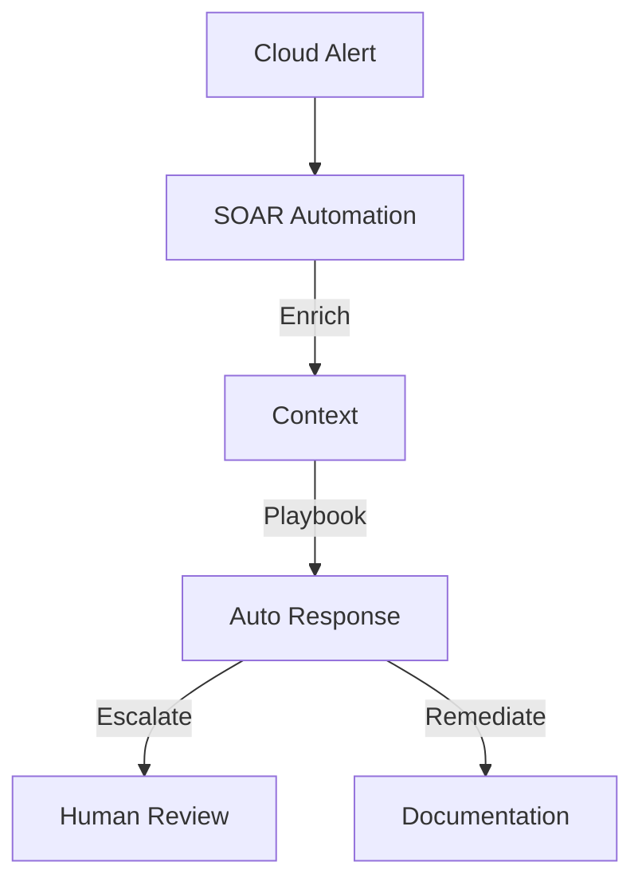
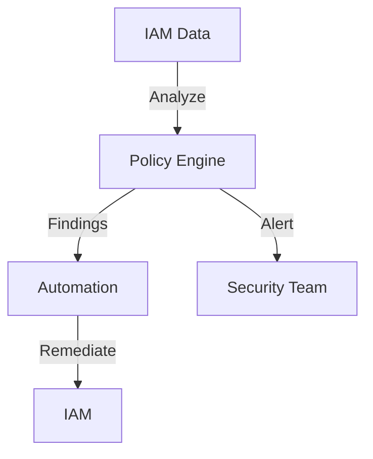

# Pro Workflows: Cloud Security

## 1. CSPM Automation (Cloud Security Posture Management)
**Problem:** Manual cloud config reviews miss misconfigurations and compliance gaps.

**Workflow:**

```mermaid
flowchart TD
    %% Multi-Cloud Infrastructure
    subgraph CloudInfra
        A1[AWS] --> A2[Azure]
        A2 --> A3[GCP]
        A3 --> A4[Kubernetes]
        A4 --> A5[Serverless]
        A5 --> A6[Containers]
    end
    subgraph ScanLayer
        B1[CSPM Tools] --> B2[Compliance Scan]
        B2 --> B3[Vuln Scan]
        B3 --> B4[Container Sec]
        B4 --> B5[Secrets Scan]
        B5 --> B6[Net Sec]
    end
    subgraph Policy
        C1[Compliance] --> C2[Custom Policy]
        C2 --> C3[Risk Score]
        C3 --> C4[Enforcement]
        C4 --> C5[Reporting]
        C5 --> C6[Reg Mapping]
    end
    subgraph ConfigMgmt
        D1[IaC] --> D2[Drift Detect]
        D2 --> D3[Baseline]
        D3 --> D4[Change Mgmt]
        D4 --> D5[Version Ctrl]
        D5 --> D6[Deploy Auto]
    end
    subgraph Auto
        E1[Serverless] --> E2[Orchestration]
        E2 --> E3[Event Auto]
        E3 --> E4[API Int]
        E4 --> E5[Custom Scripts]
        E5 --> E6[Third-party]
    end
    subgraph MonAlert
        F1[Cloud Mon] --> F2[SIEM]
        F2 --> F3[Alert Mgmt]
        F3 --> F4[Dashboard]
        F4 --> F5[Log Agg]
        F5 --> F6[Perf Mon]
    end
    subgraph SecOps
        G1[IR] --> G2[Threat Detect]
        G2 --> G3[Forensics]
        G3 --> G4[Compliance]
        G4 --> G5[Metrics]
        G5 --> G6[Notify]
    end
    A6 --> B1
    B6 --> C1
    C6 --> D1
    D6 --> E1
    E6 --> F1
    F6 --> G1
    G6 --> C1
```

**Tools:** Prowler, Cloud Custodian, Steampipe, AWS Config, Lambda, Ansible

**Automation/AI Tips:**
- Schedule regular scans and auto-remediation for common misconfigs
- Use LLMs to summarize findings and suggest fixes

**Metrics:** 90%+ reduction in manual reviews, faster compliance

**References:** Prowler docs, Cloud Custodian, AWS Well-Architected

---

## 2. Automated Cloud Incident Response
**Problem:** Cloud incidents require fast, coordinated response across services.

**Workflow:**

**Tools:** Shuffle, StackStorm, AWS Lambda, Azure Logic Apps, TheHive

**Automation/AI Tips:**
- Use SOAR to trigger cloud-specific playbooks
- Auto-document all actions for compliance

**Metrics:** 60%+ faster cloud IR, consistent response

**References:** AWS IR Playbooks, Azure Security Center

---

## 3. Cloud IAM Hygiene Automation
**Problem:** Excessive permissions and stale accounts are a top cloud risk.

**Workflow:**

**Tools:** Steampipe, Cloud Custodian, AWS IAM Access Analyzer, Lambda

**Automation/AI Tips:**
- Regularly scan for excessive/stale permissions
- Auto-remediate or alert on risky accounts

**Metrics:** 80%+ reduction in cloud IAM risk, faster cleanup

**References:** Steampipe docs, AWS IAM Analyzer, Cloud Custodian 