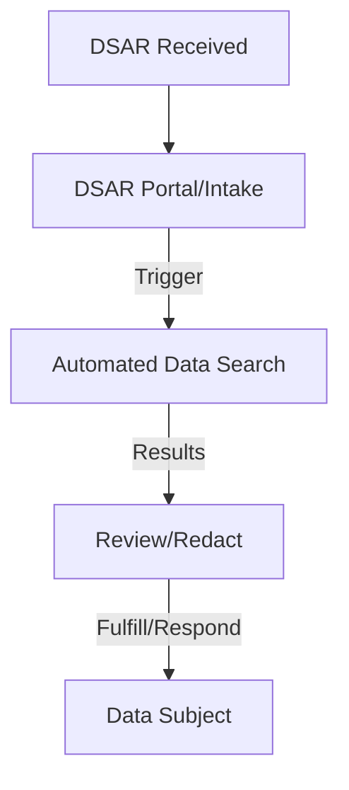

# Pro Workflows: Data Privacy

## 1. Automated Data Discovery & Classification
**Problem:** Sensitive data is often scattered and untracked, leading to privacy risks and compliance failures.

**Workflow:**

```mermaid
flowchart TD
    %% Data Sources & Storage
    subgraph "Data Sources & Storage"
        A1[Structured Data - Databases/SQL]
        A2[Unstructured Data - Files/Documents]
        A3[Cloud Storage - S3/Blob/Cloud Storage]
        A4[Applications - Web Apps/APIs]
        A5[Email Systems - Exchange/Gmail]
        A6[Backup Systems - Tape/Cloud Backup]
    end
    
    %% Data Discovery & Scanning
    subgraph "Data Discovery Engine"
        B1[Automated Scanners - OpenDLP/Sniffles]
        B2[Content Analysis - ML/NLP Processing]
        B3[Pattern Recognition - Regex/ML Models]
        B4[Metadata Extraction - File Properties]
        B5[Data Lineage - Source/Tracking]
        B6[Data Mapping - Location/Flow]
    end
    
    %% Data Classification & Labeling
    subgraph "Classification Engine"
        C1[Data Types - PII/PHI/PCI/Confidential]
        C2[Sensitivity Levels - Public/Internal/Confidential/Restricted]
        C3[Regulatory Classification - GDPR/HIPAA/SOX/PCI]
        C4[Business Classification - Customer/Employee/Financial]
        C5[Retention Classification - Temporary/Permanent]
        C6[Access Classification - Role-based/Permissions]
    end
    
    %% Privacy Compliance Engine
    subgraph "Privacy Compliance"
        D1[GDPR Compliance - Data Subject Rights]
        D2[HIPAA Compliance - PHI Protection]
        D3[SOX Compliance - Financial Data]
        D4[PCI Compliance - Payment Data]
        D5[Industry Standards - ISO 27001/NIST]
        D6[Custom Policies - Organization-specific]
    end
    
    %% Data Protection & Security
    subgraph "Data Protection"
        E1[Encryption - At Rest/In Transit]
        E2[Access Controls - RBAC/ABAC]
        E3[Data Masking - PII/PHI Redaction]
        E4[Tokenization - Sensitive Data Replacement]
        E5[Data Loss Prevention - DLP Policies]
        E6[Audit Logging - Access/Changes]
    end
    
    %% Data Subject Rights Management
    subgraph "Data Subject Rights"
        F1[Right to Access - DSAR Processing]
        F2[Right to Rectification - Data Correction]
        F3[Right to Erasure - Data Deletion]
        F4[Right to Portability - Data Export]
        F5[Right to Object - Processing Restriction]
        F6[Consent Management - Opt-in/Opt-out]
    end
    
    %% Privacy Operations
    subgraph "Privacy Operations"
        G1[Privacy Impact Assessment - PIA/DPIA]
        G2[Data Processing Agreements - DPA Management]
        G3[Vendor Management - Third-party Risk]
        G4[Incident Response - Data Breach Handling]
        G5[Training & Awareness - Privacy Education]
        G6[Compliance Reporting - Audit/Evidence]
    end
    
    %% Automation & Integration
    subgraph "Automation & Integration"
        H1[Workflow Automation - n8n/Shuffle]
        H2[API Integration - REST/GraphQL]
        H3[Database Integration - Direct/ETL]
        H4[Cloud Integration - AWS/Azure/GCP]
        H5[Identity Integration - AD/Azure AD/Okta]
        H6[Security Integration - SIEM/EDR/DLP]
    end
    
    %% Monitoring & Reporting
    subgraph "Monitoring & Reporting"
        I1[Privacy Metrics - KPIs/Dashboards]
        I2[Compliance Monitoring - Real-time/Periodic]
        I3[Risk Assessment - Automated/Manual]
        I4[Incident Detection - Anomaly/Pattern]
        I5[Audit Trail - Complete/Immutable]
        I6[Executive Reporting - Board/Management]
    end
    
    %% Data Flow Connections
    A1 --> B1
    A2 --> B1
    A3 --> B1
    A4 --> B2
    A5 --> B2
    A6 --> B3
    
    B1 --> C1
    B2 --> C1
    B3 --> C1
    B4 --> C2
    B5 --> C2
    B6 --> C2
    
    C1 --> D1
    C2 --> D1
    C3 --> D1
    C4 --> D2
    C5 --> D2
    C6 --> D2
    
    D1 --> E1
    D2 --> E1
    D3 --> E1
    D4 --> E2
    D5 --> E2
    D6 --> E2
    
    E1 --> F1
    E2 --> F1
    E3 --> F1
    E4 --> F2
    E5 --> F2
    E6 --> F2
    
    F1 --> G1
    F2 --> G1
    F3 --> G1
    F4 --> G2
    F5 --> G2
    F6 --> G2
    
    G1 --> H1
    G2 --> H1
    G3 --> H1
    G4 --> H2
    G5 --> H2
    G6 --> H2
    
    H1 --> I1
    H2 --> I1
    H3 --> I1
    H4 --> I2
    H5 --> I2
    H6 --> I2
    
    %% Feedback Loops
    I1 --> C1
    I2 --> D1
    I3 --> E1
    I4 --> F1
    I5 --> G1
    I6 --> H1
```

**Tools:** OpenDLP, Sniffles, Apache Atlas, DataSunrise, Elastic Security

**Automation/AI Tips:**
- Schedule regular automated scans for new/changed data
- Use LLMs to interpret scan results and flag high-risk data

**Metrics:** 95%+ sensitive data coverage, reduced unknown data stores

**References:** OpenDLP docs, Apache Atlas, DataSunrise

---

## 2. Data Subject Access Request (DSAR) Automation
**Problem:** Manual DSAR handling is slow, error-prone, and risks non-compliance with privacy laws.

**Workflow:**

**Tools:** OneTrust, Osano, OpenDLP, custom scripts

**Automation/AI Tips:**
- Automate data search and redaction for DSARs
- Use LLMs to draft responses and check for sensitive info

**Metrics:** 90%+ DSARs fulfilled on time, reduced manual effort

**References:** OneTrust DSAR, Osano, GDPR guidelines

---

## 3. Privacy Policy Enforcement & Monitoring
**Problem:** Privacy policies are often unenforced, leading to accidental data exposure or misuse.

**Workflow:**
```mermaid
flowchart TD
    A[Policy Definition] --> B[Policy Engine (OPA/Apache Ranger)]
    B -->|Enforce| C[Data Access]
    C -->|Monitor| D[Audit Logs]
    D -->|Alert| E[Privacy/Compliance Team]
```
**Tools:** Open Policy Agent, Apache Ranger, DataSunrise, Elastic Security

**Automation/AI Tips:**
- Automate policy enforcement and real-time monitoring
- Use LLMs to analyze audit logs for privacy violations

**Metrics:** 100% policy coverage, reduced privacy incidents

**References:** Open Policy Agent, Apache Ranger, DataSunrise 