# Pro Workflows: Deception & Honeypots

## 1. Automated Honeypot Deployment & Monitoring
**Problem:** Manual honeypot setup is slow, inconsistent, and hard to scale.

**Workflow:**

```mermaid
flowchart TD
    %% Network Infrastructure
    subgraph "Network Infrastructure"
        A1[Production Network - Critical Systems]
        A2[DMZ - Public-facing Services]
        A3[Internal Network - Corporate Systems]
        A4[Cloud Infrastructure - AWS/Azure/GCP]
        A5[IoT Network - Smart Devices/OT]
        A6[Guest Network - Visitors/Contractors]
    end
    
    %% Deception Technology Platform
    subgraph "Deception Technology Platform"
        B1[Honeypot Management - T-Pot/OpenCanary]
        B2[Deception Credentials - Fake Accounts/Passwords]
        B3[Decoy Files - Sensitive-looking Documents]
        B4[Decoy Applications - Fake Services/APIs]
        B5[Decoy Networks - Fake Subnets/VLANs]
        B6[Decoy Endpoints - Fake Workstations/Servers]
    end
    
    %% Honeypot Types & Deployment
    subgraph "Honeypot Types & Deployment"
        C1[Low-interaction Honeypots - Honeyd/Honeytrap]
        C2[High-interaction Honeypots - Cowrie/Dionaea]
        C3[Web Application Honeypots - Glastopf/WebLabyrinth]
        C4[Database Honeypots - MySQL/PostgreSQL Decoys]
        C5[Email Honeypots - Spam Traps/Harvester]
        C6[Industrial Honeypots - SCADA/ICS Decoys]
    end
    
    %% Deception Credential Management
    subgraph "Deception Credential Management"
        D1[Credential Generation - Fake Users/Passwords]
        D2[Credential Distribution - Strategic Placement]
        D3[Credential Monitoring - Usage Tracking]
        D4[Credential Rotation - Periodic Updates]
        D5[Credential Analysis - Attack Patterns]
        D6[Credential Intelligence - Threat Intel]
    end
    
    %% Monitoring & Detection
    subgraph "Monitoring & Detection"
        E1[Network Monitoring - Traffic Analysis]
        E2[System Monitoring - Process/File Activity]
        E3[User Monitoring - Login/Command Activity]
        E4[Application Monitoring - API/Web Requests]
        E5[Database Monitoring - Query/Connection Activity]
        E6[Email Monitoring - Spam/Phishing Detection]
    end
    
    %% Threat Intelligence Collection
    subgraph "Threat Intelligence Collection"
        F1[Attack Patterns - TTPs/Behaviors]
        F2[Attacker Tools - Malware/Exploits]
        F3[Attacker Infrastructure - IPs/Domains]
        F4[Attacker Motivations - Goals/Objectives]
        F5[Attacker Attribution - Groups/Individuals]
        F6[Campaign Analysis - Scope/Impact]
    end
    
    %% Incident Response Integration
    subgraph "Incident Response Integration"
        G1[Alert Generation - Real-time/Threshold-based]
        G2[Incident Triage - Severity/Priority]
        G3[Response Coordination - IT/Security/Legal]
        G4[Evidence Collection - Logs/Artifacts]
        G5[Forensic Analysis - Deep Dive/Investigation]
        G6[Lessons Learned - Process/Technology]
    end
    
    %% Automation & Orchestration
    subgraph "Automation & Orchestration"
        H1[Deployment Automation - Terraform/Ansible]
        H2[Configuration Management - Templates/Standards]
        H3[Monitoring Automation - Scripts/APIs]
        H4[Response Automation - Playbooks/Scripts]
        H5[Reporting Automation - Dashboards/Reports]
        H6[Maintenance Automation - Updates/Patches]
    end
    
    %% Analytics & Reporting
    subgraph "Analytics & Reporting"
        I1[Attack Analytics - Frequency/Trends]
        I2[Threat Analytics - Types/Sources]
        I3[Effectiveness Analytics - Detection/Response]
        I4[Risk Analytics - Exposure/Impact]
        I5[Compliance Analytics - Regulatory/Audit]
        I6[ROI Analytics - Cost/Benefit/Value]
    end
    
    %% Integration & Communication
    subgraph "Integration & Communication"
        J1[SIEM Integration - Splunk/QRadar/ELK]
        J2[SOAR Integration - Shuffle/TheHive]
        J3[Threat Intel Integration - MISP/OpenCTI]
        J4[Security Tools Integration - EDR/Firewall]
        J5[Communication Integration - Slack/Email/Teams]
        J6[Compliance Integration - Audit/Reporting]
    end
    
    %% Data Flow Connections
    A1 --> B1
    A2 --> B1
    A3 --> B1
    A4 --> B2
    A5 --> B2
    A6 --> B2
    
    B1 --> C1
    B2 --> C1
    B3 --> C1
    B4 --> C2
    B5 --> C2
    B6 --> C2
    
    C1 --> D1
    C2 --> D1
    C3 --> D1
    C4 --> D2
    C5 --> D2
    C6 --> D2
    
    D1 --> E1
    D2 --> E1
    D3 --> E1
    D4 --> E2
    D5 --> E2
    D6 --> E2
    
    E1 --> F1
    E2 --> F1
    E3 --> F1
    E4 --> F2
    E5 --> F2
    E6 --> F2
    
    F1 --> G1
    F2 --> G1
    F3 --> G1
    F4 --> G2
    F5 --> G2
    F6 --> G2
    
    G1 --> H1
    G2 --> H1
    G3 --> H1
    G4 --> H2
    G5 --> H2
    G6 --> H2
    
    H1 --> I1
    H2 --> I1
    H3 --> I1
    H4 --> I2
    H5 --> I2
    H6 --> I2
    
    %% Integration Connections
    J1 --> E1
    J2 --> G1
    J3 --> F1
    J4 --> E1
    J5 --> G1
    J6 --> I1
    
    %% Feedback Loops
    I1 --> B1
    I2 --> C1
    I3 --> D1
    I4 --> E1
    I5 --> F1
    I6 --> G1
```

**Tools:** T-Pot, OpenCanary, Cowrie, Modern Honey Network

**Automation/AI Tips:**
- Automate deployment and monitoring of honeypots
- Use LLMs to analyze honeypot logs and generate threat intel

**Metrics:** 100% coverage of key network segments, faster threat detection

**References:** T-Pot docs, OpenCanary, Modern Honey Network

---

## 2. Deception Credential Injection
**Problem:** Attackers often harvest real credentials; deception credentials can detect and mislead them.

**Workflow:**
```mermaid
flowchart TD
    A[Credential Generation] --> B[Deception Platform (OpenCanary/Cowrie)]
    B -->|Inject| C[Endpoints/Apps]
    C -->|Monitor| D[Alert on Use]
    D -->|Investigate| E[Security Team]
```
**Tools:** OpenCanary, Cowrie, custom scripts

**Automation/AI Tips:**
- Automate credential generation and injection
- Use LLMs to correlate alerts and suggest responses

**Metrics:** Increased detection of credential theft, reduced attacker dwell time

**References:** OpenCanary, Cowrie

---

## 3. Threat Intelligence from Deception Systems
**Problem:** Honeypot data is underutilized for threat intelligence and proactive defense.

**Workflow:**
```mermaid
flowchart TD
    A[Honeypot Logs] --> B[Log Aggregator (ELK/Splunk)]
    B -->|Parse| C[Threat Intel Engine]
    C -->|Enrich| D[Threat Feeds]
    D -->|Report| E[Security Team]
```
**Tools:** ELK Stack, Splunk, MISP, OpenCanary

**Automation/AI Tips:**
- Automate log parsing and threat enrichment
- Use LLMs to summarize findings and generate IOCs

**Metrics:** More actionable threat intel, faster response to new TTPs

**References:** ELK Stack, MISP, OpenCanary 