# Pro Workflows: DevSecOps & CI/CD

## 1. Automated Security Checks in CI/CD
**Problem:** Security checks are often skipped or inconsistent in fast-moving pipelines.

**Workflow:**

```mermaid
flowchart TD
    %% Development Environment
    subgraph "Development Phase"
        A1[Developer IDE - VS Code/IntelliJ]
        A2[Pre-commit Hooks - Git Hooks]
        A3[Local Security Scans - IDE Plugins]
        A4[Code Review - GitHub/GitLab]
        A5[Branch Protection - Policies/Rules]
    end
    
    %% Source Code Management
    subgraph "Source Control"
        B1[Git Repository - GitHub/GitLab]
        B2[Branch Strategy - GitFlow/Trunk]
        B3[Pull Request Workflow]
        B4[Code Review Automation]
        B5[Merge Protection Rules]
    end
    
    %% CI/CD Pipeline - Build Phase
    subgraph "Build Phase"
        C1[Build Trigger - Webhook/Manual]
        C2[Environment Setup - Docker/K8s]
        C3[Dependency Management - npm/pip/maven]
        C4[Build Process - Compile/Package]
        C5[Artifact Generation - Images/Archives]
    end
    
    %% Security Scanning - SAST
    subgraph "SAST Scanning"
        D1[Static Analysis - SonarQube/Semgrep]
        D2[Secret Detection - TruffleHog/GitGuardian]
        D3[License Compliance - FOSSA/Black Duck]
        D4[Code Quality - SonarQube/CodeClimate]
        D5[Custom Rules - Organization Policies]
    end
    
    %% Security Scanning - SCA
    subgraph "Software Composition Analysis"
        E1[Dependency Scanning - Snyk/Dependabot]
        E2[Vulnerability Assessment - NVD/CVE]
        E3[License Risk Analysis]
        E4[SBOM Generation - CycloneDX/SPDX]
        E5[Supply Chain Security - Sigstore]
    end
    
    %% Security Scanning - Container
    subgraph "Container Security"
        F1[Image Scanning - Trivy/Clair]
        F2[Base Image Analysis - Distroless/Alpine]
        F3[Runtime Security - Falco/OPA]
        F4[Secrets Management - Vault/Secrets Manager]
        F5[Image Signing - Cosign/Notary]
    end
    
    %% Security Scanning - Infrastructure
    subgraph "Infrastructure as Code"
        G1[Terraform Security - Checkov/Tfsec]
        G2[Kubernetes Security - Kubesec/OPA]
        G3[Cloud Security - AWS Config/Azure Policy]
        G4[Compliance Scanning - CIS Benchmarks]
        G5[Cost Optimization - Infracost]
    end
    
    %% Security Scanning - DAST
    subgraph "Dynamic Application Security"
        H1[Web App Scanning - OWASP ZAP/Burp]
        H2[API Security Testing - 42Crunch/Postman]
        H3[Load Testing - JMeter/K6]
        H4[Performance Security - Lighthouse]
        H5[Accessibility Security - axe-core]
    end
    
    %% Decision & Gating
    subgraph "Security Gates"
        I1[Risk Assessment - CVSS/Severity]
        I2[Policy Enforcement - OPA/Gatekeeper]
        I3[Approval Workflow - Manual/Auto]
        I4[Compliance Checks - SOX/HIPAA/PCI]
        I5[Business Impact Analysis]
    end
    
    %% Deployment & Runtime
    subgraph "Deployment & Runtime"
        J1[Environment Promotion - Dev/Staging/Prod]
        J2[Blue-Green Deployment - Zero Downtime]
        J3[Canary Releases - Gradual Rollout]
        J4[Runtime Monitoring - Prometheus/Grafana]
        J5[Security Monitoring - SIEM/EDR]
    end
    
    %% Feedback & Optimization
    subgraph "Feedback Loop"
        K1[Security Metrics - Dashboard/Reports]
        K2[Developer Education - Training/Guides]
        K3[Process Improvement - Retrospectives]
        K4[Tool Optimization - Tuning/Configuration]
        K5[Compliance Reporting - Audit/Evidence]
    end
    
    %% Data Flow Connections
    A1 --> A2
    A2 --> A3
    A3 --> A4
    A4 --> A5
    
    A5 --> B1
    B1 --> B2
    B2 --> B3
    B3 --> B4
    B4 --> B5
    
    B5 --> C1
    C1 --> C2
    C2 --> C3
    C3 --> C4
    C4 --> C5
    
    C5 --> D1
    C5 --> E1
    C5 --> F1
    C5 --> G1
    
    D1 --> D2
    D2 --> D3
    D3 --> D4
    D4 --> D5
    
    E1 --> E2
    E2 --> E3
    E3 --> E4
    E4 --> E5
    
    F1 --> F2
    F2 --> F3
    F3 --> F4
    F4 --> F5
    
    G1 --> G2
    G2 --> G3
    G3 --> G4
    G4 --> G5
    
    D5 --> I1
    E5 --> I1
    F5 --> I1
    G5 --> I1
    
    I1 --> I2
    I2 --> I3
    I3 --> I4
    I4 --> I5
    
    I5 --> J1
    J1 --> J2
    J2 --> J3
    J3 --> J4
    J4 --> J5
    
    J5 --> K1
    K1 --> K2
    K2 --> K3
    K3 --> K4
    K4 --> K5
    
    %% Feedback Loops
    K2 --> A1
    K3 --> B1
    K4 --> C1
    K5 --> I1
```

**Tools:** GitHub Actions, GitLab CI, Jenkins, Semgrep, Trivy, Checkov, OWASP ZAP

**Automation/AI Tips:**
- Integrate SAST, DAST, dependency, and IaC scans as pipeline steps
- Use LLMs to summarize findings and auto-suggest fixes

**Metrics:** 90%+ coverage of code with security checks, faster feedback

**References:** OWASP, Snyk, GitHub Security Lab

---

## 2. Supply Chain Security & SBOM Automation
**Problem:** Lack of visibility into dependencies and supply chain risk.

**Workflow:**
```mermaid
flowchart TD
    A[Source Code/Dependencies] -->|SBOM Generation| B[SBOM Tool (Syft/Trivy)]
    B -->|SBOM File| C[SBOM Repository]
    C -->|Validation| D[Policy Engine]
    D -->|Alerts| E[Security Team]
    D -->|Pass/Fail| F[CI/CD Pipeline]
    B -->|Vuln Scan| G[Vulnerability DB (OSV/NVD)]
    G -->|Findings| D
```
**Tools:** Syft, Trivy, CycloneDX, OSV, NVD, GitHub Advisory DB

**Automation/AI Tips:**
- Auto-generate and validate SBOMs on every build
- Alert on new vulnerabilities in dependencies

**Metrics:** 100% SBOM coverage, faster vuln response

**References:** CycloneDX, Syft, Trivy docs

---

## 3. Self-Healing Infrastructure
**Problem:** Manual remediation of misconfigs and drift is slow and error-prone.

**Workflow:**
```mermaid
flowchart TD
    A[Cloud/Infra Resources] -->|Monitor| B[Policy Engine (OPA/Cloud Custodian)]
    B -->|Detect Drift/Violation| C[Automation Orchestrator (Ansible/Lambda)]
    C -->|Remediation Action| A
    B -->|Alert| D[Security Team]
    C -->|Logs| E[SIEM/Log Management]
```
**Tools:** OPA, Cloud Custodian, Ansible, AWS Lambda, SIEM

**Automation/AI Tips:**
- Use policy-as-code to detect and auto-remediate drift/misconfig
- Alert only on exceptions or failed remediations

**Metrics:** 80%+ reduction in manual remediation, fewer incidents

**References:** OPA docs, Cloud Custodian, Ansible community 