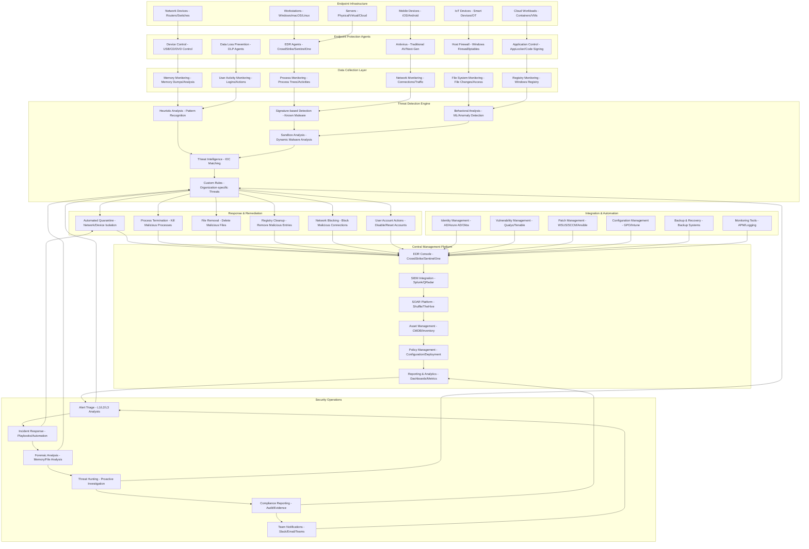

# Pro Workflows: Endpoint Security

## 1. Automated Endpoint Detection & Response (EDR)
**Problem:** Manual endpoint monitoring is slow, error-prone, and cannot scale to modern threats.

**Workflow:**

**Tools:** Wazuh, Velociraptor, OSQuery, FleetDM, Elastic Agent

**Automation/AI Tips:**
- Automate threat detection and response actions (quarantine, kill process)
- Use LLMs to triage alerts and recommend remediations

**Metrics:** 90%+ endpoint coverage, reduced dwell time, faster incident response

**References:** Wazuh docs, Velociraptor docs, Elastic Security

---

## 2. Patch Management Automation
**Problem:** Unpatched endpoints are a leading cause of breaches, but manual patching is slow and inconsistent.

**Workflow:**
```mermaid
flowchart TD
    A[Patch Released] --> B[Patch Management Tool (WSUS/Ansible)]
    B -->|Deploy| C[Endpoints]
    C -->|Status| D[Central Dashboard]
    D -->|Report| E[Security/IT Team]
```
**Tools:** WSUS, Ansible, Wazuh, ManageEngine, Chocolatey

**Automation/AI Tips:**
- Schedule and automate patch deployment across all endpoints
- Use LLMs to summarize patch status and flag high-risk gaps

**Metrics:** 95%+ patch compliance, reduced patch cycle time

**References:** Ansible docs, Microsoft WSUS, ManageEngine Patch Manager

---

## 3. Device Compliance & Zero Trust Enforcement
**Problem:** Non-compliant or unmanaged devices increase risk, especially in remote/hybrid environments.

**Workflow:**
```mermaid
flowchart TD
    A[Device Enrollment] --> B[MDM/UEM (Intune/FleetDM)]
    B -->|Compliance Check| C[Policy Engine]
    C -->|Compliant| D[Grant Access]
    C -->|Non-Compliant| E[Remediate/Restrict]
```
**Tools:** Microsoft Intune, FleetDM, Jamf, Wazuh, Open Policy Agent

**Automation/AI Tips:**
- Automate device compliance checks and access enforcement
- Use LLMs to analyze compliance trends and suggest policy updates

**Metrics:** 100% device enrollment, reduced non-compliance incidents

**References:** Microsoft Intune docs, FleetDM, Open Policy Agent 