# Pro Workflows: Governance, Risk, and Compliance (GRC)

## 1. Automated Risk Assessment & Register
**Problem:** Manual risk assessments are slow, subjective, and often outdated.

**Workflow:**

```mermaid
flowchart TD
    %% Asset & Data Inventory
    subgraph "Asset & Data Inventory"
        A1[IT Assets - Servers/Workstations/Network]
        A2[Applications - Web Apps/APIs/Databases]
        A3[Data Assets - PII/PHI/PCI/Confidential]
        A4[Cloud Resources - AWS/Azure/GCP]
        A5[Third-party Services - Vendors/Partners]
        A6[Physical Assets - Facilities/Equipment]
    end
    
    %% Risk Assessment Engine
    subgraph "Risk Assessment Engine"
        B1[Threat Modeling - STRIDE/PASTA/Attack Trees]
        B2[Vulnerability Assessment - Qualys/Tenable/OpenVAS]
        B3[Business Impact Analysis - Financial/Operational]
        B4[Likelihood Assessment - Historical/Expert Judgment]
        B5[Risk Scoring - CVSS/FAIR/Qualitative]
        B6[Risk Categorization - Strategic/Operational/Financial]
    end
    
    %% Compliance Framework Management
    subgraph "Compliance Frameworks"
        C1[Regulatory Compliance - SOX/HIPAA/PCI/GDPR]
        C2[Industry Standards - ISO 27001/NIST/CIS]
        C3[Internal Policies - Organization-specific]
        C4[Contractual Requirements - Customer/Vendor]
        C5[Geographic Requirements - Regional Laws]
        C6[Industry-specific - Healthcare/Finance/Government]
    end
    
    %% Policy Management System
    subgraph "Policy Management"
        D1[Policy Creation - Templates/Standards]
        D2[Policy Distribution - Training/Awareness]
        D3[Policy Enforcement - Monitoring/Controls]
        D4[Policy Review - Periodic/Triggered]
        D5[Policy Updates - Change Management]
        D6[Policy Attestation - Employee/Contractor]
    end
    
    %% Control Framework
    subgraph "Control Framework"
        E1[Preventive Controls - Access/Encryption/Firewall]
        E2[Detective Controls - Monitoring/Logging/Audit]
        E3[Corrective Controls - Incident Response/Recovery]
        E4[Compensating Controls - Alternative Measures]
        E5[Control Testing - Automated/Manual]
        E6[Control Effectiveness - Metrics/Reporting]
    end
    
    %% Risk Register & Management
    subgraph "Risk Register & Management"
        F1[Risk Register - Centralized Database]
        F2[Risk Ownership - Business/IT/Security]
        F3[Risk Treatment - Accept/Transfer/Mitigate/Avoid]
        F4[Risk Monitoring - Continuous/Periodic]
        F5[Risk Reporting - Executive/Board/Stakeholders]
        F6[Risk Review - Quarterly/Annual]
    end
    
    %% Audit & Assurance
    subgraph "Audit & Assurance"
        G1[Internal Audits - Self-assessment/Independent]
        G2[External Audits - Third-party/Certification]
        G3[Continuous Monitoring - Real-time/Periodic]
        G4[Evidence Collection - Automated/Manual]
        G5[Audit Trail - Complete/Immutable]
        G6[Remediation Tracking - Issues/Actions]
    end
    
    %% Reporting & Analytics
    subgraph "Reporting & Analytics"
        H1[Executive Dashboards - KPIs/Metrics]
        H2[Compliance Reports - Regulatory/Internal]
        H3[Risk Reports - Heat Maps/Trends]
        H4[Performance Metrics - Efficiency/Effectiveness]
        H5[Trend Analysis - Historical/Predictive]
        H6[Stakeholder Communication - Board/Management]
    end
    
    %% Integration & Automation
    subgraph "Integration & Automation"
        I1[Security Tools - SIEM/EDR/Vulnerability Scanners]
        I2[IT Tools - CMDB/Asset Management]
        I3[Business Tools - ERP/CRM/HR Systems]
        I4[Cloud Tools - AWS/Azure/GCP APIs]
        I5[Third-party Tools - Vendor APIs]
        I6[Custom Integration - APIs/Scripts]
    end
    
    %% Data Flow Connections
    A1 --> B1
    A2 --> B1
    A3 --> B1
    A4 --> B2
    A5 --> B2
    A6 --> B3
    
    B1 --> C1
    B2 --> C1
    B3 --> C1
    B4 --> C2
    B5 --> C2
    B6 --> C2
    
    C1 --> D1
    C2 --> D1
    C3 --> D1
    C4 --> D2
    C5 --> D2
    C6 --> D2
    
    D1 --> E1
    D2 --> E1
    D3 --> E1
    D4 --> E2
    D5 --> E2
    D6 --> E2
    
    E1 --> F1
    E2 --> F1
    E3 --> F1
    E4 --> F2
    E5 --> F2
    E6 --> F2
    
    F1 --> G1
    F2 --> G1
    F3 --> G1
    F4 --> G2
    F5 --> G2
    F6 --> G2
    
    G1 --> H1
    G2 --> H1
    G3 --> H1
    G4 --> H2
    G5 --> H2
    G6 --> H2
    
    %% Integration Connections
    I1 --> B1
    I2 --> A1
    I3 --> C1
    I4 --> A4
    I5 --> A5
    I6 --> H1
    
    %% Feedback Loops
    H1 --> D1
    H2 --> E1
    H3 --> F1
    H4 --> G1
    H5 --> B1
    H6 --> C1
```

**Tools:** OpenRMF, Eramba, Risk Register, GRC Toolbox

**Automation/AI Tips:**
- Automate risk scoring and register updates
- Use LLMs to summarize risks and suggest mitigations

**Metrics:** 90%+ asset coverage, faster risk reviews

**References:** OpenRMF docs, Eramba, NIST RMF

---

## 2. Policy Management & Attestation Automation
**Problem:** Policy distribution and attestation are often manual, leading to gaps and non-compliance.

**Workflow:**
```mermaid
flowchart TD
    A[Policy Draft] --> B[GRC Platform (Eramba/DocRead)]
    B -->|Distribute| C[Employees]
    C -->|Attest| D[Attestation Records]
    D -->|Report| E[GRC/Compliance Team]
```
**Tools:** Eramba, DocRead, GRC Toolbox, custom scripts

**Automation/AI Tips:**
- Automate policy distribution and attestation tracking
- Use LLMs to analyze attestation gaps and recommend actions

**Metrics:** 100% policy attestation, reduced compliance gaps

**References:** Eramba docs, DocRead, ISO 27001

---

## 3. Continuous Compliance Monitoring
**Problem:** Compliance checks are often point-in-time, missing ongoing violations.

**Workflow:**
```mermaid
flowchart TD
    A[Compliance Controls] --> B[Monitoring Tool (OpenSCAP/Auditd)]
    B -->|Scan| C[Compliance Dashboard]
    C -->|Alert| D[GRC/Compliance Team]
```
**Tools:** OpenSCAP, Auditd, Eramba, GRC Toolbox

**Automation/AI Tips:**
- Schedule automated compliance scans and reporting
- Use LLMs to interpret scan results and flag issues

**Metrics:** 95%+ control coverage, reduced audit findings

**References:** OpenSCAP, Auditd, Eramba 