# Pro Workflows: Critical Infrastructure Security

## 1. ICS/SCADA Network Segmentation & Monitoring
**Problem:** Flat networks in critical infrastructure increase the risk of widespread compromise.

**Workflow:**

```mermaid
flowchart TD
    %% Critical Infrastructure Sectors
    subgraph "Critical Infrastructure Sectors"
        A1[Energy - Power Plants/Grid/Utilities]
        A2[Transportation - Airports/Railways/Highways]
        A3[Water - Treatment Plants/Distribution Systems]
        A4[Manufacturing - Industrial Plants/Assembly Lines]
        A5[Healthcare - Hospitals/Medical Devices]
        A6[Communications - Telecom/Internet/Data Centers]
    end
    
    %% ICS/SCADA Systems
    subgraph "ICS/SCADA Systems"
        B1[Supervisory Control - HMI/SCADA Servers]
        B2[Programmable Logic Controllers - PLCs/RTUs]
        B3[Distributed Control Systems - DCS/Field Devices]
        B4[Safety Instrumented Systems - SIS/ESD Systems]
        B5[Industrial Networks - Fieldbus/Modbus/Ethernet]
        B6[Legacy Systems - Older/Unsupported Equipment]
    end
    
    %% Network Architecture & Segmentation
    subgraph "Network Architecture & Segmentation"
        C1[Enterprise Network - Business/IT Systems]
        C2[DMZ Network - Internet-facing Services]
        C3[Control Network - SCADA/HMI Systems]
        C4[Field Network - PLCs/RTUs/Field Devices]
        C5[Safety Network - SIS/ESD/Critical Safety]
        C6[Isolation Zones - Air-gapped/Secure Enclaves]
    end
    
    %% Security Controls & Monitoring
    subgraph "Security Controls & Monitoring"
        D1[Firewalls - Next-gen/Industrial/Application]
        D2[Intrusion Detection - IDS/IPS/Network Monitoring]
        D3[Access Control - Authentication/Authorization]
        D4[Data Protection - Encryption/Backup/Recovery]
        D5[Physical Security - Access Control/Surveillance]
        D6[Environmental Monitoring - Temperature/Humidity/Power]
    end
    
    %% Threat Detection & Response
    subgraph "Threat Detection & Response"
        E1[Anomaly Detection - ML/AI/Behavioral Analysis]
        E2[Threat Intelligence - ICS-specific/Industry Feeds]
        E3[Incident Response - ICS-specific Playbooks]
        E4[Forensic Analysis - Digital/Physical Evidence]
        E5[Recovery Planning - Business Continuity/Disaster Recovery]
        E6[Communication - Internal/External/Regulatory]
    end
    
    %% Compliance & Standards
    subgraph "Compliance & Standards"
        F1[NERC CIP - Electric Grid Security]
        F2[NIST Cybersecurity Framework - Risk Management]
        F3[ISA/IEC 62443 - Industrial Security Standards]
        F4[ISO 27001 - Information Security Management]
        F5[Industry-specific Standards - Sector Requirements]
        F6[Regulatory Requirements - Government/State Laws]
    end
    
    %% Asset Management & Inventory
    subgraph "Asset Management & Inventory"
        G1[Asset Discovery - Automated/Manual Inventory]
        G2[Vulnerability Assessment - Scanning/Testing]
        G3[Configuration Management - Baselines/Standards]
        G4[Patch Management - Security/Functional Updates]
        G5[Lifecycle Management - Procurement/Retirement]
        G6[Risk Assessment - Asset/System/Network Risk]
    end
    
    %% Operational Technology Security
    subgraph "Operational Technology Security"
        H1[Device Security - Hardening/Configuration]
        H2[Protocol Security - Modbus/DNP3/Ethernet Security]
        H3[Application Security - HMI/SCADA Application Security]
        H4[Data Security - Historian/Archive/Backup Security]
        H5[Communication Security - Network/Protocol Encryption]
        H6[Physical Security - Facility/Equipment Protection]
    end
    
    %% Business Continuity & Resilience
    subgraph "Business Continuity & Resilience"
        I1[Disaster Recovery - Backup/Restore/Recovery]
        I2[Business Continuity - Critical Operations/Processes]
        I3[Redundancy - Systems/Networks/Power]
        I4[Failover - Automatic/Manual System Switching]
        I5[Testing - DR/BC/Incident Response Testing]
        I6[Documentation - Procedures/Plans/Processes]
    end
    
    %% Integration & Automation
    subgraph "Integration & Automation"
        J1[Security Tool Integration - SIEM/EDR/DLP]
        J2[OT System Integration - SCADA/HMI/PLC APIs]
        J3[Business System Integration - ERP/MES/CRM]
        J4[Monitoring Integration - APM/Logging/Alerting]
        J5[Compliance Integration - GRC/Policy Management]
        J6[Third-party Integration - Vendors/Partners/Services]
    end
    
    %% Data Flow Connections
    A1 --> B1
    A2 --> B1
    A3 --> B1
    A4 --> B2
    A5 --> B2
    A6 --> B2
    
    B1 --> C1
    B2 --> C1
    B3 --> C1
    B4 --> C2
    B5 --> C2
    B6 --> C2
    
    C1 --> D1
    C2 --> D1
    C3 --> D1
    C4 --> D2
    D5 --> D2
    D6 --> D2
    
    D1 --> E1
    D2 --> E1
    D3 --> E1
    D4 --> E2
    E5 --> E2
    E6 --> E2
    
    E1 --> F1
    E2 --> F1
    E3 --> F1
    E4 --> F2
    F5 --> F2
    F6 --> F2
    
    F1 --> G1
    F2 --> G1
    F3 --> G1
    F4 --> G2
    G5 --> G2
    G6 --> G2
    
    G1 --> H1
    G2 --> H1
    G3 --> H1
    G4 --> H2
    H5 --> H2
    H6 --> H2
    
    H1 --> I1
    H2 --> I1
    H3 --> I1
    H4 --> I2
    I5 --> I2
    I6 --> I2
    
    I1 --> J1
    I2 --> J1
    I3 --> J1
    I4 --> J2
    J5 --> J2
    J6 --> J2
    
    %% Feedback Loops
    J1 --> B1
    J2 --> C1
    J3 --> D1
    J4 --> E1
    J5 --> F1
    J6 --> G1
```

**Tools:** Snort, Suricata, pfSense, custom segmentation scripts

**Automation/AI Tips:**
- Automate network segmentation policy enforcement
- Use LLMs to analyze IDS/IPS alerts for critical threats

**Metrics:** 100% network segmentation, reduced lateral movement

**References:** Snort, Suricata, ICS security best practices

---

## 2. OT Asset Inventory & Vulnerability Management
**Problem:** Untracked OT assets and unpatched vulnerabilities are a major risk in critical infrastructure.

**Workflow:**
```mermaid
flowchart TD
    A[OT Devices] --> B[Asset Discovery (Nmap/Custom)]
    B -->|Inventory| C[Vulnerability Scanner (OpenVAS)]
    C -->|Findings| D[Remediation Plan]
    D -->|Patch/Isolate| E[OT Devices]
```
**Tools:** Nmap, OpenVAS, custom asset scripts

**Automation/AI Tips:**
- Automate asset discovery and vulnerability scanning
- Use LLMs to prioritize remediation based on risk

**Metrics:** 95%+ asset coverage, reduced unpatched vulnerabilities

**References:** Nmap, OpenVAS, ICS-CERT

---

## 3. Incident Response Automation for Critical Infrastructure
**Problem:** Manual incident response is too slow for high-impact critical infrastructure attacks.

**Workflow:**
```mermaid
flowchart TD
    A[Security Alert] --> B[SOAR Platform (Shuffle/TheHive)]
    B -->|Playbook| C[Automated Response]
    C -->|Contain/Remediate| D[OT/IT Systems]
    C -->|Report| E[Security Team]
```
**Tools:** Shuffle, TheHive, custom SOAR scripts

**Automation/AI Tips:**
- Automate incident response playbooks for common attack scenarios
- Use LLMs to generate incident summaries and lessons learned

**Metrics:** 90%+ incident containment rate, reduced response time

**References:** Shuffle, TheHive, ICS-CERT 