# Pro Workflows: Education Industry Security

## 1. Student Data Privacy & FERPA Compliance Automation
**Problem:** Manual FERPA compliance checks are slow and often miss student data exposures.

**Workflow:**

```mermaid
flowchart TD
    %% Educational Infrastructure
    subgraph "Educational Infrastructure"
        A1[Student Information Systems - Banner/PeopleSoft]
        A2[Learning Management Systems - Canvas/Blackboard/Moodle]
        A3[Research Systems - Grants/Clinical Trials/Data Analysis]
        A4[Administrative Systems - HR/Finance/Facilities]
        A5[Student Portals - Online Registration/Financial Aid]
        A6[Research Computing - HPC/Cloud/Data Centers]
    end
    
    %% Student Data Management
    subgraph "Student Data Management"
        B1[Academic Records - Grades/Transcripts/Credits]
        B2[Personal Information - Demographics/Contact/Financial]
        B3[Health Information - Medical/Disability/Immunization]
        B4[Financial Aid - FAFSA/Grants/Loans/Work-study]
        B5[Research Data - Studies/Experiments/Publications]
        B6[Operational Data - Facilities/Equipment/Supplies]
    end
    
    %% FERPA Compliance Framework
    subgraph "FERPA Compliance Framework"
        C1[Directory Information - Public/Non-public Data]
        C2[Educational Records - Academic/Disciplinary/Health]
        C3[Parent Rights - Access/Amendment/Consent]
        C4[Student Rights - Access/Amendment/Consent]
        C5[Disclosure Controls - Authorized/Unauthorized Release]
        C6[State Privacy Laws - Additional Requirements]
    end
    
    %% Data Protection & Security
    subgraph "Data Protection & Security"
        D1[Access Controls - Role-based/Need-to-know]
        D2[Data Encryption - At Rest/In Transit]
        D3[Audit Logging - Access/Changes/Disclosures]
        D4[Data Loss Prevention - DLP/Content Filtering]
        D5[Backup & Recovery - Secure/Encrypted Backups]
        D6[Incident Response - Breach/Privacy Violations]
    end
    
    %% Remote Learning Security
    subgraph "Remote Learning Security"
        E1[Video Conferencing - Zoom/Teams/WebEx Security]
        E2[Online Assessment - Proctoring/Plagiarism Detection]
        E3[Digital Content - Copyright/Intellectual Property]
        E4[Device Management - BYOD/Institutional Devices]
        E5[Network Security - VPN/WiFi/Internet Filtering]
        E6[Accessibility - ADA Compliance/Universal Design]
    end
    
    %% Research Data Security
    subgraph "Research Data Security"
        F1[Data Classification - Public/Internal/Confidential]
        F2[Export Controls - ITAR/EAR/Technology Transfer]
        F3[Intellectual Property - Patents/Copyrights/Trade Secrets]
        F4[Collaboration Security - Multi-institution/International]
        F5[Compliance Monitoring - IRB/Regulatory Requirements]
        F6[Data Sharing - Open Access/Controlled Access]
    end
    
    %% Compliance Monitoring & Reporting
    subgraph "Compliance Monitoring & Reporting"
        G1[Automated Scanning - DLP/Vulnerability/Configuration]
        G2[Real-time Monitoring - Access/Usage/Anomalies]
        G3[Compliance Assessment - Gap Analysis/Remediation]
        G4[Audit Preparation - Evidence Collection/Reports]
        G5[Regulatory Reporting - DOE/State Agencies]
        G6[Performance Metrics - KPIs/Dashboards]
    end
    
    %% Student Privacy Rights
    subgraph "Student Privacy Rights"
        H1[Right to Access - Educational Records/Information]
        H2[Right to Amend - Correct/Update Information]
        H3[Right to Consent - Disclosure/Release Authorization]
        H4[Right to File Complaint - Privacy Violations]
        H5[Right to Directory Information - Opt-out/Opt-in]
        H6[Right to Portability - Electronic Copies]
    end
    
    %% Integration & Automation
    subgraph "Integration & Automation"
        I1[SIS Integration - Banner/PeopleSoft APIs]
        I2[LMS Integration - Canvas/Blackboard/Moodle]
        I3[Security Tool Integration - SIEM/EDR/DLP]
        I4[Compliance Tool Integration - GRC/Policy Management]
        I5[Business System Integration - ERP/CRM/HR]
        I6[Third-party Integration - Vendors/Partners/Regulators]
    end
    
    %% Incident Response & Recovery
    subgraph "Incident Response & Recovery"
        J1[Security Incident Response - Breach/Attack Handling]
        J2[Privacy Incident Response - FERPA Violations]
        J3[Research Incident Response - Data Compromise]
        J4[Business Continuity - Academic Continuity]
        J5[Student Communication - Notification/Support]
        J6[Regulatory Notification - DOE/State Agencies]
    end
    
    %% Data Flow Connections
    A1 --> B1
    A2 --> B1
    A3 --> B1
    A4 --> B2
    A5 --> B2
    A6 --> B2
    
    B1 --> C1
    B2 --> C1
    B3 --> C1
    B4 --> C2
    B5 --> C2
    B6 --> C2
    
    C1 --> D1
    C2 --> D1
    C3 --> D1
    C4 --> D2
    D5 --> D2
    D6 --> D2
    
    D1 --> E1
    D2 --> E1
    D3 --> E1
    D4 --> E2
    E5 --> E2
    E6 --> E2
    
    E1 --> F1
    E2 --> F1
    E3 --> F1
    E4 --> F2
    F5 --> F2
    F6 --> F2
    
    F1 --> G1
    F2 --> G1
    F3 --> G1
    F4 --> G2
    G5 --> G2
    G6 --> G2
    
    G1 --> H1
    G2 --> H1
    G3 --> H1
    G4 --> H2
    H5 --> H2
    H6 --> H2
    
    H1 --> I1
    H2 --> I1
    H3 --> I1
    H4 --> I2
    I5 --> I2
    I6 --> I2
    
    I1 --> J1
    I2 --> J1
    I3 --> J1
    I4 --> J2
    J5 --> J2
    J6 --> J2
    
    %% Feedback Loops
    J1 --> D1
    J2 --> C1
    J3 --> F1
    J4 --> G1
    J5 --> H1
    J6 --> B1
```

**Tools:** OpenDLP, Varonis, Wazuh, custom FERPA scripts

**Automation/AI Tips:**
- Schedule automated student data scans and compliance checks
- Use LLMs to interpret findings and suggest remediations

**Metrics:** 100% student data coverage, reduced FERPA violations

**References:** FERPA guidelines, OpenDLP, Varonis

---

## 2. Secure Remote Learning Environments
**Problem:** Remote learning platforms are frequent targets for attacks and data breaches.

**Workflow:**
```mermaid
flowchart TD
    A[Remote Learning Platform] --> B[Security Scanner (OpenVAS/Nessus)]
    B -->|Scan| C[Vulnerability Dashboard]
    C -->|High Risk| D[Patch/Restrict]
    C -->|Low Risk| E[Monitor]
```
**Tools:** OpenVAS, Nessus, Wazuh, custom scripts

**Automation/AI Tips:**
- Automate vulnerability scanning and patch management for learning platforms
- Use LLMs to prioritize vulnerabilities and recommend fixes

**Metrics:** 95%+ platform coverage, reduced breaches

**References:** OpenVAS, Nessus, EdTech security best practices

---

## 3. Phishing & Social Engineering Defense for Faculty/Students
**Problem:** Faculty and students are frequent targets for phishing and social engineering attacks.

**Workflow:**
```mermaid
flowchart TD
    A[Phishing Campaign] --> B[Inbox (Faculty/Student)]
    B -->|Click/Report| C[Awareness Platform (GoPhish)]
    C -->|Track| D[Metrics Dashboard]
    D -->|Feedback| E[User]
```
**Tools:** GoPhish, KnowBe4, Lucy Security

**Automation/AI Tips:**
- Automate phishing simulations and feedback
- Use LLMs to generate realistic phishing templates and analyze results

**Metrics:** 90%+ participation, reduced phishing success rates

**References:** GoPhish docs, KnowBe4, Lucy Security 