# Pro Workflows: Finance Industry Security

## 1. Automated PCI DSS Compliance Monitoring
**Problem:** Manual PCI DSS compliance checks are slow, error-prone, and often miss ongoing violations.

**Workflow:**

```mermaid
flowchart TD
    %% Financial Infrastructure
    subgraph "Financial Infrastructure"
        A1[Core Banking Systems - Teller/Account Management]
        A2[Payment Processing - Credit/Debit/ACH/Wire]
        A3[Card Processing - POS/ATM/Online Transactions]
        A4[Investment Systems - Trading/Portfolio Management]
        A5[Customer Portals - Online Banking/Mobile Apps]
        A6[Back Office Systems - Accounting/Compliance/HR]
    end
    
    %% PCI DSS Control Framework
    subgraph "PCI DSS Control Framework"
        B1[Build & Maintain Secure Network - Firewalls/VLANs]
        B2[Protect Cardholder Data - Encryption/Tokenization]
        B3[Maintain Vulnerability Management - Patches/Scans]
        B4[Implement Access Controls - Authentication/Authorization]
        B5[Monitor & Test Networks - Logging/Intrusion Detection]
        B6[Maintain Security Policy - Policies/Procedures/Training]
    end
    
    %% Compliance Monitoring Tools
    subgraph "Compliance Monitoring Tools"
        C1[Vulnerability Scanners - Qualys/Tenable/OpenVAS]
        C2[Configuration Scanners - OpenSCAP/CIS Benchmarks]
        C3[Network Monitoring - IDS/IPS/NetFlow Analysis]
        C4[Log Management - SIEM/ELK Stack/Splunk]
        C5[Access Control Monitoring - IAM/PAM/Privileged Access]
        C6[Data Protection Monitoring - DLP/Encryption/Tokenization]
    end
    
    %% Real-time Compliance Engine
    subgraph "Real-time Compliance Engine"
        D1[Control Assessment - Automated/Manual Testing]
        D2[Compliance Scoring - Pass/Fail/Partial]
        D3[Risk Prioritization - Critical/High/Medium/Low]
        D4[Remediation Tracking - Issues/Actions/Timeline]
        D5[Exception Management - Waivers/Compensating Controls]
        D6[Continuous Monitoring - 24/7/Real-time Alerts]
    end
    
    %% Financial Fraud Detection
    subgraph "Financial Fraud Detection"
        E1[Transaction Monitoring - Real-time/Pattern Analysis]
        E2[Behavioral Analytics - User/Account/Device Patterns]
        E3[Anomaly Detection - ML/AI/Statistical Models]
        E4[Risk Scoring - Transaction/Account/Customer Risk]
        E5[Fraud Rules Engine - Business Rules/ML Models]
        E6[Alert Management - Prioritization/Investigation]
    end
    
    %% Regulatory Compliance Management
    subgraph "Regulatory Compliance Management"
        F1[SOX Compliance - Financial Controls/Reporting]
        F2[GLBA Compliance - Privacy/Data Protection]
        F3[FFIEC Compliance - Banking Standards]
        F4[Basel III Compliance - Capital Requirements]
        F5[GDPR Compliance - Data Privacy/Rights]
        F6[Industry Standards - ISO 27001/NIST/CIS]
    end
    
    %% Reporting & Analytics
    subgraph "Reporting & Analytics"
        G1[Executive Dashboards - KPIs/Metrics/ROI]
        G2[Compliance Reports - PCI/SOX/GLBA/FFIEC]
        G3[Risk Reports - Heat Maps/Trends/Analysis]
        G4[Audit Reports - Internal/External/Regulatory]
        G5[Performance Metrics - Efficiency/Effectiveness]
        G6[Stakeholder Communication - Board/Regulators/Customers]
    end
    
    %% Integration & Automation
    subgraph "Integration & Automation"
        H1[Core Banking Integration - APIs/Data Feeds]
        H2[Payment System Integration - Transaction Data]
        H3[Security Tool Integration - SIEM/EDR/Firewall]
        H4[Compliance Tool Integration - GRC/Policy Management]
        H5[Business System Integration - ERP/CRM/HR]
        H6[Third-party Integration - Vendors/Partners/Regulators]
    end
    
    %% Incident Response & Recovery
    subgraph "Incident Response & Recovery"
        I1[Security Incident Response - Breach/Attack Handling]
        I2[Fraud Incident Response - Transaction/Account Fraud]
        I3[Compliance Incident Response - Violation/Reporting]
        I4[Business Continuity - Disaster Recovery/Backup]
        I5[Customer Communication - Notification/Support]
        I6[Regulatory Notification - Required/Voluntary Reporting]
    end
    
    %% Data Flow Connections
    A1 --> B1
    A2 --> B1
    A3 --> B1
    A4 --> B2
    A5 --> B2
    A6 --> B2
    
    B1 --> C1
    B2 --> C1
    B3 --> C1
    B4 --> C2
    B5 --> C2
    B6 --> C2
    
    C1 --> D1
    C2 --> D1
    C3 --> D1
    C4 --> D2
    C5 --> D2
    C6 --> D2
    
    D1 --> E1
    D2 --> E1
    D3 --> E1
    D4 --> E2
    D5 --> E2
    D6 --> E2
    
    E1 --> F1
    E2 --> F1
    E3 --> F1
    E4 --> F2
    E5 --> F2
    E6 --> F2
    
    F1 --> G1
    F2 --> G1
    F3 --> G1
    F4 --> G2
    F5 --> G2
    F6 --> G2
    
    G1 --> H1
    G2 --> H1
    G3 --> H1
    G4 --> H2
    G5 --> H2
    G6 --> H2
    
    H1 --> I1
    H2 --> I1
    H3 --> I1
    H4 --> I2
    H5 --> I2
    H6 --> I2
    
    %% Feedback Loops
    I1 --> D1
    I2 --> E1
    I3 --> F1
    I4 --> G1
    I5 --> H1
    I6 --> B1
```

**Tools:** OpenSCAP, Qualys, Wazuh, custom PCI scripts

**Automation/AI Tips:**
- Schedule automated PCI scans and reporting
- Use LLMs to interpret scan results and suggest remediations

**Metrics:** 100% PCI control coverage, reduced audit findings

**References:** PCI DSS guidelines, OpenSCAP, Qualys

---

## 2. Real-time Fraud Detection & Response
**Problem:** Financial fraud detection is often reactive and slow, leading to significant losses.

**Workflow:**

```mermaid
flowchart TD
    %% Transaction Data Sources
    subgraph "Transaction Data Sources"
        A1[Credit Card Transactions - POS/Online/ATM]
        A2[Debit Card Transactions - PIN/Contactless/Online]
        A3[ACH Transactions - Direct Deposit/Wire Transfers]
        A4[Digital Payments - Mobile/Peer-to-peer/Crypto]
        A5[Investment Transactions - Trading/Settlements]
        A6[Account Activities - Deposits/Withdrawals/Transfers]
    end
    
    %% Fraud Detection Engine
    subgraph "Fraud Detection Engine"
        B1[Real-time Processing - Stream Processing/Event-driven]
        B2[Pattern Recognition - Historical/Behavioral Analysis]
        B3[Machine Learning Models - Supervised/Unsupervised]
        B4[Rule-based Engine - Business Rules/Thresholds]
        B5[Anomaly Detection - Statistical/ML-based Models]
        B6[Risk Scoring - Transaction/Account/Customer Level]
    end
    
    %% Data Processing & Analytics
    subgraph "Data Processing & Analytics"
        C1[Data Ingestion - Kafka/Spark Streaming]
        C2[Data Transformation - ETL/Data Pipeline]
        C3[Feature Engineering - Transaction/User/Device Features]
        C4[Model Training - Batch/Online Learning]
        C5[Model Validation - A/B Testing/Performance Metrics]
        C6[Model Deployment - Canary/Blue-green Deployment]
    end
    
    %% Risk Assessment & Scoring
    subgraph "Risk Assessment & Scoring"
        D1[Transaction Risk - Amount/Location/Time/Device]
        D2[Account Risk - History/Behavior/Patterns]
        D3[Customer Risk - Profile/History/Relationships]
        D4[Device Risk - Device Fingerprinting/Reputation]
        D5[Network Risk - IP/Location/Behavior Analysis]
        D6[Aggregate Risk - Combined/Multi-factor Scoring]
    end
    
    %% Decision Engine & Actions
    subgraph "Decision Engine & Actions"
        E1[Automated Decisions - Allow/Block/Review]
        E2[Manual Review - Analyst/Investigator Review]
        E3[Escalation Rules - Risk-based Escalation]
        E4[Customer Communication - SMS/Email/App Notifications]
        E5[Account Actions - Freeze/Close/Flag Accounts]
        E6[Regulatory Reporting - SAR/CTR/Compliance Reports]
    end
    
    %% Investigation & Response
    subgraph "Investigation & Response"
        F1[Case Management - Investigation Workflow]
        F2[Evidence Collection - Transaction/Device/Network Data]
        F3[Forensic Analysis - Digital/Financial Forensics]
        F4[Customer Support - Fraud Claims/Disputes]
        F5[Recovery Actions - Chargebacks/Reversals]
        F6[Law Enforcement - Reporting/Coordination]
    end
    
    %% Monitoring & Optimization
    subgraph "Monitoring & Optimization"
        G1[Performance Monitoring - Detection Rate/False Positives]
        G2[Model Performance - Accuracy/Precision/Recall]
        G3[Business Impact - Loss Prevention/Revenue Protection]
        G4[Customer Experience - Friction/Approval Rates]
        G5[Compliance Monitoring - Regulatory Requirements]
        G6[Continuous Improvement - Model Updates/Retraining]
    end
    
    %% Integration & Automation
    subgraph "Integration & Automation"
        H1[Core Banking Integration - Transaction Systems]
        H2[Payment System Integration - Card Networks/Processors]
        H3[Security Tool Integration - SIEM/EDR/Threat Intel]
        H4[Customer System Integration - CRM/Support Systems]
        H5[Regulatory Integration - Reporting/Compliance Systems]
        H6[Third-party Integration - Data Providers/Analytics]
    end
    
    %% Data Flow Connections
    A1 --> B1
    A2 --> B1
    A3 --> B1
    A4 --> B2
    A5 --> B2
    A6 --> B2
    
    B1 --> C1
    B2 --> C1
    B3 --> C1
    B4 --> C2
    C5 --> C2
    C6 --> C2
    
    C1 --> D1
    C2 --> D1
    C3 --> D1
    C4 --> D2
    D5 --> D2
    D6 --> D2
    
    D1 --> E1
    D2 --> E1
    D3 --> E1
    D4 --> E2
    E5 --> E2
    E6 --> E2
    
    E1 --> F1
    E2 --> F1
    E3 --> F1
    E4 --> F2
    F5 --> F2
    F6 --> F2
    
    F1 --> G1
    F2 --> G1
    F3 --> G1
    F4 --> G2
    G5 --> G2
    G6 --> G2
    
    G1 --> H1
    G2 --> H1
    G3 --> H1
    G4 --> H2
    H5 --> H2
    H6 --> H2
    
    %% Feedback Loops
    H1 --> B1
    H2 --> C1
    H3 --> D1
    H4 --> E1
    H5 --> F1
    H6 --> G1
```

**Tools:** Apache Spark, TensorFlow, Wazuh, custom ML models

**Automation/AI Tips:**
- Use ML models to detect fraud patterns in real-time
- Automate fraud response actions (block, alert, investigate)

**Metrics:** 90%+ fraud detection rate, reduced false positives

**References:** Apache Spark, TensorFlow, financial fraud patterns

---

## 3. Regulatory Reporting Automation (SOX, GLBA)
**Problem:** Manual regulatory reporting is time-consuming and prone to errors.

**Workflow:**

```mermaid
flowchart TD
    %% Regulatory Data Sources
    subgraph "Regulatory Data Sources"
        A1[Financial Controls - SOX/Internal Controls]
        A2[Privacy Controls - GLBA/Data Protection]
        A3[Security Controls - PCI/ISO 27001]
        A4[Operational Controls - Basel III/Capital Requirements]
        A5[Customer Data - PII/PHI/Financial Information]
        A6[Transaction Data - Banking/Investment/Trading]
    end
    
    %% Data Collection & Aggregation
    subgraph "Data Collection & Aggregation"
        B1[Log Aggregation - SIEM/ELK Stack/Splunk]
        B2[Configuration Management - CMDB/Asset Inventory]
        B3[Vulnerability Data - Scanners/Assessments]
        B4[Incident Data - Security/Privacy/Operational]
        B5[Compliance Data - Audit/Assessment Results]
        B6[Business Data - Financial/Operational Metrics]
    end
    
    %% Compliance Engine & Processing
    subgraph "Compliance Engine & Processing"
        C1[Data Parsing - Structured/Unstructured Data]
        C2[Compliance Mapping - Control/Requirement Mapping]
        C3[Risk Assessment - Automated/Risk Scoring]
        C4[Gap Analysis - Compliance/Control Gaps]
        C5[Remediation Tracking - Issues/Actions/Timeline]
        C6[Exception Management - Waivers/Compensating Controls]
    end
    
    %% Report Generation & Automation
    subgraph "Report Generation & Automation"
        D1[SOX Reports - Financial Controls/Internal Audit]
        D2[GLBA Reports - Privacy/Data Protection]
        D3[PCI Reports - Security/Compliance Status]
        D4[Basel III Reports - Capital/Risk Management]
        D5[Custom Reports - Internal/External Requirements]
        D6[Executive Dashboards - KPIs/Metrics/ROI]
    end
    
    %% Quality Assurance & Validation
    subgraph "Quality Assurance & Validation"
        E1[Data Validation - Accuracy/Completeness/Consistency]
        E2[Report Validation - Format/Content/Compliance]
        E3[Automated Testing - Report Generation/Accuracy]
        E4[Manual Review - Subject Matter Expert Review]
        E5[Audit Trail - Changes/Approvals/Tracking]
        E6[Version Control - Report Versions/History]
    end
    
    %% Submission & Distribution
    subgraph "Submission & Distribution"
        F1[Regulatory Submission - Automated/Manual Submission]
        F2[Stakeholder Distribution - Board/Management/Teams]
        F3[Customer Communication - Privacy/Transparency Reports]
        F4[Public Disclosure - Required/Voluntary Reports]
        F5[Archive Management - Storage/Retention/Retrieval]
        F6[Compliance Tracking - Submission/Approval Status]
    end
    
    %% Monitoring & Analytics
    subgraph "Monitoring & Analytics"
        G1[Compliance Monitoring - Real-time/Continuous]
        G2[Performance Metrics - Efficiency/Accuracy/Timeliness]
        G3[Trend Analysis - Compliance/Risk Trends]
        G4[Benchmarking - Industry/Peer Comparison]
        G5[Predictive Analytics - Risk/Compliance Forecasting]
        G6[Continuous Improvement - Process/Report Optimization]
    end
    
    %% Integration & Automation
    subgraph "Integration & Automation"
        H1[Business System Integration - ERP/CRM/HR Systems]
        H2[Security Tool Integration - SIEM/EDR/GRC Tools]
        H3[Regulatory Integration - Government/Industry Portals]
        H4[Data Source Integration - APIs/Data Feeds/Connectors]
        H5[Workflow Integration - Approval/Notification Systems]
        H6[Third-party Integration - Vendors/Partners/Services]
    end
    
    %% Governance & Oversight
    subgraph "Governance & Oversight"
        I1[Policy Management - Compliance/Reporting Policies]
        I2[Role Management - Responsibilities/Accountabilities]
        I3[Approval Workflows - Review/Approval/Authorization]
        I4[Training & Awareness - Compliance/Reporting Training]
        I5[Audit Support - Internal/External Audit Support]
        I6[Risk Management - Compliance/Risk Assessment]
    end
    
    %% Data Flow Connections
    A1 --> B1
    A2 --> B1
    A3 --> B1
    A4 --> B2
    A5 --> B2
    A6 --> B2
    
    B1 --> C1
    B2 --> C1
    B3 --> C1
    B4 --> C2
    C5 --> C2
    C6 --> C2
    
    C1 --> D1
    C2 --> D1
    C3 --> D1
    C4 --> D2
    D5 --> D2
    D6 --> D2
    
    D1 --> E1
    D2 --> E1
    D3 --> E1
    D4 --> E2
    E5 --> E2
    E6 --> E2
    
    E1 --> F1
    E2 --> F1
    E3 --> F1
    E4 --> F2
    F5 --> F2
    F6 --> F2
    
    F1 --> G1
    F2 --> G1
    F3 --> G1
    F4 --> G2
    G5 --> G2
    G6 --> G2
    
    G1 --> H1
    G2 --> H1
    G3 --> H1
    G4 --> H2
    H5 --> H2
    H6 --> H2
    
    H1 --> I1
    H2 --> I1
    H3 --> I1
    H4 --> I2
    I5 --> I2
    I6 --> I2
    
    %% Feedback Loops
    I1 --> B1
    I2 --> C1
    I3 --> D1
    I4 --> E1
    I5 --> F1
    I6 --> G1
```

**Tools:** ELK Stack, Splunk, custom reporting scripts

**Automation/AI Tips:**
- Automate report generation and submission
- Use LLMs to summarize findings and flag compliance issues

**Metrics:** 100% report accuracy, reduced manual effort

**References:** SOX guidelines, GLBA requirements, ELK Stack 