# Pro Workflows: Government Industry Security

## 1. FedRAMP Compliance Automation
**Problem:** Manual FedRAMP compliance monitoring is complex, time-consuming, and error-prone.

**Workflow:**

```mermaid
flowchart TD
    %% Government Infrastructure
    subgraph "Government Infrastructure"
        A1[Federal Systems - Executive/Legislative/Judicial]
        A2[State Systems - Government Services/Citizen Portals]
        A3[Local Systems - Municipal/County/City Services]
        A4[Defense Systems - Military/Intelligence/Classified]
        A5[Critical Infrastructure - Energy/Transportation/Water]
        A6[Public Services - Healthcare/Education/Social Services]
    end
    
    %% FedRAMP Compliance Framework
    subgraph "FedRAMP Compliance Framework"
        B1[Security Controls - NIST SP 800-53 Rev 5]
        B2[Risk Assessment - FISMA/RMF Process]
        B3[Authorization Process - ATO/Continuous Monitoring]
        B4[Cloud Service Categories - SaaS/PaaS/IaaS]
        B5[Impact Levels - Low/Moderate/High]
        B6[Third-party Assessment - 3PAO/Certification]
    end
    
    %% Classified Data Management
    subgraph "Classified Data Management"
        C1[Data Classification - Top Secret/Secret/Confidential]
        C2[Access Controls - Clearance Levels/Need-to-know]
        C3[Data Handling - Marking/Storage/Transmission]
        C4[Declassification - Review/Process/Automation]
        C5[Cross-domain Solutions - Secure Transfer/Validation]
        C6[Compartmented Information - Special Access Programs]
    end
    
    %% Supply Chain Security
    subgraph "Supply Chain Security"
        D1[Vendor Assessment - Security/Compliance/Trust]
        D2[Component Analysis - Hardware/Software/Services]
        D3[Threat Modeling - Supply Chain Risks/Attack Vectors]
        D4[Continuous Monitoring - Vendor/Component/Service]
        D5[Incident Response - Supply Chain Compromise]
        D6[Recovery Planning - Alternative Sources/Backup]
    end
    
    %% Cybersecurity Framework
    subgraph "Cybersecurity Framework"
        E1[Identify - Asset/Threat/Vulnerability Management]
        E2[Protect - Access/Data/Infrastructure Protection]
        E3[Detect - Monitoring/Anomaly/Threat Detection]
        E4[Respond - Incident Response/Communication/Recovery]
        E5[Recover - Business Continuity/Disaster Recovery]
        E6[Govern - Policy/Risk/Compliance Management]
    end
    
    %% Compliance Monitoring Tools
    subgraph "Compliance Monitoring Tools"
        F1[Configuration Scanners - OpenSCAP/CIS Benchmarks]
        F2[Vulnerability Scanners - Qualys/Tenable/OpenVAS]
        F3[Network Monitoring - IDS/IPS/NetFlow Analysis]
        F4[Log Management - SIEM/ELK Stack/Splunk]
        F5[Access Control Monitoring - IAM/PAM/Privileged Access]
        F6[Data Protection Monitoring - DLP/Encryption/Tokenization]
    end
    
    %% Threat Intelligence & Sharing
    subgraph "Threat Intelligence & Sharing"
        G1[Federal Threat Intel - CISA/FBI/NSA/DoD]
        G2[Information Sharing - ISACs/ISAOs/STIX/TAXII]
        G3[Indicators of Compromise - IOCs/TTPs/Behaviors]
        G4[Threat Attribution - Actor Groups/Motivations]
        G5[Campaign Analysis - Scope/Impact/Response]
        G6[Intelligence Integration - SIEM/SOAR/Automation]
    end
    
    %% Incident Response & Recovery
    subgraph "Incident Response & Recovery"
        H1[Federal IR Coordination - US-CERT/CISA/DoD]
        H2[State/Local IR Coordination - Regional/National]
        H3[Critical Infrastructure IR - Sector-specific Response]
        H4[Classified Incident Response - Secure/Compartmented]
        H5[Public Communication - Press/Stakeholders/Citizens]
        H6[Recovery Planning - Business Continuity/Resilience]
    end
    
    %% Reporting & Analytics
    subgraph "Reporting & Analytics"
        I1[Executive Dashboards - KPIs/Metrics/ROI]
        I2[Compliance Reports - FedRAMP/FISMA/State Laws]
        I3[Risk Reports - Heat Maps/Trends/Analysis]
        I4[Audit Reports - Internal/External/IG]
        I5[Performance Metrics - Efficiency/Effectiveness]
        I6[Stakeholder Communication - Congress/Public/Partners]
    end
    
    %% Integration & Automation
    subgraph "Integration & Automation"
        J1[Federal System Integration - APIs/Data Feeds]
        J2[State/Local Integration - Interoperability/Standards]
        J3[Security Tool Integration - SIEM/EDR/Firewall]
        J4[Compliance Tool Integration - GRC/Policy Management]
        J5[Business System Integration - ERP/CRM/HR]
        J6[Third-party Integration - Vendors/Partners/Contractors]
    end
    
    %% Data Flow Connections
    A1 --> B1
    A2 --> B1
    A3 --> B1
    A4 --> B2
    A5 --> B2
    A6 --> B2
    
    B1 --> C1
    B2 --> C1
    B3 --> C1
    B4 --> C2
    B5 --> C2
    B6 --> C2
    
    C1 --> D1
    C2 --> D1
    C3 --> D1
    C4 --> D2
    C5 --> D2
    C6 --> D2
    
    D1 --> E1
    D2 --> E1
    D3 --> E1
    D4 --> E2
    D5 --> E2
    D6 --> E2
    
    E1 --> F1
    E2 --> F1
    E3 --> F1
    E4 --> F2
    E5 --> F2
    E6 --> F2
    
    F1 --> G1
    F2 --> G1
    F3 --> G1
    F4 --> G2
    F5 --> G2
    F6 --> G2
    
    G1 --> H1
    G2 --> H1
    G3 --> H1
    G4 --> H2
    G5 --> H2
    G6 --> H2
    
    H1 --> I1
    H2 --> I1
    H3 --> I1
    H4 --> I2
    H5 --> I2
    H6 --> I2
    
    I1 --> J1
    I2 --> J1
    I3 --> J1
    I4 --> J2
    I5 --> J2
    I6 --> J2
    
    %% Feedback Loops
    J1 --> B1
    J2 --> C1
    J3 --> D1
    J4 --> E1
    J5 --> F1
    J6 --> G1
```

**Tools:** OpenSCAP, Qualys, Wazuh, custom FedRAMP scripts

**Automation/AI Tips:**
- Schedule automated FedRAMP scans and reporting
- Use LLMs to interpret findings and suggest remediations

**Metrics:** 100% control coverage, reduced audit findings

**References:** FedRAMP guidelines, OpenSCAP, NIST SP 800-53

---

## 2. Classified Data Protection & Monitoring
**Problem:** Unauthorized access to classified data is a critical national security risk.

**Workflow:**

```mermaid
flowchart TD
    %% Classified Data Systems
    subgraph "Classified Data Systems"
        A1[Top Secret Systems - SCI/Compartmented Information]
        A2[Secret Systems - National Security Information]
        A3[Confidential Systems - Government/Defense Information]
        A4[Special Access Programs - SAP/Compartmented Programs]
        A5[Cross-domain Systems - High-to-Low/Low-to-High Transfer]
        A6[Legacy Systems - Older/Unsupported Classified Systems]
    end
    
    %% Data Classification & Marking
    subgraph "Data Classification & Marking"
        B1[Classification Levels - Top Secret/Secret/Confidential]
        B2[Compartmented Information - SCI/SAP/Program Access]
        B3[Data Marking - Header/Footer/Page Markings]
        B4[Handling Instructions - Dissemination/Storage Controls]
        B5[Declassification - Review/Process/Automation]
        B6[Derivative Classification - Derived/Combined Information]
    end
    
    %% Access Control & Authentication
    subgraph "Access Control & Authentication"
        C1[Security Clearances - Background/Investigation/Approval]
        C2[Need-to-Know - Mission/Project/Task Requirements]
        C3[Multi-factor Authentication - CAC/PIV/Biometrics]
        C4[Privileged Access - Administrative/System Access]
        C5[Session Management - Timeout/Auto-logout/Revalidation]
        C6[Emergency Access - Break-glass/Override Procedures]
    end
    
    %% Monitoring & Detection
    subgraph "Monitoring & Detection"
        D1[Access Monitoring - User/System/Data Access]
        D2[Behavioral Analysis - Normal/Abnormal Patterns]
        D3[Anomaly Detection - ML/AI/Statistical Models]
        D4[Threat Detection - Insider/External Threats]
        D5[Data Loss Prevention - DLP/Content Filtering]
        D6[Network Monitoring - Traffic/Communication Analysis]
    end
    
    %% Incident Response & Investigation
    subgraph "Incident Response & Investigation"
        E1[Security Incident Response - Breach/Compromise Handling]
        E2[Insider Threat Response - Malicious/Inadvertent Actions]
        E3[Data Spill Response - Unauthorized Disclosure]
        E4[Forensic Analysis - Digital/Network/Physical Evidence]
        E5[Law Enforcement Coordination - FBI/DoD/Intelligence]
        E6[Damage Assessment - Scope/Impact/Recovery Planning]
    end
    
    %% Compliance & Governance
    subgraph "Compliance & Governance"
        F1[Executive Order 13526 - Classified National Security Information]
        F2[32 CFR Part 2001 - Information Security Oversight Office]
        F3[NIST SP 800-53 - Security Controls for Federal Systems]
        F4[Intelligence Community Directives - ICD/IC Policy]
        F5[Department/Agency Policies - Specific Requirements]
        F6[Audit & Oversight - IG/GAO/External Audits]
    end
    
    %% Physical Security & Environmental
    subgraph "Physical Security & Environmental"
        G1[Facility Security - SCIF/SAPF/Classified Areas]
        G2[Access Control - Badges/Keys/Biometrics]
        G3[Environmental Controls - Temperature/Humidity/Power]
        G4[Communications Security - TEMPEST/EMSEC]
        G5[Waste Management - Destruction/Disposal Procedures]
        G6[Visitor Control - Escort/Logging/Approval]
    end
    
    %% Training & Awareness
    subgraph "Training & Awareness"
        H1[Security Training - Initial/Annual/Refresher]
        H2[Insider Threat Training - Recognition/Reporting]
        H3[Classified Information Training - Handling/Protection]
        H4[Incident Response Training - Procedures/Roles]
        H5[Compliance Training - Policies/Regulations]
        H6[Testing & Validation - Knowledge/Performance Assessment]
    end
    
    %% Integration & Automation
    subgraph "Integration & Automation"
        I1[Security Tool Integration - SIEM/EDR/GRC Tools]
        I2[Identity Integration - IAM/SSO/Active Directory]
        I3[Network Integration - Firewall/IDS/Proxy Systems]
        I4[Business Integration - HR/Finance/Operations]
        I5[Intelligence Integration - Threat Intel/Indicators]
        I6[Third-party Integration - Vendors/Partners/Services]
    end
    
    %% Reporting & Analytics
    subgraph "Reporting & Analytics"
        J1[Security Metrics - KPIs/Dashboards/Reports]
        J2[Compliance Reports - Audit/Assessment/Status]
        J3[Incident Reports - Investigation/Resolution/Follow-up]
        J4[Executive Reports - Board/Congress/Stakeholders]
        J5[Performance Analytics - Efficiency/Effectiveness]
        J6[Trend Analysis - Threats/Risks/Incidents]
    end
    
    %% Data Flow Connections
    A1 --> B1
    A2 --> B1
    A3 --> B1
    A4 --> B2
    A5 --> B2
    A6 --> B2
    
    B1 --> C1
    B2 --> C1
    B3 --> C1
    B4 --> C2
    C5 --> C2
    C6 --> C2
    
    C1 --> D1
    C2 --> D1
    C3 --> D1
    C4 --> D2
    D5 --> D2
    D6 --> D2
    
    D1 --> E1
    D2 --> E1
    D3 --> E1
    D4 --> E2
    E5 --> E2
    E6 --> E2
    
    E1 --> F1
    E2 --> F1
    E3 --> F1
    E4 --> F2
    F5 --> F2
    F6 --> F2
    
    F1 --> G1
    F2 --> G1
    F3 --> G1
    F4 --> G2
    G5 --> G2
    G6 --> G2
    
    G1 --> H1
    G2 --> H1
    G3 --> H1
    G4 --> H2
    H5 --> H2
    H6 --> H2
    
    H1 --> I1
    H2 --> I1
    H3 --> I1
    H4 --> I2
    I5 --> I2
    I6 --> I2
    
    I1 --> J1
    I2 --> J1
    I3 --> J1
    I4 --> J2
    J5 --> J2
    J6 --> J2
    
    %% Feedback Loops
    J1 --> B1
    J2 --> C1
    J3 --> D1
    J4 --> E1
    J5 --> F1
    J6 --> G1
```

**Tools:** Wazuh, ELK Stack, custom classified data scripts

**Automation/AI Tips:**
- Use ML to detect anomalous access patterns
- Automate incident response for unauthorized access

**Metrics:** 100% access monitoring, faster incident response

**References:** Wazuh, ELK Stack, NIST SP 800-53

---

## 3. Supply Chain Security Monitoring
**Problem:** Government supply chains are vulnerable to compromise and require continuous monitoring.

**Workflow:**

```mermaid
flowchart TD
    %% Government Supply Chain Components
    subgraph "Government Supply Chain Components"
        A1[Hardware Components - Servers/Network/Storage Devices]
        A2[Software Components - Operating Systems/Applications]
        A3[Cloud Services - IaaS/PaaS/SaaS Providers]
        A4[Professional Services - Consulting/Support/Maintenance]
        A5[Critical Infrastructure - Energy/Transportation/Communications]
        A6[Defense Systems - Military/Intelligence/Weapons Systems]
    end
    
    %% Vendor Assessment & Management
    subgraph "Vendor Assessment & Management"
        B1[Vendor Onboarding - Security/Compliance Assessment]
        B2[Risk Classification - Critical/High/Medium/Low Risk]
        B3[Security Requirements - Contractual/SLAs/Compliance]
        B4[Performance Monitoring - Security/Quality/Delivery]
        B5[Relationship Management - Communication/Coordination]
        B6[Offboarding - Data/Asset/Knowledge Transfer]
    end
    
    %% Supply Chain Risk Assessment
    subgraph "Supply Chain Risk Assessment"
        C1[Threat Modeling - Attack Vectors/Adversary Capabilities]
        C2[Vulnerability Assessment - Technical/Process/People]
        C3[Impact Analysis - Mission/Business/National Security]
        C4[Dependency Mapping - Critical/Non-critical Dependencies]
        C5[Geographic Risk - Country/Region/Political Risk]
        C6[Financial Risk - Cost/Performance/Continuity Risk]
    end
    
    %% Security Controls & Monitoring
    subgraph "Security Controls & Monitoring"
        D1[Code Analysis - SAST/SCA/Secret Detection]
        D2[Component Testing - Vulnerability/Configuration Scanning]
        D3[Network Monitoring - Traffic/Communication Analysis]
        D4[Access Control - Authentication/Authorization/Monitoring]
        D5[Data Protection - Encryption/Tokenization/Backup]
        D6[Incident Detection - Anomaly/Threat/Behavior Detection]
    end
    
    %% Compliance & Standards
    subgraph "Compliance & Standards"
        E1[Federal Requirements - FISMA/FedRAMP/EO Requirements]
        E2[Industry Standards - ISO 27001/NIST/CIS Benchmarks]
        E3[Sector-specific Standards - Defense/Intelligence/Healthcare]
        E4[International Standards - NATO/Allied/Partner Standards]
        E5[Contractual Requirements - SLAs/Performance/Security]
        E6[Audit Requirements - Internal/External/Third-party]
    end
    
    %% Threat Intelligence & Sharing
    subgraph "Threat Intelligence & Sharing"
        F1[Government Threat Intel - CISA/FBI/NSA/DoD]
        F2[Industry Threat Intel - ISACs/ISAOs/Private Sector]
        F3[International Threat Intel - Allies/Partners/Organizations]
        F4[Supply Chain Intel - Vendor/Component/Service Threats]
        F5[Indicators of Compromise - IOCs/TTPs/Behaviors]
        F6[Intelligence Integration - SIEM/SOAR/Automation]
    end
    
    %% Incident Response & Recovery
    subgraph "Incident Response & Recovery"
        G1[Supply Chain Incident Response - Compromise/Disruption]
        G2[Vendor Coordination - Communication/Coordination/Support]
        G3[Alternative Sourcing - Backup/Redundant Suppliers]
        G4[Recovery Planning - Business Continuity/Disaster Recovery]
        G5[Lessons Learned - Analysis/Improvement/Prevention]
        G6[Regulatory Notification - Required/Voluntary Reporting]
    end
    
    %% Continuous Monitoring & Improvement
    subgraph "Continuous Monitoring & Improvement"
        H1[Real-time Monitoring - Performance/Security/Compliance]
        H2[Automated Assessment - Scanning/Testing/Validation]
        H3[Performance Metrics - KPIs/SLAs/ROI Measurement]
        H4[Risk Trending - Threat/Risk/Vulnerability Trends]
        H5[Process Improvement - Efficiency/Effectiveness/Quality]
        H6[Technology Evolution - Emerging/Disruptive Technologies]
    end
    
    %% Integration & Automation
    subgraph "Integration & Automation"
        I1[Business System Integration - ERP/CRM/Procurement]
        I2[Security Tool Integration - SIEM/EDR/GRC Tools]
        I3[Vendor Integration - APIs/Data Feeds/Connectors]
        I4[Compliance Integration - Policy/Assessment/Reporting]
        I5[Intelligence Integration - Threat Intel/Indicators]
        I6[Third-party Integration - Monitoring/Management Services]
    end
    
    %% Governance & Oversight
    subgraph "Governance & Oversight"
        J1[Policy Management - Supply Chain/Security/Compliance]
        J2[Risk Management - Assessment/Mitigation/Monitoring]
        J3[Stakeholder Management - Internal/External/Partners]
        J4[Training & Awareness - Staff/Vendor/Partner Training]
        J5[Audit & Oversight - Internal/External/Regulatory]
        J6[Performance Management - Metrics/Reporting/Accountability]
    end
    
    %% Data Flow Connections
    A1 --> B1
    A2 --> B1
    A3 --> B1
    A4 --> B2
    A5 --> B2
    A6 --> B2
    
    B1 --> C1
    B2 --> C1
    B3 --> C1
    B4 --> C2
    C5 --> C2
    C6 --> C2
    
    C1 --> D1
    C2 --> D1
    C3 --> D1
    C4 --> D2
    D5 --> D2
    D6 --> D2
    
    D1 --> E1
    D2 --> E1
    D3 --> E1
    D4 --> E2
    E5 --> E2
    E6 --> E2
    
    E1 --> F1
    E2 --> F1
    E3 --> F1
    E4 --> F2
    F5 --> F2
    F6 --> F2
    
    F1 --> G1
    F2 --> G1
    F3 --> G1
    F4 --> G2
    G5 --> G2
    G6 --> G2
    
    G1 --> H1
    G2 --> H1
    G3 --> H1
    G4 --> H2
    H5 --> H2
    H6 --> H2
    
    H1 --> I1
    H2 --> I1
    H3 --> I1
    H4 --> I2
    I5 --> I2
    I6 --> I2
    
    I1 --> J1
    I2 --> J1
    I3 --> J1
    I4 --> J2
    J5 --> J2
    J6 --> J2
    
    %% Feedback Loops
    J1 --> B1
    J2 --> C1
    J3 --> D1
    J4 --> E1
    J5 --> F1
    J6 --> G1
```

**Tools:** OpenVAS, SonarQube, Wazuh, custom supply chain scripts

**Automation/AI Tips:**
- Automate supply chain security assessments
- Use LLMs to analyze risk patterns and suggest mitigations

**Metrics:** 95%+ supply chain coverage, reduced supply chain risks

**References:** OpenVAS, SonarQube, NIST Cybersecurity Framework 