# Pro Workflows: Healthcare Industry Security

## 1. HIPAA Compliance Automation & Monitoring
**Problem:** Manual HIPAA compliance monitoring is slow, inconsistent, and often misses PHI exposure.

**Workflow:**

```mermaid
flowchart TD
    %% Healthcare Infrastructure
    subgraph "Healthcare Infrastructure"
        A1[Electronic Health Records - Epic/Cerner/Allscripts]
        A2[Medical Devices - MRI/CT/X-Ray/Patient Monitors]
        A3[Clinical Systems - Lab/Pharmacy/Radiology]
        A4[Administrative Systems - Billing/Scheduling/HR]
        A5[Patient Portals - Online Access/Telemedicine]
        A6[Research Systems - Clinical Trials/Data Analysis]
    end
    
    %% PHI Data Management
    subgraph "PHI Data Management"
        B1[Patient Data - Demographics/Medical History]
        B2[Clinical Data - Diagnoses/Treatments/Medications]
        B3[Financial Data - Insurance/Billing/Payment]
        B4[Administrative Data - Scheduling/Appointments]
        B5[Research Data - Clinical Trials/Studies]
        B6[Operational Data - Staff/Equipment/Supplies]
    end
    
    %% HIPAA Compliance Framework
    subgraph "HIPAA Compliance Framework"
        C1[Privacy Rule - PHI Use/Disclosure Controls]
        C2[Security Rule - Technical/Administrative/Physical]
        C3[Breach Notification Rule - Incident Reporting]
        C4[HITECH Act - Electronic Health Records]
        C5[Omnibus Rule - Business Associates/Enforcement]
        C6[State Privacy Laws - Additional Requirements]
    end
    
    %% Data Protection & Security
    subgraph "Data Protection & Security"
        D1[Access Controls - Authentication/Authorization]
        D2[Data Encryption - At Rest/In Transit]
        D3[Audit Logging - Access/Changes/Disclosures]
        D4[Data Loss Prevention - DLP/Content Filtering]
        D5[Backup & Recovery - Secure/Encrypted Backups]
        D6[Incident Response - Breach/Privacy Violations]
    end
    
    %% Medical Device Security
    subgraph "Medical Device Security"
        E1[Device Inventory - Asset Management/Tracking]
        E2[Vulnerability Management - Patches/Updates]
        E3[Network Segmentation - Isolated/Protected Networks]
        E4[Access Control - Device/User Authentication]
        E5[Monitoring & Alerting - Anomaly Detection]
        E6[Compliance Monitoring - FDA/Regulatory Requirements]
    end
    
    %% Clinical Workflow Security
    subgraph "Clinical Workflow Security"
        F1[User Authentication - Single Sign-On/MFA]
        F2[Session Management - Timeout/Auto-logout]
        F3[Data Access Controls - Role-based/Need-to-know]
        F4[Audit Trails - Complete/Immutable Logs]
        F5[Data Integrity - Checksums/Validation]
        F6[Emergency Access - Break-glass Procedures]
    end
    
    %% Compliance Monitoring & Reporting
    subgraph "Compliance Monitoring & Reporting"
        G1[Automated Scanning - DLP/Vulnerability/Configuration]
        G2[Real-time Monitoring - Access/Usage/Anomalies]
        G3[Compliance Assessment - Gap Analysis/Remediation]
        G4[Audit Preparation - Evidence Collection/Reports]
        G5[Regulatory Reporting - OCR/State Agencies]
        G6[Performance Metrics - KPIs/Dashboards]
    end
    
    %% Patient Privacy Rights
    subgraph "Patient Privacy Rights"
        H1[Right to Access - Medical Records/Information]
        H2[Right to Amend - Correct/Update Information]
        H3[Right to Accounting - Disclosure History]
        H4[Right to Restrict - Use/Disclosure Limitations]
        H5[Right to Portability - Electronic Copies]
        H6[Right to Complain - Privacy Violations]
    end
    
    %% Integration & Automation
    subgraph "Integration & Automation"
        I1[EHR Integration - Epic/Cerner/Allscripts APIs]
        I2[Medical Device Integration - HL7/DICOM/Proprietary]
        I3[Security Tool Integration - SIEM/EDR/DLP]
        I4[Compliance Tool Integration - GRC/Policy Management]
        I5[Business System Integration - ERP/CRM/HR]
        I6[Third-party Integration - Vendors/Partners/Regulators]
    end
    
    %% Incident Response & Recovery
    subgraph "Incident Response & Recovery"
        J1[Security Incident Response - Breach/Attack Handling]
        J2[Privacy Incident Response - PHI Exposure/Violations]
        J3[Medical Device Incident Response - Device Compromise]
        J4[Business Continuity - Patient Care Continuity]
        J5[Patient Communication - Notification/Support]
        J6[Regulatory Notification - OCR/State Agencies]
    end
    
    %% Data Flow Connections
    A1 --> B1
    A2 --> B1
    A3 --> B1
    A4 --> B2
    A5 --> B2
    A6 --> B2
    
    B1 --> C1
    B2 --> C1
    B3 --> C1
    B4 --> C2
    B5 --> C2
    B6 --> C2
    
    C1 --> D1
    C2 --> D1
    C3 --> D1
    C4 --> D2
    C5 --> D2
    C6 --> D2
    
    D1 --> E1
    D2 --> E1
    D3 --> E1
    D4 --> E2
    D5 --> E2
    D6 --> E2
    
    E1 --> F1
    E2 --> F1
    E3 --> F1
    E4 --> F2
    E5 --> F2
    E6 --> F2
    
    F1 --> G1
    F2 --> G1
    F3 --> G1
    F4 --> G2
    F5 --> G2
    F6 --> G2
    
    G1 --> H1
    G2 --> H1
    G3 --> H1
    G4 --> H2
    G5 --> H2
    G6 --> H2
    
    H1 --> I1
    H2 --> I1
    H3 --> I1
    H4 --> I2
    H5 --> I2
    H6 --> I2
    
    I1 --> J1
    I2 --> J1
    I3 --> J1
    I4 --> J2
    I5 --> J2
    I6 --> J2
    
    %% Feedback Loops
    J1 --> D1
    J2 --> C1
    J3 --> E1
    J4 --> G1
    J5 --> H1
    J6 --> B1
```

**Tools:** OpenDLP, Varonis, Wazuh, custom HIPAA scripts

**Automation/AI Tips:**
- Schedule automated PHI scans and compliance checks
- Use LLMs to interpret findings and suggest remediations

**Metrics:** 100% PHI coverage, reduced HIPAA violations

**References:** HIPAA guidelines, OpenDLP, Varonis

---

## 2. Medical Device Security Monitoring
**Problem:** Medical devices are often unpatched and vulnerable, creating patient safety risks.

**Workflow:**
```mermaid
flowchart TD
    A[Medical Devices] --> B[Device Scanner (OpenVAS/Nessus)]
    B -->|Scan| C[Vulnerability Dashboard]
    C -->|High Risk| D[Patch/Isolate]
    C -->|Low Risk| E[Schedule Patch]
```
**Tools:** OpenVAS, Nessus, Wazuh, custom medical device scripts

**Automation/AI Tips:**
- Automate vulnerability scanning and patch management
- Use LLMs to prioritize patches based on patient safety impact

**Metrics:** 95%+ device coverage, reduced device vulnerabilities

**References:** OpenVAS, Nessus, FDA medical device security

---

## 3. Patient Data Access Monitoring & Audit
**Problem:** Unauthorized access to patient data is hard to detect and investigate.

**Workflow:**
```mermaid
flowchart TD
    A[Access Events] --> B[SIEM (ELK/Wazuh)]
    B -->|Analyze| C[Access Patterns]
    C -->|Anomaly| D[Alert Security Team]
    C -->|Normal| E[Log for Audit]
```
**Tools:** ELK Stack, Wazuh, custom audit scripts

**Automation/AI Tips:**
- Use ML to detect anomalous access patterns
- Automate audit report generation for compliance

**Metrics:** 100% access logging, faster incident detection

**References:** ELK Stack, Wazuh, HIPAA audit requirements 