# Pro Workflows: SaaS/Tech Industry Security

## 1. Multi-Tenant Data Isolation & Monitoring
**Problem:** SaaS platforms risk data leakage between tenants if isolation is not enforced and monitored.

**Workflow:**

```mermaid
flowchart TD
    %% SaaS Infrastructure
    subgraph "SaaS Infrastructure"
        A1[Multi-tenant Applications - Web Apps/APIs]
        A2[Database Systems - PostgreSQL/MySQL/MongoDB]
        A3[Storage Systems - S3/Blob/Cloud Storage]
        A4[Compute Resources - Containers/VMs/Serverless]
        A5[Network Infrastructure - Load Balancers/CDN]
        A6[Identity Systems - SSO/OAuth/SAML]
    end
    
    %% Tenant Management
    subgraph "Tenant Management"
        B1[Tenant Onboarding - Provisioning/Configuration]
        B2[Tenant Isolation - Network/Data/Compute]
        B3[Tenant Configuration - Customization/Settings]
        B4[Tenant Lifecycle - Creation/Modification/Deletion]
        B5[Tenant Billing - Usage/Metering/Invoicing]
        B6[Tenant Support - Customer Service/Technical Support]
    end
    
    %% Data Isolation & Security
    subgraph "Data Isolation & Security"
        C1[Database Isolation - Schema/Row/Column Level]
        C2[Storage Isolation - Bucket/Container/Object Level]
        C3[Network Isolation - VPC/VLAN/Security Groups]
        C4[Application Isolation - Process/Container/VM Level]
        C5[API Isolation - Rate Limiting/Quotas/Throttling]
        C6[Encryption - Tenant-specific Keys/Data Encryption]
    end
    
    %% Access Control & Authentication
    subgraph "Access Control & Authentication"
        D1[Multi-factor Authentication - MFA/2FA]
        D2[Single Sign-On - SSO/SAML/OAuth]
        D3[Role-based Access Control - RBAC/ABAC]
        D4[Privileged Access Management - PAM/Just-in-time]
        D5[API Authentication - API Keys/JWT/OAuth]
        D6[Session Management - Timeout/Single Sign-out]
    end
    
    %% Monitoring & Detection
    subgraph "Monitoring & Detection"
        E1[Real-time Monitoring - Performance/Metrics]
        E2[Security Monitoring - SIEM/EDR/Threat Detection]
        E3[Compliance Monitoring - Audit/Policy Enforcement]
        E4[Anomaly Detection - ML/AI/Behavioral Analysis]
        E5[Data Access Monitoring - User/API/System Access]
        E6[Performance Monitoring - APM/Logging/Tracing]
    end
    
    %% CI/CD & DevOps Security
    subgraph "CI/CD & DevOps Security"
        F1[Source Code Security - SAST/SCA/Secret Detection]
        F2[Build Security - Container/Image Scanning]
        F3[Deployment Security - Infrastructure as Code]
        F4[Runtime Security - RASP/WAF/API Security]
        F5[Configuration Security - Secrets/Environment Variables]
        F6[Supply Chain Security - SBOM/Dependency Scanning]
    end
    
    %% Compliance & Governance
    subgraph "Compliance & Governance"
        G1[SOC 2 Compliance - Security/Availability/Confidentiality]
        G2[ISO 27001 Compliance - Information Security]
        G3[GDPR Compliance - Data Privacy/Rights]
        G4[Industry Standards - PCI/HIPAA/FedRAMP]
        G5[Internal Policies - Security/Privacy/Data Handling]
        G6[Audit Management - Internal/External/Customer]
    end
    
    %% Incident Response & Recovery
    subgraph "Incident Response & Recovery"
        H1[Security Incident Response - Breach/Attack Handling]
        H2[Data Breach Response - Customer Notification]
        H3[Service Outage Response - Availability/Recovery]
        H4[Customer Communication - Status/Updates/Support]
        H5[Regulatory Notification - Required/Voluntary]
        H6[Business Continuity - Disaster Recovery/Backup]
    end
    
    %% Analytics & Reporting
    subgraph "Analytics & Reporting"
        I1[Security Metrics - KPIs/Dashboards/Reports]
        I2[Performance Metrics - Uptime/Latency/Throughput]
        I3[Customer Analytics - Usage/Behavior/Feedback]
        I4[Compliance Reports - Audit/Evidence/Attestation]
        I5[Business Intelligence - Revenue/Growth/Customer Success]
        I6[Executive Reporting - Board/Investors/Stakeholders]
    end
    
    %% Integration & Automation
    subgraph "Integration & Automation"
        J1[API Integration - REST/GraphQL/Webhooks]
        J2[Security Tool Integration - SIEM/EDR/DLP]
        J3[Monitoring Integration - APM/Logging/Alerting]
        J4[Compliance Integration - GRC/Policy Management]
        J5[Business Integration - CRM/ERP/Billing Systems]
        J6[Third-party Integration - Vendors/Partners/Services]
    end
    
    %% Data Flow Connections
    A1 --> B1
    A2 --> B1
    A3 --> B1
    A4 --> B2
    A5 --> B2
    A6 --> B2
    
    B1 --> C1
    B2 --> C1
    B3 --> C1
    B4 --> C2
    B5 --> C2
    B6 --> C2
    
    C1 --> D1
    C2 --> D1
    C3 --> D1
    C4 --> D2
    D5 --> D2
    D6 --> D2
    
    D1 --> E1
    D2 --> E1
    D3 --> E1
    D4 --> E2
    E5 --> E2
    E6 --> E2
    
    E1 --> F1
    E2 --> F1
    E3 --> F1
    E4 --> F2
    F5 --> F2
    F6 --> F2
    
    F1 --> G1
    F2 --> G1
    F3 --> G1
    F4 --> G2
    G5 --> G2
    G6 --> G2
    
    G1 --> H1
    G2 --> H1
    G3 --> H1
    G4 --> H2
    H5 --> H2
    H6 --> H2
    
    H1 --> I1
    H2 --> I1
    H3 --> I1
    H4 --> I2
    I5 --> I2
    I6 --> I2
    
    I1 --> J1
    I2 --> J1
    I3 --> J1
    I4 --> J2
    J5 --> J2
    J6 --> J2
    
    %% Feedback Loops
    J1 --> B1
    J2 --> C1
    J3 --> D1
    J4 --> E1
    J5 --> F1
    J6 --> G1
```

**Tools:** Open Policy Agent, custom isolation scripts, ELK Stack

**Automation/AI Tips:**
- Automate tenant isolation checks and alerting
- Use LLMs to analyze audit logs for isolation failures

**Metrics:** 100% tenant isolation, zero cross-tenant incidents

**References:** Open Policy Agent, SaaS security best practices

---

## 2. CI/CD Pipeline Security Automation
**Problem:** Insecure CI/CD pipelines can introduce vulnerabilities into production SaaS environments.

**Workflow:**

```mermaid
flowchart TD
    %% CI/CD Pipeline Components
    subgraph "CI/CD Pipeline Components"
        A1[Source Code Management - Git/GitHub/GitLab/Bitbucket]
        A2[Build Systems - Jenkins/GitHub Actions/GitLab CI]
        A3[Container Platforms - Docker/Kubernetes/ECS/EKS]
        A4[Infrastructure as Code - Terraform/CloudFormation/ARM]
        A5[Deployment Platforms - Kubernetes/ECS/Lambda/Functions]
        A6[Monitoring & Observability - APM/Logging/Metrics]
    end
    
    %% Security Scanning & Analysis
    subgraph "Security Scanning & Analysis"
        B1[Static Application Security Testing - SAST/SonarQube/Semgrep]
        B2[Software Composition Analysis - SCA/Snyk/Dependabot]
        B3[Secret Detection - GitGuardian/TruffleHog/Gitleaks]
        B4[Container Security - Trivy/Clair/Anchore]
        B5[Infrastructure Security - Checkov/Tfsec/CloudSploit]
        B6[Dynamic Application Security Testing - DAST/OWASP ZAP/Burp]
    end
    
    %% Code Quality & Standards
    subgraph "Code Quality & Standards"
        C1[Code Review - Automated/Manual/Peer Review]
        C2[Code Coverage - Unit/Integration/Test Coverage]
        C3[Performance Testing - Load/Stress/Performance Analysis]
        C4[Security Testing - Penetration/Security/Compliance Testing]
        C5[Quality Gates - Automated/Manual/Approval Gates]
        C6[Documentation - API/Code/Deployment Documentation]
    end
    
    %% Automated Security Controls
    subgraph "Automated Security Controls"
        D1[Vulnerability Scanning - Automated/Continuous/Real-time]
        D2[License Compliance - Open Source/License/Compliance Checking]
        D3[Configuration Validation - Security/Compliance/Policy Validation]
        D4[Access Control - Pipeline/Deployment/Environment Access]
        D5[Secrets Management - Vault/AWS Secrets Manager/Azure Key Vault]
        D6[Audit Logging - Pipeline/Deployment/Change Logging]
    end
    
    %% Developer Experience & Feedback
    subgraph "Developer Experience & Feedback"
        E1[Developer Feedback - Real-time/Immediate/Actionable Feedback]
        E2[Security Education - Training/Guidance/Best Practices]
        E3[Remediation Guidance - Automated/Suggested/Fix Recommendations]
        E4[Integration - IDE/Editor/Development Environment]
        E5[Collaboration - Team/Cross-team/Stakeholder Communication]
        E6[Metrics & Analytics - Performance/Quality/Security Metrics]
    end
    
    %% Deployment Security
    subgraph "Deployment Security"
        F1[Environment Security - Dev/Staging/Production Security]
        F2[Deployment Validation - Pre-deployment/Post-deployment Checks]
        F3[Rollback Capability - Automated/Manual/Rollback Procedures]
        F4[Blue-green Deployment - Zero-downtime/Safe/Validated Deployments]
        F5[Canary Deployment - Gradual/Controlled/Risk-managed Deployments]
        F6[Feature Flags - Toggle/Control/Feature Management]
    end
    
    %% Compliance & Governance
    subgraph "Compliance & Governance"
        G1[SOC 2 Compliance - Security/Availability/Confidentiality]
        G2[ISO 27001 Compliance - Information Security Management]
        G3[Industry Standards - PCI/HIPAA/FedRAMP/SOX]
        G4[Internal Policies - Security/Quality/Development Standards]
        G5[Audit Requirements - Internal/External/Customer Audits]
        G6[Risk Management - Assessment/Mitigation/Monitoring]
    end
    
    %% Monitoring & Alerting
    subgraph "Monitoring & Alerting"
        H1[Pipeline Monitoring - Build/Deploy/Performance Monitoring]
        H2[Security Monitoring - Threats/Vulnerabilities/Incidents]
        H3[Application Monitoring - Performance/Availability/Errors]
        H4[Infrastructure Monitoring - Resources/Performance/Security]
        H5[Alert Management - Real-time/Intelligent/Contextual Alerts]
        H6[Incident Response - Automated/Manual/Coordinated Response]
    end
    
    %% Integration & Automation
    subgraph "Integration & Automation"
        I1[Security Tool Integration - SAST/SCA/Secret Detection Tools]
        I2[Monitoring Integration - APM/Logging/Metrics Platforms]
        I3[Communication Integration - Slack/Teams/Email Notifications]
        I4[Business Integration - Jira/ServiceNow/Project Management]
        I5[Third-party Integration - Vendors/Partners/Services]
        I6[Analytics Integration - BI/Reporting/Dashboard Platforms]
    end
    
    %% Data Flow Connections
    A1 --> B1
    A2 --> B1
    A3 --> B1
    A4 --> B2
    A5 --> B2
    A6 --> B2
    
    B1 --> C1
    B2 --> C1
    B3 --> C1
    B4 --> C2
    C5 --> C2
    C6 --> C2
    
    C1 --> D1
    C2 --> D1
    C3 --> D1
    C4 --> D2
    D5 --> D2
    D6 --> D2
    
    D1 --> E1
    D2 --> E1
    D3 --> E1
    D4 --> E2
    E5 --> E2
    E6 --> E2
    
    E1 --> F1
    E2 --> F1
    E3 --> F1
    E4 --> F2
    F5 --> F2
    F6 --> F2
    
    F1 --> G1
    F2 --> G1
    F3 --> G1
    F4 --> G2
    G5 --> G2
    G6 --> G2
    
    G1 --> H1
    G2 --> H1
    G3 --> H1
    G4 --> H2
    H5 --> H2
    H6 --> H2
    
    H1 --> I1
    H2 --> I1
    H3 --> I1
    H4 --> I2
    I5 --> I2
    I6 --> I2
    
    %% Feedback Loops
    I1 --> B1
    I2 --> C1
    I3 --> D1
    I4 --> E1
    I5 --> F1
    I6 --> G1
```

**Tools:** Jenkins, GitHub Actions, Snyk, OWASP ZAP, Semgrep

**Automation/AI Tips:**
- Automate security scans in every pipeline run
- Use LLMs to triage findings and suggest remediations

**Metrics:** 90%+ pipeline coverage, reduced vulnerabilities in prod

**References:** Jenkins, Snyk, OWASP ZAP

---

## 3. SaaS User Access & Privilege Management
**Problem:** Over-privileged users and stale accounts increase risk in SaaS environments.

**Workflow:**

**Tools:** Okta, Auth0, custom scripts, ELK Stack

**Automation/AI Tips:**
- Automate access reviews and privilege revocation
- Use LLMs to analyze access patterns and flag risks

**Metrics:** 100% access review coverage, reduced privilege creep

**References:** Okta, Auth0, SaaS security best practices 