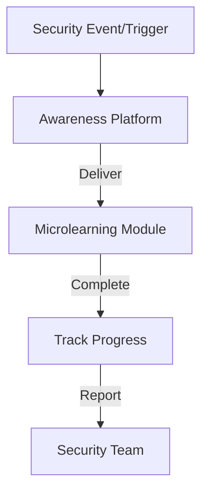
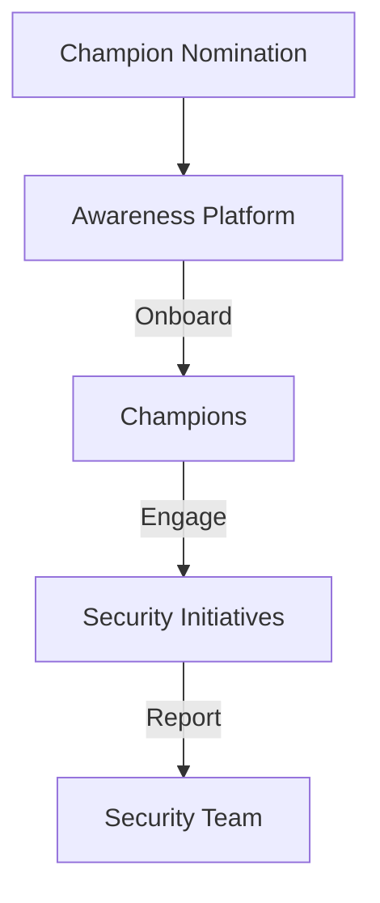

# Pro Workflows: Security Awareness

## 1. Automated Phishing Simulation & Training
**Problem:** Employees remain vulnerable to phishing without regular, realistic training.

**Workflow:**
```mermaid
flowchart TD
    A[Phishing Campaign] --> B[Employee Inbox]
    B -->|Click/Report| C[Awareness Platform (GoPhish/PhishSim)]
    C -->|Track| D[Metrics Dashboard]
    D -->|Feedback| E[Employee]
```
**Tools:** GoPhish, PhishSim, KnowBe4, Lucy Security

**Automation/AI Tips:**
- Automate campaign scheduling and feedback
- Use LLMs to generate realistic phishing templates

**Metrics:** 90%+ employee participation, reduced click rates

**References:** GoPhish docs, KnowBe4, Lucy Security

---

## 2. Just-in-Time Security Microlearning
**Problem:** Annual training is quickly forgotten and rarely changes behavior.

**Workflow:**

**Tools:** KnowBe4, Curricula, Lucy Security, custom LMS

**Automation/AI Tips:**
- Trigger microlearning based on real events (e.g., phishing click)
- Use LLMs to personalize content and quizzes

**Metrics:** 80%+ completion rate, improved security behavior

**References:** KnowBe4, Curricula, Lucy Security

---

## 3. Security Champions Program Automation
**Problem:** Security culture is hard to scale without distributed ownership.

**Workflow:**

**Tools:** KnowBe4, custom scripts, Slack/Teams integrations

**Automation/AI Tips:**
- Automate nomination, onboarding, and engagement tracking
- Use LLMs to analyze champion impact and suggest improvements

**Metrics:** 10%+ workforce as champions, increased security engagement

**References:** KnowBe4, Slack integrations 