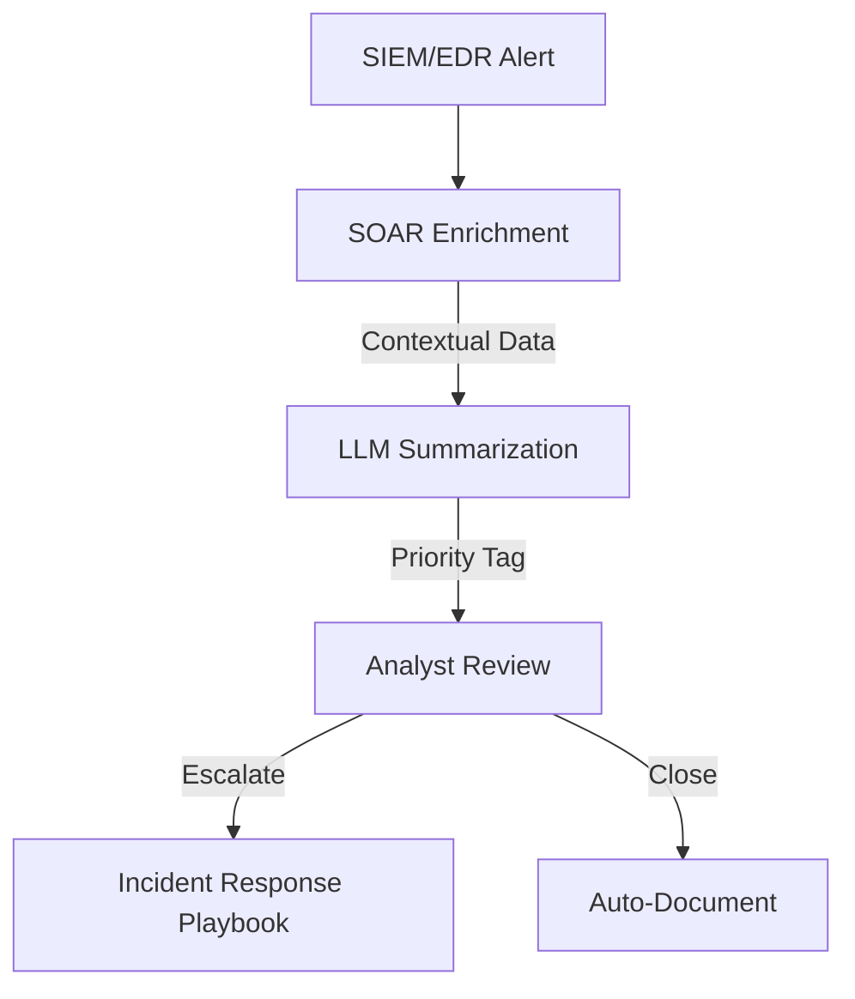
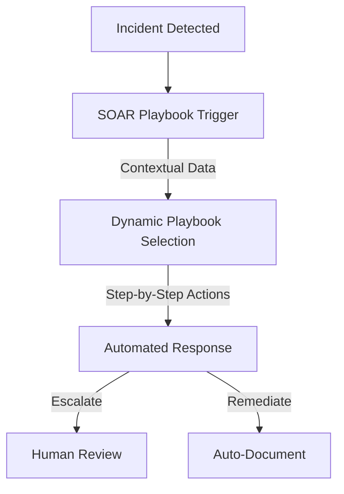

# Pro Workflows: SOC/SIEM/IR

## 1. AI-Driven Alert Triage & Enrichment
**Problem:** Analysts drown in noisy, low-context alerts, leading to fatigue and missed threats.

**Workflow:**

**Tools:** Shuffle, WALKOFF, OpenAI/Llama, TheHive

**Automation/AI Tips:**
- Use SOAR to auto-enrich alerts with threat intel, asset/user context
- Integrate LLMs for summarization and prioritization
- Route only high/medium-priority alerts to humans

**Metrics:** 80%+ reduction in manual triage, 50%+ faster MTTR, lower burnout

**References:** SANS SOC Survey 2025, MDPI Hyperautomation SOAR 2025

---

## 2. Automated Incident Response Playbooks
**Problem:** Manual IR is slow, inconsistent, and stressful for analysts.

**Workflow:**

**Tools:** StackStorm, Shuffle, TheHive, MITRE ATT&CK

**Automation/AI Tips:**
- Use dynamic playbook selection based on incident type/context
- Auto-document every step for compliance/post-mortem

**Metrics:** 60%+ faster IR, consistent response, audit-ready

**References:** MITRE ATT&CK, NIST CSF, SANS IR Playbooks

---

## 3. Daily AI-Powered Threat Briefings
**Problem:** Info overload and context switching lead to missed trends and analyst stress.

**Workflow:**
```mermaid
flowchart TD
    A[SIEM/EDR/Threat Feeds] --> B[Aggregator (n8n/Shuffle)]
    B -->|Summarize| C[LLM (GPT/Llama)]
    C -->|Digest| D[Slack/Email/Notion]
```
**Tools:** n8n, Shuffle, OpenAI/Llama, Slack/Notion

**Automation/AI Tips:**
- Aggregate alerts, CVEs, and threat feeds daily
- Summarize with LLM and deliver to team channels

**Metrics:** 90% reduction in manual reporting, improved focus

**References:** InfoSec Writeups, SANS, n8n community 