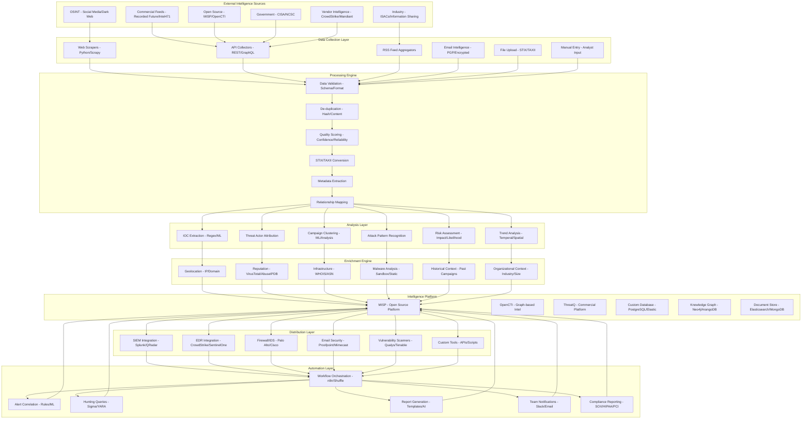
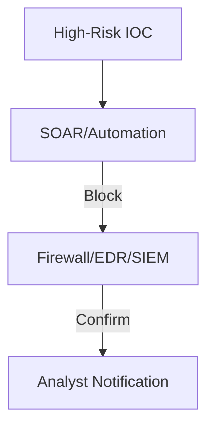

# Pro Workflows: Threat Intelligence

## 1. Automated Threat Feed Ingestion & Correlation
**Problem:** Manual threat feed ingestion is slow and error-prone, leading to missed IOCs.

**Workflow:**

**Tools:** MISP, OpenCTI, Shuffle, TheHive

**Automation/AI Tips:**
- Use MISP/OpenCTI to auto-ingest and correlate feeds
- Integrate with SOAR for downstream automation

**Metrics:** 80%+ reduction in manual IOC handling, faster detection

**References:** MISP docs, OpenCTI community

---

## 2. IOC Enrichment & Contextualization
**Problem:** Raw IOCs lack context, leading to false positives and wasted effort.

**Workflow:**
```mermaid
flowchart TD
    A[IOC] --> B[Enrichment (VirusTotal, AbuseIPDB, LLM)]
    B -->|Contextual Data| C[Analyst Review]
    C -->|Action| D[Block/Investigate]
```
**Tools:** VirusTotal, AbuseIPDB, OpenAI/Llama, Shuffle

**Automation/AI Tips:**
- Use APIs and LLMs to enrich IOCs with context
- Auto-prioritize based on risk and asset value

**Metrics:** 70%+ reduction in false positives, faster triage

**References:** VirusTotal API, AbuseIPDB, SANS

---

## 3. Auto-Blocking of Malicious IOCs
**Problem:** Delays in blocking known bad IOCs increase risk.

**Workflow:**

**Tools:** Shuffle, StackStorm, EDR APIs, Firewall APIs

**Automation/AI Tips:**
- Auto-block high-confidence IOCs, notify analysts for review
- Log all actions for audit/compliance

**Metrics:** 90%+ reduction in time to block, improved protection

**References:** Shuffle docs, SANS, OpenCTI community 